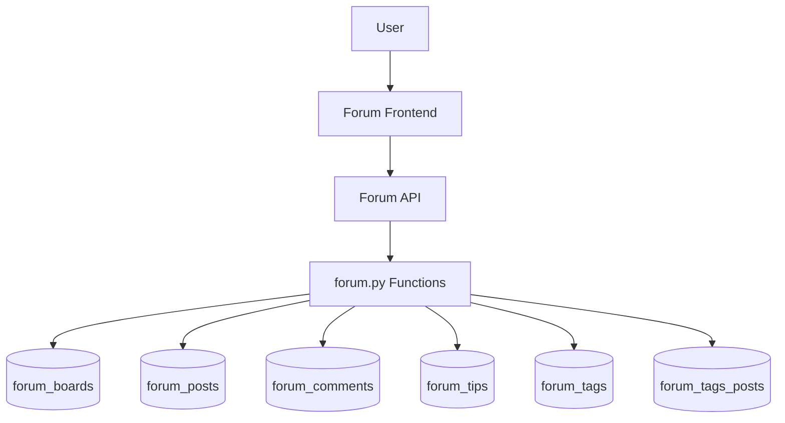

# Platform Forum System Skill

## Overview

The forum is the core social feature of PI CryptoMind, allowing users to discuss crypto topics, share insights, and tip content creators. It includes boards, posts, comments (push/boo/reply), tips, tags, and content moderation.

**Key Files:**
- **Backend**: `core/database/forum.py` (888 lines, 28 functions)
- **Frontend**: `web/js/forum.js` (1907 lines, 75 functions)
- **Pages**: `web/forum/index.html`, `post.html`, `create.html`, `dashboard.html`, `profile.html`

---

## Architecture

### System Components



### Database Schema

#### Core Tables

**1. forum_boards** - 看板/分類板塊
```sql
- id: SERIAL PRIMARY KEY
- slug: VARCHAR(100) UNIQUE  -- URL slug (e.g., 'general', 'trading')
- name_zh: VARCHAR(200)       -- 中文名稱
- name_en: VARCHAR(200)       -- 英文名稱 
- description_zh: TEXT
- description_en: TEXT
- is_active: BOOLEAN DEFAULT true
- created_at: TIMESTAMP
```

**2. forum_posts** - 文章
```sql
- id: SERIAL PRIMARY KEY
- board_id: INTEGER REFERENCES forum_boards
- user_id: VARCHAR(100)       -- Pi wallet address
- category: VARCHAR(50)       -- 'technical', 'news', 'discussion', 'question'
- title: VARCHAR(500)
- content: TEXT
- view_count: INTEGER DEFAULT 0
- push_count: INTEGER DEFAULT 0
- boo_count: INTEGER DEFAULT 0
- comment_count: INTEGER DEFAULT 0
- tip_total: NUMERIC(20,7) DEFAULT 0
- is_hidden: BOOLEAN DEFAULT false
- payment_tx_hash: VARCHAR(200)  -- 付費發文的交易哈希
- created_at: TIMESTAMP
- updated_at: TIMESTAMP
```

**3. forum_comments** - 評論/推噓
```sql
- id: SERIAL PRIMARY KEY
- post_id: INTEGER REFERENCES forum_posts
- user_id: VARCHAR(100)
- comment_type: VARCHAR(20)   -- 'push', 'boo', 'comment'
- content: TEXT               -- 可為 NULL (push/boo 可不寫內容)
- parent_id: INTEGER REFERENCES forum_comments  -- 回覆層級
- is_hidden: BOOLEAN DEFAULT false
- created_at: TIMESTAMP
```

**4. forum_tips** - 打賞記錄
```sql
- id: SERIAL PRIMARY KEY
- post_id: INTEGER REFERENCES forum_posts
- from_user_id: VARCHAR(100)
- to_user_id: VARCHAR(100)
- amount: NUMERIC(20,7)
- tx_hash: VARCHAR(200) UNIQUE  -- Pi transaction hash
- created_at: TIMESTAMP
```

**5. forum_tags** & **forum_tags_posts** - 標籤系統
```sql
forum_tags:
- id: SERIAL PRIMARY KEY
- name: VARCHAR(100) UNIQUE
- created_at: TIMESTAMP

forum_tags_posts (關聯表):
- tag_id: INTEGER REFERENCES forum_tags
- post_id: INTEGER REFERENCES forum_posts
- PRIMARY KEY (tag_id, post_id)
```

---

## Business Rules & Limits

### Post Limits (Daily)

**Rate Limits** (enforced in `check_daily_post_limit()`):
```python
FREE_USER:  3 posts/day
PRO_USER:   unlimited
```

**How it works:**
1. Check user's `is_premium` status via `get_user_membership(user_id)`
2. Query `forum_posts` for count where `user_id = X AND DATE(created_at) = today`
3. If FREE and count >= 3: reject with `RateLimitExceeded`
4. PRO users bypass limit check (`skip_limit_check=True`)

### Comment Limits

**Rate Limits**:
```python
FREE_USER:  No specific limit (but flood protection exists)
PRO_USER:   No specific limit

# Flood protection in add_comment():
- Check last comment timestamp
- If < 3 seconds ago: reject with error
```

### Payment Requirements

**Paid Posts** (optional feature):
- Posts can require Pi payment to create (controlled by `POST_FEE_AMOUNT` in system config)
- Payment transaction hash must be provided and verified
- Backend verifies payment before allowing post creation

**Tips**:
- Minimum: 0.01 Pi (frontend validation)
- Maximum: No limit
- **IRREVERSIBLE** - once sent, cannot be refunded per Pi SDK rules
- Must provide valid Pi `tx_hash` to record tip

---

## API Endpoints

### Backend Functions (`forum.py`)

#### Boards
```python
get_boards(active_only=True)
# Returns: List[{id, slug, name_zh, name_en, ...}]

get_board_by_slug(slug)
# Returns: {id, slug, name_zh, ...} or None
```

#### Posts - Create & Read
```python
check_daily_post_limit(user_id)
# Returns: {"allowed": bool, "count": int, "limit": int|None, "remaining": int|None}

create_post(board_id, user_id, category, title, content, 
            tags=None, payment_tx_hash=None, skip_limit_check=False)
# Returns: {"success": bool, "post_id": int} 
#       or {"success": False, "error": str, "code": str}

get_posts(board_id=None, category=None, tag=None, 
          limit=20, offset=0, include_hidden=False)
# Returns: List[{post_info...}]

get_post_by_id(post_id, increment_view=True, viewer_user_id=None)
# Returns: {id, title, content, author_info, stats, has_liked, ...}
```

#### Posts - Update & Delete
```python
update_post(post_id, user_id, title=None, content=None, category=None)
# Only author can update. Returns: {"success": bool, "message": str}

delete_post(post_id, user_id)
# Soft delete (is_hidden=true). Returns: {"success": bool, "message": str}

get_user_posts(user_id, limit=20, offset=0)
# Get posts by specific user
```

#### Comments
```python
add_comment(post_id, user_id, comment_type, content=None, parent_id=None)
# comment_type: 'push', 'boo', 'comment'
# Returns: {"success": bool, "comment_id": int}

get_comments(post_id, include_hidden=False)
# Returns: List[{id, user_id, type, content, created_at, ...}]

get_daily_comment_count(user_id)
get_daily_post_count(user_id)
```

#### Tips
```python
create_tip(post_id, from_user_id, to_user_id, amount, tx_hash)
# Returns: {"success": bool, "tip_id": int}

get_tips_sent(user_id, limit=50)
get_tips_received(user_id, limit=50)
get_tips_total_received(user_id)
```

#### Tags
```python
get_trending_tags(limit=10)
# Returns most frequently used tags in recent posts

get_posts_by_tag(tag_name, limit=20, offset=0)
search_tags(query, limit=10)
```

#### Statistics
```python
get_user_forum_stats(user_id)
# Returns: {total_posts, total_comments, total_push, total_boo, 
#           total_tips_sent, total_tips_received, ...}

get_user_payment_history(user_id, limit=50)
# Returns all payment records (post fees + membership fees)
```

---

## Frontend Workflows

### Key Objects

**ForumAPI** - API client wrapper
```javascript
ForumAPI = {
    _getUserId(),           // Get current Pi user ID
    _getAuthHeaders(),      // Get Authorization header
    
    // Boards
    getBoards(),
    
    // Posts
    getPosts(filters),
    getPost(id),
    createPost(data),
    updatePost(postId, data),
    deletePost(postId),
    
    // Comments
    getComments(postId),
    createComment(postId, data),
    pushPost(postId),      // Like post
    booPost(postId),       // Dislike post
    
    // Tags & Tips
    getTrendingTags(),
    tipPost(postId, amount, txHash),
    
    // User data
    getMyStats(),
    getMyPosts(),
    getMyTipsSent(),
    getMyTipsReceived(),
    getMyPayments(),
    checkLimits()
}
```

**ForumApp** - Application logic
```javascript
ForumApp = {
    init(),                // Initialize forum app
    bindEvents(),          // Bind UI event handlers
    updateAuthUI(),        // Update UI based on auth state
    
    // Index page
    initIndexPage(),
    loadBoards(),
    loadPosts(filters),
    loadTrendingTags(),
    
    // Post detail page
    initPostPage(),
    loadPostDetail(id),
    updatePostStats(post),
    loadComments(postId),
    handlePush(postId),
    handleBoo(postId),
    toggleReplyForm(),
    submitReply(postId),
    handleDelete(postId),
    handleEdit(postId),
    
    // Create page
    initCreatePage(),
    submitPost(),
    
    // Dashboard page
    initDashboardPage(),
    loadMyPosts(),
    loadMyStats(),
    loadMyTips(),
    loadMyPayments(),
    
    // Profile page
    initProfilePage(),
    loadUserPosts(userId),
    loadUserStats(userId)
}
```

### Common Workflows

#### 1. Create Post Flow

```javascript
// Frontend: web/forum/create.html
1. User fills form (board, category, title, content, tags)
2. Click "發布文章"
3. ForumApp.submitPost() called
4. Check if payment required (FREE user + reached limit)
   - If yes: Request Pi payment via Pi.createPayment()
   - Wait for payment confirmation
   - Get tx_hash from payment
5. Call ForumAPI.createPost({ board_id, category, title, content, tags, tx_hash })
6. Backend: create_post() in forum.py
   - Verify user auth
   - Check daily limit (if not PRO)
   - Verify payment if tx_hash provided
   - Insert into forum_posts
   - Insert tags into forum_tags + forum_tags_posts
7. Redirect to post detail page

// CRITICAL: In TEST_MODE, payment can be skipped for test users
```

#### 2. View Post Detail Flow

```javascript
// Frontend: web/forum/post.html
1. URL: post.html?id=123
2. ForumApp.loadPostDetail(123)
3. Backend: get_post_by_id(123, increment_view=true)
   - Increment view_count
   - Return post data + author info
   - Check if viewer has liked (push/boo)
4. Render post content
5. ForumApp.loadComments(123)
6. Backend: get_comments(123)
7. Render comment list with push/boo/reply threads
```

#### 3. Tip Post Flow

```javascript
// Frontend: Post page tip button
1. Click "打賞" button
2. Prompt for amount (min 0.01 Pi)
3. Create Pi payment:
   payment = await Pi.createPayment({
       amount: tipAmount,
       memo: `打賞文章 #${postId}`,
       metadata: { type: 'tip', post_id: postId }
   })
4. Get tx_hash from payment
5. Call ForumAPI.tipPost(postId, amount, tx_hash)
6. Backend: create_tip()
   - Verify tx_hash is valid and not duplicate
   - Insert into forum_tips
   - Update post.tip_total
7. Update UI to show new tip total
8. Show toast notification

// NOTE: Tips are IRREVERSIBLE per Pi SDK requirements
```

---

## Common Issues & Solutions

### Issue 1: "已達每日發文上限" (Rate Limit Exceeded)

**Cause**: FREE user has posted 3 times today

**Solution**:
```javascript
// Option A: Upgrade to PRO (show upgrade modal)
showProUpgradeModal();

// Option B: Wait until tomorrow (show remaining time)
const tomorrow = new Date();
tomorrow.setDate(tomorrow.getDate() + 1);
tomorrow.setHours(0,0,0,0);
const hoursLeft = Math.ceil((tomorrow - new Date()) / 3600000);
showAlert(`您今日已發布 3 篇文章。FREE 用戶每日上限 3 篇。
           還需等待 ${hoursLeft} 小時或升級為 PRO 會員解鎖無限發文。`);
```

### Issue 2: Push/Boo Not Working

**Cause**: Missing or incorrect auth headers

**Solution**:
```javascript
// In ForumAPI._getAuthHeaders()
// ✅ CORRECT
_getAuthHeaders() {
    const token = AuthManager?.currentUser?.accessToken || 
                  localStorage.getItem('auth_token');
    return token ? { 'Authorization': `Bearer ${token}` } : {};
}

// ❌ WRONG - using access_token instead of auth_token
localStorage.getItem('access_token')  // NEVER use this key
```

### Issue 3: Tips Not Recording

**Cause**: Duplicate tx_hash or invalid payment

**Solution**:
```python
# Backend validation in create_tip()
# Check for duplicate tx_hash
existing = db.fetchone("SELECT id FROM forum_tips WHERE tx_hash = ?", (tx_hash,))
if existing:
    return {"success": False, "error": "此交易已被記錄"}

# Verify payment amount matches
# (Future: integrate with Pi Payment API verification)
```

### Issue 4: Comments Not Showing

**Cause**: Comments marked as `is_hidden=true` due to moderation

**Solution**:
```python
# In get_comments()
# For normal users, exclude hidden comments
if not include_hidden:
    query += " AND is_hidden = FALSE"

# For moderators/admins, include_hidden=True to review flagged content
```

---

## Modification Guidelines

### ✅ Safe Modifications

1. **Add new board**
   ```sql
   INSERT INTO forum_boards (slug, name_zh, name_en, description_zh, description_en)
   VALUES ('new-board', '新板名', 'New Board', '描述', 'Description');
   ```

2. **Add new post category**
   - Update frontend category dropdown in `create.html`
   - No backend change needed (category is just a VARCHAR field)

3. **Adjust rate limits**
   - Modify `system_config` table values for `daily_post_limit_free`
   - Changes take effect immediately via `get_limits()`

4. **Add custom post fields**
   ```sql
   ALTER TABLE forum_posts ADD COLUMN custom_field VARCHAR(200);
   ```
   - Update `create_post()` to accept new field
   - Update frontend form to collect it

### ❌ Dangerous Modifications

1. **Changing user_id format**
   - Currently uses Pi wallet address (VARCHAR(100))
   - Changing this breaks authentication integration
   - **NEVER modify user_id column type or constraints**

2. **Removing payment verification**
   ```python
   # ❌ NEVER do this - violates Pi SDK compliance
   def create_post(..., tx_hash=None):
       # Skip payment verification
       pass  # DANGEROUS!
   ```

3. **Allowing tip refunds**
   - Pi payments are irreversible per Pi SDK rules
   - **NEVER implement tip refund feature**

4. **Bypassing rate limits globally**
   ```python
   # ❌ WRONG - defeats spam prevention
   if not skip_limit_check:
       skip_limit_check = True  # NEVER hardcode this
   ```

5. **Exposing hidden content publicly**
   ```python
   # ❌ WRONG - bypasses content moderation
   get_posts(include_hidden=True)  # Only for moderators!
   ```

---

## Testing Checklist

Before deploying forum modifications:

- [ ] Can FREE users post <= 3 times/day?
- [ ] Can PRO users post unlimited times?
- [ ] Do push/boo actions require authentication?
- [ ] Are tips irreversible (no refund button exists)?
- [ ] Do deleted posts show as hidden (not removed from DB)?
- [ ] Do comment threads display correctly (parent-child)?
- [ ] Are tags searchable and clickable?
- [ ] Do payments (if required) verify tx_hash?
- [ ] Is flood protection working (3-second cooldown)?
- [ ] Are hidden comments excluded for non-moderators?

---

## Performance Considerations

### Pagination

Always use `limit` and `offset` when fetching posts/comments:

```python
# ✅ GOOD - Paginated
get_posts(limit=20, offset=page*20)

# ❌ BAD - Fetches all posts (memory intensive)
get_posts(limit=999999)
```

### Indexing

Critical indexes on forum tables:
```sql
-- Post queries
CREATE INDEX idx_forum_posts_board ON forum_posts(board_id);
CREATE INDEX idx_forum_posts_user ON forum_posts(user_id);
CREATE INDEX idx_forum_posts_created ON forum_posts(created_at DESC);

-- Comment queries
CREATE INDEX idx_forum_comments_post ON forum_comments(post_id);

-- Tag queries
CREATE INDEX idx_forum_tags_name ON forum_tags(name);
CREATE INDEX idx_forum_tags_posts_tag ON forum_tags_posts(tag_id);
CREATE INDEX idx_forum_tags_posts_post ON forum_tags_posts(post_id);
```

### Caching Strategy

```javascript
// Frontend: Cache boards list (rarely changes)
if (!window._cachedBoards) {
    window._cachedBoards = await ForumAPI.getBoards();
}

// Don't cache: Posts, comments (frequently updated)
// Always fetch fresh data for these
```

---

## Related Skills

- **platform-pro-membership**: PRO benefits including unlimited posts
- **platform-scam-reporting**: Content moderation and flagging
- **pi-payments**: Pi Payment API for post fees and tips
- **platform-policies**: Compliance rules for forum content

---

## Maintenance Notes

**Last Updated**: 2026-02-08

**Key Files to Monitor**:
- `core/database/forum.py` - Backend logic
- `web/js/forum.js` - Frontend logic
- `system_config` table - Rate limits and fees

**Future Enhancements**:
- [ ] Real-time comment updates (WebSocket)
- [ ] Rich text editor (Markdown support)
- [ ] Image/video uploads
- [ ] Bookmark/save posts feature
- [ ] Advanced search (full-text search)
