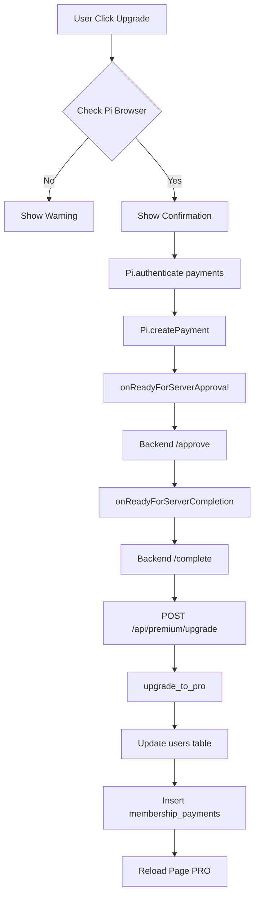

# Platform PRO Membership System Skill

## Overview

The PRO Membership system allows users to upgrade from FREE to premium membership by paying with Pi cryptocurrency. PRO members receive enhanced benefits including unlimited forum posts, higher scam reporting limits, and moderator eligibility.

**Key Files:**
- **Backend API**: `api/routers/premium.py` (111 lines)
- **Database Functions**: `core/database/user.py` (`get_user_membership`, `upgrade_to_pro`)
- **Frontend**: `web/js/premium.js` (608 lines, `PremiumManager` class)
- **Payment Validation**: Pi SDK Payment API integration

---

## Architecture

### System Flow



### Database Schema

#### users table (membership fields)
```sql
- membership_tier: VARCHAR(50) DEFAULT 'free'   -- 'free' or 'pro'
- membership_expires_at: TIMESTAMP             -- NULL for free, expire date for PRO
```

#### membership_payments table
```sql
CREATE TABLE membership_payments (
    id SERIAL PRIMARY KEY,
    user_id VARCHAR(100) REFERENCES users(user_id),
    amount NUMERIC(20,7),           -- Pi amount paid
    months INTEGER,                 -- Duration purchased (usually 1)
    tx_hash VARCHAR(200) UNIQUE,    -- Pi blockchain transaction hash
    created_at TIMESTAMP DEFAULT NOW()
);
```

---

## Business Rules

### Membership Tiers

| Tier | Price | Duration | Benefits |
|------|-------|----------|----------|
| **FREE** | 0 Pi | Forever | 3 posts/day, 5 reports/day, basic features |
| **PRO** | 10 Pi* | 30 days | Unlimited posts, 10 reports/day, moderator eligibility |

*Price configurable via `system_config.pi_prices.premium`

### Expiration Handling

**Automatic Downgrade**:
```python
# In get_user_membership():
if is_pro and expires_at < datetime.utcnow():
    # Mark as expired (optionally auto-downgrade if auto_update_expired=True)
    is_expired = True
    if auto_update_expired:
        UPDATE users SET membership_tier='free', membership_expires_at=NULL
```

**Renewal Extension**:
```python
# In upgrade_to_pro():
if currently_pro and not_expired:
    # Extend from current expiry date
    new_expires = current_expires + months
else:
    # New purchase: start from now
    new_expires = now() + months
```

### Payment Validation

**Critical Rules**:
1. ✅ **MUST** verify `tx_hash` is unique (no duplicate charges)
2. ✅ **MUST** use Pi Payment API three-phase flow
3. ❌ **NEVER** grant PRO without verified payment
4. ❌ **NEVER** allow refunds (Pi payments are irreversible per ToS)

```python
# Duplicate detection
SELECT user_id FROM membership_payments WHERE tx_hash = ?
if existing:
    raise ValueError("此交易已被處理")
```

---

## API Endpoints

### Backend (`api/routers/premium.py`)

#### POST /api/premium/upgrade
Upgrade user to PRO membership

**Request**:
```json
{
    "user_id": "GXXXXXX....",
    "months": 1,
    "tx_hash": "abc123def..."
}
```

**Response**:
```json
{
    "success": true,
    "message": "成功升級到高級會員 1 個月！",
    "membership": {
        "tier": "pro",
        "expires_at": "2026-03-08 12:00:00",
        "is_pro": true,
        "is_expired": false
    }
}
```

**Validation**:
- Requires authentication (user must match current_user)
- Checks for duplicate `tx_hash`
- Verifies user exists
- Determines if new purchase or renewal

#### GET /api/premium/status/{user_id}
Get membership status

**Response**:
```json
{
    "success": true,
    "membership": {
        "tier": "pro",
        "expires_at": "2026-03-08 12:00:00",
        "is_pro": true,
        "is_expired": false
    }
}
```

### Database Functions (`core/database/user.py`)

#### get_user_membership(user_id, auto_update_expired=False)
Retrieve user's membership status

**Parameters**:
- `user_id`: Pi wallet address
- `auto_update_expired`: If True, auto-downgrade expired PRO to FREE

**Returns**:
```python
{
    "tier": "pro",
    "expires_at": "2026-03-08 12:00:00",  # str or None
    "is_pro": True,                       # False if expired
    "is_expired": False                   # True if expired but not updated
}
```

**Usage**:
```python
# Check membership before allowing action
membership = get_user_membership(user_id)
if membership["is_pro"]:
    # Grant PRO benefits
    allow_unlimited_posts()
```

#### upgrade_to_pro(user_id, months=1, tx_hash=None)
Upgrade user to PRO tier

**Parameters**:
- `user_id`: User to upgrade
- `months`: Duration (default 1 month = 30 days)
- `tx_hash`: Pi transaction hash (required for production)

**Returns**: `bool` - Success status

**Logic**:
```python
# 1. Check for duplicate tx_hash
if tx_hash in membership_payments:
    raise ValueError("Duplicate transaction")

# 2. Determine renewal vs new purchase
if user.is_pro and user.expires_at > now():
    # Renewal: extend from current expiry
    new_expires = current_expires + months
else:
    # New purchase: start from now
    new_expires = now() + months

# 3. Update users table
UPDATE users SET membership_tier='pro', membership_expires_at=new_expires

# 4. Record payment
INSERT INTO membership_payments (user_id, amount, months, tx_hash)
```

---

## Frontend Workflows

### PremiumManager Class (`premium.js`)

**Initialization**:
```javascript
window.PremiumManager = new PremiumManager();
// Listens for 'pi-prices-updated' event to get premium price
// Binds upgrade buttons with class 'upgrade-premium-btn'
```

**Key Methods**:

#### handleUpgradeClick()
Main upgrade flow orchestrator

```javascript
async handleUpgradeClick() {
    // 1. Load premium price from window.PiPrices
    // 2. Check user authentication
    // 3. Verify Pi Browser environment
    // 4. Show confirmation modal
    // 5. Call startUpgradeProcess()
}
```

#### startUpgradeProcess()
Execute three-phase payment

```javascript
async startUpgradeProcess() {
    // Phase 1: Authenticate payments scope
    await authenticateForPayment()
    
    // Phase 2: Execute Pi payment
    txHash = await executePiPayment()
    
    // Phase 3: Request backend upgrade
    result = await requestUpgrade(txHash)
    
    // Phase 4: Update UI and reload
    updateUserInterface()
    window.location.reload()
}
```

#### executePiPayment()
Handle Pi SDK payment with retry logic

```javascript
return new Promise((resolve, reject) => {
    Pi.createPayment({
        amount: this.premiumPrice,
        memo: "升級高級會員",
        metadata: { type: "premium_upgrade", user_id: ... }
    }, {
        onReadyForServerApproval: async (paymentId) => {
            await fetch('/api/user/payment/approve', {POST paymentId})
        },
        onReadyForServerCompletion: async (paymentId, txid) => {
            // Retry up to 3 times with exponential backoff
            for (let i=0; i<3; i++) {
                try {
                    await fetch('/api/user/payment/complete', {POST paymentId, txid})
                    resolve(txid)
                    return
                } catch (error) {
                    await sleep(1000 * 2^i)
                }
            }
            // All retries failed: save txid to localStorage
            localStorage.setItem('pending_premium_upgrade', {paymentId, txid})
            showToast('支付已完成，但系統確認失敗。請聯繫客服', 'warning')
            resolve(txid) // Still resolve to allow manual retry
        },
        onCancel: (paymentId) => reject('用戶取消支付'),
        onError: (error) => reject(error)
    })
})
```

### UI Components

**Upgrade Button** (add to any page):
```html
<button class="upgrade-premium-btn px-6 py-3 bg-gradient-to-r from-yellow-500 to-orange-500 text-white rounded-xl">
    升級到 PRO 會員 - <span data-price="premium">Loading...</span>
</button>
```

**Membership Badge** (display tier):
```html
<div class="membership-badge">
    <i data-lucide="star" class="w-3 h-3"></i>
    高級會員
</div>
```

**Price Display** (auto-updates from backend):
```html
<span data-price="premium">10 Pi</span>
```

---

## PRO Benefits Integration

### Forum System

**Unlimited Posts** (`core/database/forum.py`):
```python
def check_daily_post_limit(user_id):
    membership = get_user_membership(user_id)
    if membership["is_pro"]:
        return {"allowed": True, "limit": None, "remaining": None}
    
    # FREE users: check 3 posts/day limit
    count = count_posts_today(user_id)
    return {"allowed": count < 3, "count": count, "limit": 3, "remaining": 3-count}
```

### Scam Reporting

**Increased Report Limit** (`core/database/governance.py`):
```python
PRO_DAILY_REPORT_LIMIT = 10
DEFAULT_DAILY_REPORT_LIMIT = 5

membership = get_user_membership(user_id)
limit = PRO_DAILY_REPORT_LIMIT if membership["is_pro"] else DEFAULT_DAILY_REPORT_LIMIT
```

### Moderator Eligibility

**PRO Requirement** (`core/database/governance.py`):
```python
def can_review_report(user_id):
    membership = get_user_membership(user_id)
    if not membership["is_pro"]:
        raise PermissionError("Only PRO members can be reviewers")
    
    # Additional requirement: 3-person consensus needed
```

---

## Common Issues & Solutions

### Issue 1: Payment Complete But Not Upgraded

**Symptoms**: User paid but still shows as FREE tier

**Causes**:
1. Backend `/complete` API failed during payment
2. Network timeout during upgrade request
3. Duplicate `tx_hash` rejection

**Solution**:
```javascript
// Frontend saves txid to localStorage on completion failure
const pending = localStorage.getItem('pending_premium_upgrade')
if (pending) {
    const {paymentId, txid} = JSON.parse(pending)
    // Manually retry upgrade with saved txid
    await fetch('/api/premium/upgrade', {
        method: 'POST',
        body: JSON.stringify({user_id, months: 1, tx_hash: txid})
    })
    localStorage.removeItem('pending_premium_upgrade')
}
```

### Issue 2: PRO Benefits Not Working After Upgrade

**Cause**: Page not reloaded after upgrade

**Solution**:
```javascript
// PremiumManager automatically reloads page after 2 seconds
setTimeout(() => window.location.reload(), 2000)
```

**Manual Fix**:
```javascript
// Force refresh user data
if (window.AuthManager) {
    await window.AuthManager.refreshUserData()
}
```

### Issue 3: Expired PRO Still Shows as Active

**Cause**: `auto_update_expired=False` in read-only queries

**Solution**:
```python
# Use auto-update when checking permissions
membership = get_user_membership(user_id, auto_update_expired=True)

# For display purposes only, use default (False)
membership = get_user_membership(user_id)
if membership["is_expired"]:
    show_renewal_prompt()
```

### Issue 4: Duplicate Transaction Error

**Cause**: Same `tx_hash` submitted twice

**Solution**:
```python
# Backend already checks for duplicates
SELECT user_id FROM membership_payments WHERE tx_hash = ?
if existing:
    return {"success": False, "error": "此交易已被處理"}
```

**Frontend Prevention**:
```javascript
// Disable upgrade button during processing
button.disabled = true
button.textContent = "處理中..."
```

---

## Modification Guidelines

### ✅ Safe Modifications

1. **Change PRO price**
   ```sql
   UPDATE system_config 
   SET config_value = '{"premium": 15.0}' 
   WHERE config_key = 'pi_prices';
   ```
   Frontend will auto-fetch new price via `loadPiPrices()`

2. **Add new membership tier (e.g., VIP)**
   ```sql
   ALTER TABLE users ADD COLUMN IF NOT EXISTS membership_tier VARCHAR(50) DEFAULT 'free';
   -- Values: 'free', 'pro', 'vip'
   ```
   Update `get_user_membership()` to handle 'vip'

3. **Extend PRO duration**
   ```python
   # Allow multi-month purchases
   upgrade_to_pro(user_id, months=3, tx_hash=...)
   # Frontend: Add duration selector
   ```

4. **Add PRO-only features**
   ```python
   def restricted_feature(user_id):
       membership = get_user_membership(user_id)
       if not membership["is_pro"]:
           raise PermissionError("PRO membership required")
       # Feature code...
   ```

### ❌ Dangerous Modifications

1. **Granting PRO without payment**
   ```python
   # ❌ WRONG - Violates Pi SDK compliance
   upgrade_to_pro(user_id, months=1, tx_hash=None)  # NEVER do this in production!
   ```
   Always require valid `tx_hash` except in TEST_MODE

2. **Allowing membership refunds**
   ```python
   # ❌ NEVER implement - violates Terms of Service
   def refund_membership(user_id):
       # Pi payments are irreversible!
   ```

3. **Removing expiration checks**
   ```python
   # ❌ WRONG - Users could use expired PRO forever
   def get_user_membership(user_id):
       return {"is_pro": True}  # Always PRO? NO!
   ```

4. **Skipping duplicate tx_hash check**
   ```python
   # ❌ DANGEROUS - Allows double-charging
   def upgrade_to_pro(user_id, tx_hash):
       # Skip duplicate check? NO!
       INSERT INTO membership_payments (tx_hash, ...)
   ```

---

## Testing Checklist

Before deploying membership modifications:

- [ ] Can users upgrade via Pi payment?
- [ ] Is duplicate `tx_hash` rejected?
- [ ] Do PRO benefits activate immediately after upgrade?
- [ ] Does expiration auto-downgrade to FREE?
- [ ] Can PRO users renew (extends from current expiry)?
- [ ] Is payment recorded in `membership_payments` table?
- [ ] Does `/api/premium/status` return correct tier?
- [ ] Are expired PRO users blocked from PRO features?
- [ ] Does frontend show correct price from backend?
- [ ] Is TEST_MODE bypass properly restricted to test users?

---

## Integration with Other Systems

### Forum System
```python
from core.database import get_user_membership

# Check before enforcing limits
membership = get_user_membership(user_id)
if membership["is_pro"]:
    skip_post_limit = True
```

### Scam Reporting
```python
# Higher report limits for PRO
membership = get_user_membership(user_id)
report_limit = 10 if membership["is_pro"] else 5
```

### Governance & Moderation
```python
# PRO requirement for reviewers
def assign_reviewer(user_id):
    membership = get_user_membership(user_id)
    if not membership["is_pro"]:
        raise ValueError("Only PRO members can be reviewers")
```

---

## Security Considerations

### Payment Verification

**Critical**: Always verify payments server-side

```python
# ✅ CORRECT: Verify tx_hash before granting benefits
def upgrade_to_pro(user_id, tx_hash):
    # 1. Check tx_hash uniqueness
    # 2. (Future) Verify tx_hash on Pi blockchain
    # 3. Update membership
```

### TEST_MODE Handling

**Development Only**:
```python
# Allow test users to bypass payment
if TEST_MODE and user_id in TEST_USERS:
    upgrade_to_pro(user_id, tx_hash="test_tx_" + timestamp)
else:
    # Require real Pi payment
    if not tx_hash:
        raise ValueError("tx_hash required in production")
```

### Authorization Checks

```python
# Ensure user can only upgrade themselves
@router.post("/upgrade")
async def upgrade_to_premium(request, current_user):
    if current_user["user_id"] != request.user_id:
        raise HTTPException(403, "Not authorized")
```

---

## Related Skills

- **pi-payments**: Pi Payment API three-phase flow details
- **platform-forum-system**: PRO benefits for unlimited posts
- **platform-scam-reporting**: PRO benefits for higher report limits
- **platform-policies**: No-refund policy compliance

---

## Maintenance Notes

**Last Updated**: 2026-02-08

**Key Configuration**:
- PRO price: `system_config.pi_prices.premium` (default 10 Pi)
- PRO duration: 30 days (1 month)
- Report limits: system setting database `core/database/system_config.py`

**Future Enhancements**:
- [ ] Multi-tier memberships (Bronze/Silver/Gold)
- [ ] Annual subscription discount (12 months for 100 Pi)
- [ ] Gift memberships
- [ ] Auto-renewal option
- [ ] Blockchain verification for tx_hash
- [ ] Membership transfer between wallets (if allowed by Pi)
