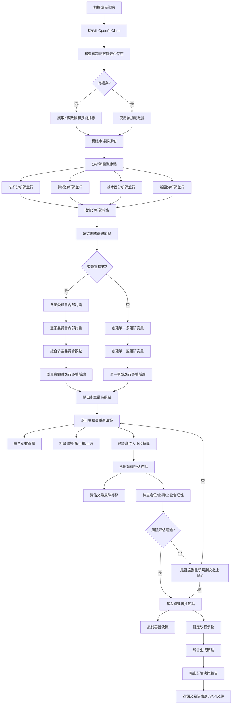
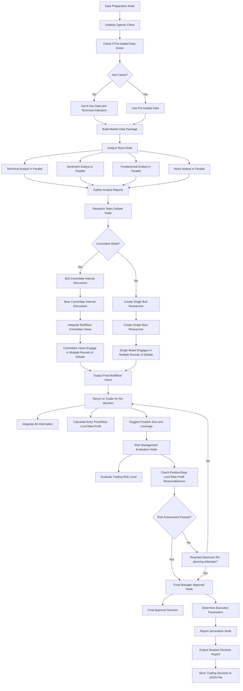

# 邁向自主智能：AI-Agent 自主代理系統

## Building the Future with AI-Agents, Intelligent Data, and Scalable Infrastructure

這是一個由獨立開發者維護的開源專案，致力於將 大型語言模型 (LLM) 從簡單的對話框，演進為能自主規劃、調用工具並解決複雜問題的 AI-Agents。從底層的數據採集、穩健的後端架構，到頂層的代理人邏輯設計，我們建構完整的 AI 生態閉環。

我們正在尋找技術夥伴、商務合作以及開發贊助，一同在 AI 浪潮中開疆闢土。

## 🛠 核心技術與團隊成員 | Our Team & Expertise

我們是由獨立開發者組成的團隊，成員專長互補，涵蓋 AI 開發的三大核心：

| 成員 | 技術專長 | 核心領域 | 聯絡方式 |
|------|----------|----------|----------|
| 陳鈺澔 (Yu-Hao Chen) | LLM & AI-Agent Architect | 專精於 LLM 應用框架、自主代理人 (AI-Agents) 工作流設計、Prompt Engineering。 | Email |
| 賴弘育 (Hung-Yu Lai) | Intelligent Data Retrieval | 專精於金融領域精準爬蟲、數據清洗與動態資訊流，為 AI 提供高品質知識庫。 | Email |
| 施柏均 (Po-Chun Shih) | Backend & Infra Engineer | 負責高併發後端架構、數據庫維運與優化，支撐 AI 代理人的大規模運算需求。 | Email |

## 🌟 我們專注的方向

- **AI-Agent 生態系統**： 開發具備自我修正與工具調用能力的自主代理。
- **智慧金融數據**： 結合 LLM 與金融爬蟲，實現自動化的市場分析與資訊提取。
- **高性能 AI 後端**： 為複雜的 AI 邏輯提供穩定、可擴展的運行環境。

## 🤝 合作、加入或贊助 | Support Our Vision

我們歡迎來自世界各地的開發者交流、企業專案委託，或是透過加密貨幣支持我們的研發工作。您的贊助資金將直接用於購買 LLM 相關 API、租用小型伺服器等基礎建設，讓我們能夠嘗試更多種技術可能性，持續優化 AI-Agent 的性能與功能。

**此為獨立開發之開源專案，與任何機構無關。**

## 📩 聯絡我們

歡迎透過上述 Email 聯繫成員，或在 GitHub 上發起討論。

## 💎 加密貨幣贊助 (Crypto Donation)

- **BTC**: bc1qze054pw29crex29rzus80e6gjtzmcrvd60qfkc
- **ETH (ERC-20)**: 0x37332CEAe1eb3AcD3a76c2dA54B8D586448F1db9
- **USDT (ERC-20)**: 0x37332ceae1eb3acd3a76c2da54b8d586448f1db9

## 🏗️ 系統架構與技術細節 | System Architecture & Technical Details

### 中文版本 | Chinese Version

這是一個基於 AI 代理（Agent）的先進加密貨幣交易系統，採用多層級分析架構，整合了技術分析、情緒分析、基本面分析和新聞分析，並通過機器學習模型進行多空辯論與風險管理。

#### 🌟 核心特性

##### 1. 多層級分析代理系統
- **分析師團隊**：技術分析師、情緒分析師、基本面分析師、新聞分析師
- **研究團隊**：多頭研究員與空頭研究員進行辯論
- **交易員**：整合資訊做出交易決策
- **風險經理**：評估風險並控制敞口
- **基金經理**：最終審批與執行

##### 2. 跨交易所兼容性
- **自動符號格式轉換**：系統自動適配不同交易所的符號格式（Binance: "PIUSDT" ↔ OKX: "PI-USDT"）
- **多交易所支持**：無縫切換 Binance、OKX 等交易平台
- **備援機制**：當主要交易所無法找到符號時，自動嘗試備用交易所
- **統一數據接口**：標準化不同交易所的數據格式，確保分析一致性

##### 3. 智能辯論機制
- 多頭與空頭研究員進行多輪辯論
- 支援委員會模式（多個模型組成委員會）
- 自動調整模型信心度與論點

##### 4. 雙市場分析
- **現貨（Spot）市場**：傳統買賣操作
- **合約（Futures）市場**：支援槓桿與雙向交易
- 獨立分析但可交叉驗證

##### 5. 全自動風險管理
- 動態倉位調控
- 止損止盈自動計算
- 槓桿風險評估
- 資金費率考量

##### 6. 智能快取與數據優化
- **LLM 快取機制**：使用 `utils/llm_cache.py` 緩存 LLM 請求結果，默認 1 小時過期時間
- **數據預加載機制**：避免重複下載，實現現貨與期貨分析共享同一份數據
- **新聞數據優化**：每次執行時獲取最新新聞，避免新聞數據過時

#### 🏗️ 系統架構

##### 代理系統工作流程（LangGraph）


##### 代理層級結構
1. **第一層：分析師團隊** (4 個代理並行)
   - 技術分析師：分析 K 線、指標、趨勢
   - 情緒分析師：評估市場情緒與參與度
   - 基本面分析師：評估長期價值與結構
   - 新聞分析師：分析市場新聞與事件影響

2. **第二層：研究團隊** (2 個代理辯論)
   - 多頭研究員：支持看漲觀點
   - 空頭研究員：支持看跌觀點
   - 支援多輪辯論與委員會模式

3. **第三層：交易員**
   - 綜合所有資訊做出交易決策
   - 計算進場價、止損價、止盈價
   - 決定倉位大小與槓桿倍數

4. **第四層：風險管理員**
   - 評估交易風險等級
   - 控制倉位與槓桿
   - 決定是否批准交易

5. **第五層：基金經理**
   - 最終審批與執行
   - 決定最終執行參數

#### 🔧 核心文件說明

##### 必需的核心文件
- `core/main.py` - 系統入口點
- `core/graph.py` - LangGraph 工作流程定義
- `core/agents.py` - 所有 AI 代理實現
- `core/models.py` - 數據模型定義 (Pydantic)
- `core/config.py` - 系統配置和 AI 模型設置
- `data/data_fetcher.py` - 交易所數據獲取
- `data/data_processor.py` - 數據處理和指標計算
- `data/indicator_calculator.py` - 技術指標計算器
- `analysis/reporting.py` - 報告生成
- `trading/okx_api_connector.py` - OKX 交易所 API 連接器

##### 工具/輔助文件
- `utils/llm_client.py` - LLM 客戶端管理
- `utils/llm_cache.py` - LLM 結果緩存機制
- `utils/retry_utils.py` - 重試機制工具
- `utils/utils.py` - 通用工具函數
- `utils/settings.py` - 系統設置參數

##### 分析功能模組
- `analysis/crypto_screener.py` - 加密貨幣篩選器
- `analysis/backend_analyzer.py` - 後台分析引擎（產生JSON格式的交易決策，支援無GUI後台運行）
- `analysis/batch_analyzer.py` - 批量分析器

##### 介面相關文件
- `interfaces/chat_interface.py` - 聊天介面
- `interfaces/run_chat.py` - 運行聊天界面
- `interfaces/batch_analyzer_app.py` - 批量分析應用界面

##### 交易相關文件
- `trading/okx_api_connector.py` - OKX 交易所 API 連接器
- `trading/okx_auto_trader.py` - OKX 自動交易執行器

##### 測試檔案
- `tests/test_backend_analyzer.py` - 後台分析器測試
- `tests/test_multi_source_news.py` - 多來源新聞分析測試
- `tests/test_pi_analysis.py` - PI Network 分析測試
- `tests/validate_backend_json.py` - 後台 JSON 輸出驗證

##### 配置與說明文件
- `requirements.txt` - 專案依賴套件清單
- `NEWS_SOURCES_GUIDE.md` - 新聞來源設定指南

##### 後台分析功能
- `analysis/backend_analyzer.py` - 後台分析核心模組
  - `BackendAnalyzer` 類別：提供後台分析功能
  - `analyze_symbol()` 方法：分析單一加密貨幣並返回JSON格式決策
  - `analyze_multiple_symbols()` 方法：批量分析多個加密貨幣
  - `save_decision_to_json()` 方法：將決策結果保存為JSON文件
  - `run_backend_analysis()` 函數：執行後台分析的主要函數
  - `run_batch_backend_analysis()` 函數：執行批量後台分析

##### 資料處理功能
- `data/indicator_calculator.py` - 技術指標計算模組
  - RSI、MACD、布林帶、移動平均線等指標計算
  - 異常值檢測和數據驗證

##### 交易所數據獲取功能
- `data/data_fetcher.py` - 交易所數據獲取模組
  - 支援多交易所數據獲取（Binance、OKX）
  - 自動符號可用性檢查
  - 現貨與合約市場數據獲取
  - OKX API 錯誤處理與重試機制
  - 不同交易所 K 線數據格式標準化

##### 介面應用功能
- `interfaces/batch_analyzer_app.py` - 批量分析介面應用
  - 支援多幣種同時分析
  - 提供圖形化操作介面
  - 匯出分析結果功能

##### 符號格式轉換功能
- `analysis/batch_analyzer.py` - 符號格式自動轉換
  - 自動將 Binance 格式符號（如 "PIUSDT"）轉換為目標交易所格式（如 OKX 的 "PI-USDT"）
  - 支援 Binance ↔ OKX 格式之間的雙向轉換
  - 主要轉換規則：Binance 格式無分隔符（BTCUSDT）轉換為 OKX 格式含分隔符（BTC-USDT）
  - 錯誤處理：當主要交易所找不到符號時，自動嘗試備用交易所

##### 交易執行功能
- `trading/okx_auto_trader.py` - 自動交易執行器
  - 匯入 JSON 交易決策
  - 執行實際買賣訂單
  - 風險控制和訂單管理

##### 測試驗證功能
- `tests/validate_backend_json.py` - JSON 格式驗證工具
  - 驗證後台分析器輸出格式
  - 檢查決策數據完整性
- `tests/test_backend_analyzer.py` - 後台分析器功能測試
- `tests/test_multi_source_news.py` - 多來源新聞分析準確性測試
- `tests/test_pi_analysis.py` - PI Network 相關分析測試

##### 系統支援功能
- `utils/llm_cache.py` - LLM 結果快取機制
  - 減少 API 請求次數
  - 加快重複分析速度
  - 快取結果驗證機制
  - 預設快取期限：1 小時 (3600秒)
  - 快取目錄：.llm_cache
- `interfaces/chat_interface.py` - 數據預加載機制
  - 避免現貨與期貨分析重複下載數據
  - 新聞數據在單次執行中統一獲取一次
  - 支援並行分析時的數據共享

##### 產出檔案
- `trading_decisions_*.json` - 交易決策存檔
  - 包含現貨和合約市場的詳細決策
  - 包含風險評估和技術指標資訊

#### 🛠️ 技術組件

##### 依賴套件
- `openai`: AI 模型接入
- `langgraph`: 代理狀態機管理
- `pandas`: 數據處理
- `numpy`: 數值運算
- `python-dotenv`: 環境變數管理
- `requests`: API 通信
- `cachetools`: 快取工具（用於接口快取和 LLM 結果快取）

##### 支援的 AI 模型平台
- **OpenAI**: GPT-4o, GPT-4o mini, o4-mini
- **Google Gemini**: Gemini 2.5 Flash, Gemini 1.5 Pro
- **OpenRouter**: 多家模型提供商
- **Local LLM**: 支援透過 vLLM, Ollama, LM Studio 等運行的本地模型（OpenAI 兼容接口）

##### 支援的交易所
- **Binance**: 現貨與期貨市場
- **OKX**: 現貨與永續合約市場
- **符號格式自動轉換**: 系統自動處理不同交易所的符號格式差異（例如 Binance 格式 "PIUSDT" 自動轉換為 OKX 格式 "PI-USDT"）
- 可擴展支持其他交易所

#### ⚙️ 配置說明

##### 環境變數配置
在 `.env` 文件中設置以下變數：

```env
# OpenAI API
OPENAI_API_KEY=your_openai_api_key

# Google Gemini API
GOOGLE_API_KEY=your_google_api_key

# OpenRouter API
OPENROUTER_API_KEY=your_openrouter_api_key

# OKX API (用於實際交易)
OKX_API_KEY=your_okx_api_key
OKX_API_SECRET=your_okx_api_secret
OKX_PASSPHRASE=your_okx_passphrase
OKX_BASE_URL=https://www.okx.com

# 新聞 API (可選)
NEWSAPI_KEY=your_newsapi_key
```

##### 系統配置（`config.py`）

###### AI 模型配置
```python
# 基礎模型（用於分析師團隊）
FAST_THINKING_MODEL = "gpt-4o"  # 用於數據收集和快速分析
DEEP_THINKING_MODEL = "o4-mini"  # 用於深度推理和決策
```

###### 多模型辯論配置
- `ENABLE_MULTI_MODEL_DEBATE`: 是否啟用多模型辯論
- `ENABLE_COMMITTEE_MODE`: 是否啟用委員會模式

###### 委員會模式配置
```python
# 多頭委員會模型
BULL_COMMITTEE_MODELS = [
    {"provider": "openai", "model": "gpt-4o-mini"},
    {"provider": "google_gemini", "model": "gemini-2.5-flash"},
    {"provider": "local", "model": "llama-3-8b-instruct"},  # 本地模型範例
]
```

###### 本地模型配置
```python
# 用於連接 vLLM, Ollama 等
LOCAL_LLM_CONFIG = {
    "base_url": "http://0.0.0.0:8080/v1",
    "api_key": "not-needed",
    "temperature": 0.1,
}
```

###### 交易限制配置
```python
# 投資金額限制 (USDT)
MINIMUM_INVESTMENT_USD = 20  # 最低投資金額
MAXIMUM_INVESTMENT_USD = 50.0  # 最高投資金額
EXCHANGE_MINIMUM_ORDER_USD = 1.0  # 交易所最低下單金額
```

#### 📊 交易策略

##### 分析維度
1. **技術分析**
   - 支撐壓力位
   - 趨勢線分析
   - RSI、MACD、布林帶等指標
   - 成交量分析

2. **情緒分析**
   - 市場恐慌貪婪指數
   - 交易量異常檢測
   - 流動性分析

3. **基本面分析**
   - 項目基本面向
   - 開發活動監控
   - 供應量變化

4. **新聞事件**
   - 重大新聞影響
   - 監管消息
   - 技術更新

##### 風險控制
- **倉位管理**: 動態調整倉位大小
- **止損機制**: 多種止損策略（ATR、百分比、技術位）
- **止盈機制**: 風險回報比管理（1:2, 1:3）
- **槓桿控制**: 根據波動率動態調整

### 英文版本 | English Version

This is an advanced cryptocurrency trading system based on AI agents, using a multi-tiered analysis architecture that integrates technical analysis, sentiment analysis, fundamental analysis, and news analysis, and performs bull/bear debates and risk management through machine learning models.

#### 🌟 Key Features

##### 1. Multi-Tiered Analysis Agent System
- **Analyst Team**: Technical analyst, sentiment analyst, fundamental analyst, news analyst
- **Research Team**: Bull researcher and bear researcher conducting debates
- **Trader**: Integrates information to make trading decisions
- **Risk Manager**: Evaluates risks and controls exposure
- **Fund Manager**: Final approval and execution

##### 2. Cross-Exchange Compatibility
- **Automatic Symbol Format Conversion**: System automatically adapts to different exchange symbol formats (Binance: "PIUSDT" ↔ OKX: "PI-USDT")
- **Multi-Exchange Support**: Seamless switching between exchanges like Binance, OKX
- **Backup Mechanism**: Automatically tries backup exchanges when primary exchange cannot find symbol
- **Unified Data Interface**: Standardizes data formats across different exchanges to ensure analysis consistency

##### 3. Intelligent Debate Mechanism
- Bulls and bears researchers engage in multiple rounds of debate
- Supports committee mode (multiple models form a committee)
- Automatically adjusts model confidence and arguments

##### 4. Dual Market Analysis
- **Spot Market**: Traditional buy/sell operations
- **Futures Market**: Supports leverage and bidirectional trading
- Independent analysis but cross-validation possible

##### 5. Fully Automated Risk Management
- Dynamic position adjustment
- Automatic stop-loss and take-profit calculation
- Leverage risk assessment
- Funding rate consideration

##### 6. Smart Caching and Data Optimization
- **LLM Cache Mechanism**: Uses `utils/llm_cache.py` to cache LLM request results, default 1-hour expiration time
- **Data Pre-loading Mechanism**: Avoids duplicate downloads and enables spot and futures analysis to share the same dataset
- **News Data Optimization**: Gets latest news on each execution to avoid outdated news data

#### 🏗️ System Architecture

##### Agent System Workflow (LangGraph)


##### Agent Hierarchy Structure
1. **Tier 1: Analyst Team** (4 parallel agents)
   - Technical Analyst: Analyzes K-lines, indicators, trends
   - Sentiment Analyst: Evaluates market sentiment and participation
   - Fundamental Analyst: Evaluates long-term value and structure
   - News Analyst: Analyzes market news and event impact

2. **Tier 2: Research Team** (2 agents debating)
   - Bull Researcher: Supports bullish view
   - Bear Researcher: Supports bearish view
   - Supports multiple rounds of debate and committee mode

3. **Tier 3: Trader**
   - Integrates all information to make trading decisions
   - Calculates entry price, stop-loss price, take-profit price
   - Determines position size and leverage multiplier

4. **Tier 4: Risk Manager**
   - Evaluates trading risk level
   - Controls position and leverage
   - Decides whether to approve trading

5. **Tier 5: Fund Manager**
   - Final approval and execution
   - Determines final execution parameters

#### 🔧 Core File Descriptions

##### Required Core Files
- `core/main.py` - System entry point
- `core/graph.py` - LangGraph workflow definition
- `core/agents.py` - All AI agent implementations
- `core/models.py` - Data model definitions (Pydantic)
- `core/config.py` - System configuration and AI model settings
- `data/data_fetcher.py` - Exchange data acquisition
- `data/data_processor.py` - Data processing and indicator calculations
- `data/indicator_calculator.py` - Technical indicator calculator
- `analysis/reporting.py` - Report generation
- `trading/okx_api_connector.py` - OKX exchange API connector

##### Tools/Utility Files
- `utils/llm_client.py` - LLM client management
- `utils/llm_cache.py` - LLM result caching mechanism
- `utils/retry_utils.py` - Retry mechanism utilities
- `utils/utils.py` - General utility functions
- `utils/settings.py` - System settings parameters

##### Analysis Module
- `analysis/crypto_screener.py` - Cryptocurrency screener
- `analysis/backend_analyzer.py` - Backend analysis engine (generates JSON-format trading decisions, supports GUI-free background running)
- `analysis/batch_analyzer.py` - Batch analyzer

##### Interface-Related Files
- `interfaces/chat_interface.py` - Chat interface
- `interfaces/run_chat.py` - Run chat interface
- `interfaces/batch_analyzer_app.py` - Batch analysis application interface

##### Trading-Related Files
- `trading/okx_api_connector.py` - OKX exchange API connector
- `trading/okx_auto_trader.py` - OKX auto trading executor

##### Test Files
- `tests/test_backend_analyzer.py` - Backend analyzer tests
- `tests/test_multi_source_news.py` - Multi-source news analysis tests
- `tests/test_pi_analysis.py` - PI Network analysis tests
- `tests/validate_backend_json.py` - Backend JSON output validation

##### Configuration and Documentation Files
- `requirements.txt` - Project dependency package list
- `NEWS_SOURCES_GUIDE.md` - News source setup guide

##### Backend Analysis Functionality
- `analysis/backend_analyzer.py` - Backend analysis core module
  - `BackendAnalyzer` class: Provides backend analysis functionality
  - `analyze_symbol()` method: Analyzes single cryptocurrency and returns JSON format decision
  - `analyze_multiple_symbols()` method: Batch analyzes multiple cryptocurrencies
  - `save_decision_to_json()` method: Saves decision result to JSON file
  - `run_backend_analysis()` function: Main function for executing backend analysis
  - `run_batch_backend_analysis()` function: Executes batch backend analysis

##### Data Processing Functionality
- `data/indicator_calculator.py` - Technical indicator calculation module
  - RSI, MACD, Bollinger Bands, moving averages and other indicators calculation
  - Outlier detection and data validation

##### Exchange Data Acquisition Functionality
- `data/data_fetcher.py` - Exchange data acquisition module
  - Supports multi-exchange data acquisition (Binance, OKX)
  - Automatic symbol availability checking
  - Spot and futures market data acquisition
  - OKX API error handling and retry mechanism
  - Different exchange K-line data format standardization

##### Interface Application Functionality
- `interfaces/batch_analyzer_app.py` - Batch analysis interface application
  - Supports simultaneous analysis of multiple coins
  - Provides graphical operation interface
  - Export analysis results functionality

##### Symbol Format Conversion Functionality
- `analysis/batch_analyzer.py` - Automatic symbol format conversion
  - Automatically converts Binance format symbols (e.g. "PIUSDT") to target exchange format (e.g. "PI-USDT" on OKX)
  - Supports bidirectional conversion between Binance ↔ OKX formats
  - Main conversion rule: Binance format without separator (BTCUSDT) converts to OKX format with separator (BTC-USDT)
  - Error handling: Automatically tries backup exchange when primary exchange cannot find symbol

##### Trading Execution Functionality
- `trading/okx_auto_trader.py` - Auto trading executor
  - Import JSON trading decisions
  - Execute actual buy/sell orders
  - Risk control and order management

##### Test Validation Functionality
- `tests/validate_backend_json.py` - JSON format validation tool
  - Validates backend analyzer output format
  - Checks decision data integrity
- `tests/test_backend_analyzer.py` - Backend analyzer function tests
- `tests/test_multi_source_news.py` - Multi-source news analysis accuracy tests
- `tests/test_pi_analysis.py` - PI Network related analysis tests

##### System Support Functions
- `utils/llm_cache.py` - LLM result caching mechanism
  - Reduces API request frequency
  - Speeds up repeated analysis
  - Cache result validation mechanism
  - Default cache duration: 1 hour (3600 seconds)
  - Cache directory: .llm_cache
- `interfaces/chat_interface.py` - Data pre-loading mechanism
  - Avoids duplicate downloads for spot and futures analysis
  - Unifies news data acquisition within single execution
  - Supports data sharing during parallel analysis

##### Output Files
- `trading_decisions_*.json` - Trading decision archives
  - Contains detailed decisions for spot and futures markets
  - Includes risk assessment and technical indicator information

#### 🛠️ Technology Components

##### Dependencies
- `openai`: AI model integration
- `langgraph`: Agent state machine management
- `pandas`: Data processing
- `numpy`: Numerical computation
- `python-dotenv`: Environment variable management
- `requests`: API communication
- `cachetools`: Caching tools (for interface caching and LLM result caching)

##### Supported AI Model Platforms
- **OpenAI**: GPT-4o, GPT-4o mini, o4-mini
- **Google Gemini**: Gemini 2.5 Flash, Gemini 1.5 Pro
- **OpenRouter**: Multiple model providers
- **Local LLM**: Supports local models running via vLLM, Ollama, LM Studio, etc. (OpenAI-compatible interface)

##### Supported Exchanges
- **Binance**: Spot and futures markets
- **OKX**: Spot and perpetual futures markets
- **Automatic Symbol Format Conversion**: System automatically handles symbol format differences across exchanges (e.g. Binance format "PIUSDT" automatically converts to OKX format "PI-USDT")
- Expandable support for other exchanges

#### ⚙️ Configuration Instructions

##### Environment Variables Configuration
Set the following variables in the `.env` file:

```env
# OpenAI API
OPENAI_API_KEY=your_openai_api_key

# Google Gemini API
GOOGLE_API_KEY=your_google_api_key

# OpenRouter API
OPENROUTER_API_KEY=your_openrouter_api_key

# OKX API (for actual trading)
OKX_API_KEY=your_okx_api_key
OKX_API_SECRET=your_okx_api_secret
OKX_PASSPHRASE=your_okx_passphrase
OKX_BASE_URL=https://www.okx.com

# News API (optional)
NEWSAPI_KEY=your_newsapi_key
```

##### System Configuration (`config.py`)

###### AI Model Configuration
```python
# Base models (used for analyst team)
FAST_THINKING_MODEL = "gpt-4o"  # Used for data collection and quick analysis
DEEP_THINKING_MODEL = "o4-mini"  # Used for deep reasoning and decision-making
```

###### Multi-Model Debate Configuration
- `ENABLE_MULTI_MODEL_DEBATE`: Enable multi-model debate or not
- `ENABLE_COMMITTEE_MODE`: Enable committee mode or not

###### Committee Mode Configuration
```python
# Bull Committee Models
BULL_COMMITTEE_MODELS = [
    {"provider": "openai", "model": "gpt-4o-mini"},
    {"provider": "google_gemini", "model": "gemini-2.5-flash"},
    {"provider": "local", "model": "llama-3-8b-instruct"},  # Local model example
]
```

###### Local Model Configuration
```python
# For connecting to vLLM, Ollama, etc.
LOCAL_LLM_CONFIG = {
    "base_url": "http://0.0.0.0:8080/v1",
    "api_key": "not-needed",
    "temperature": 0.1,
}
```

###### Trading Limit Configuration
```python
# Investment amount limits (USDT)
MINIMUM_INVESTMENT_USD = 20  # Minimum investment amount
MAXIMUM_INVESTMENT_USD = 50.0  # Maximum investment amount
EXCHANGE_MINIMUM_ORDER_USD = 1.0  # Exchange minimum order amount
```

#### 📊 Trading Strategy

##### Analysis Dimensions
1. **Technical Analysis**
   - Support and resistance levels
   - Trend line analysis
   - Indicators like RSI, MACD, Bollinger Bands
   - Volume analysis

2. **Sentiment Analysis**
   - Market fear and greed index
   - Trading volume anomaly detection
   - Liquidity analysis

3. **Fundamental Analysis**
   - Project fundamentals
   - Development activity monitoring
   - Supply changes

4. **News Events**
   - Major news impact
   - Regulatory news
   - Technical updates

##### Risk Control
- **Position Management**: Dynamically adjust position size
- **Stop-Loss**: Multiple stop-loss strategies (ATR, percentage, technical levels)
- **Take-Profit**: Risk-reward ratio management (1:2, 1:3)
- **Leverage Control**: Dynamically adjust based on volatility

---

"Collaborating to build intelligence that acts, not just talks."

讓我們一起定義 AI 的下一個十年。