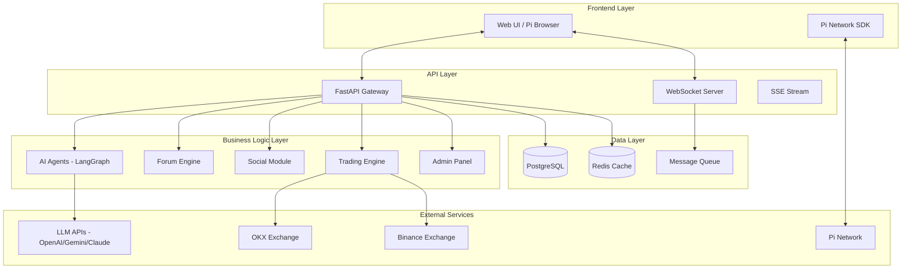

[ 🇹🇼 中文版 (Chinese Version) ](README_CN.md)

# Pi Crypto Insight
## AI-Powered Crypto Analysis × Community Ecosystem

> **Combining AI-powered analysis with Pi Network payments to create the ultimate cryptocurrency community platform**

An open-source project by independent developers, building AI-Agents that autonomously plan, use tools, and solve complex problems — from underlying data acquisition and robust backend infrastructure to high-level agent logic design.

We are looking for technical partners, business collaborations, and development sponsorship to pioneer the AI wave together.

---

## Core Value Proposition

### Why Pi Crypto Insight?

| Advantage | Description |
|-----------|-------------|
| 🧠 **Agent V4 Architecture** | Interactive multi-market analysis (Crypto, US Stocks, TW Stocks) |
| 💬 **PTT-Style Community** | Comprehensive discussion boards with native Pi tipping |
| 💰 **Pi Ecosystem Integration** | Seamless Web3 payments for posting, tipping, and membership |
| 🔐 **Privacy-First Design** | User data sovereignty, secure transactions |

### Unique Selling Points

- **First AI analysis platform** integrated with Pi Network
- **Interactive Agent V4 System** — Human-in-the-loop (HitL) intelligent planning & negotiation
- **Multi-Market Support** — Seamless tracking across Crypto, US Stocks, and TW Stocks
- **Complete community ecosystem** — Discussion + Social + Trading
- **Real-time multi-exchange data** — OKX + Binance unified interface

---

## Market Opportunity

### Target Markets

| Segment | Opportunity |
|---------|-------------|
| **Crypto Investors** | Seeking AI-assisted decision-making tools |
| **Pi Network Users** | 45M+ users lacking practical ecosystem applications |
| **Chinese-speaking Finance Community** | Advanced experience beyond PTT/Dcard |

### Competitive Advantages

| Dimension | Pi Crypto Insight | Traditional Analysis Tools | Generic Forums |
|-----------|-------------------|---------------------------|----------------|
| AI Analysis Depth | Multi-agent debate system | Single model | None |
| Payment Integration | Pi Network native | Traditional payment | Ads/Subscription |
| Community Interaction | Posts + Tipping + Reputation | None | Basic features |
| Real-time Data | OKX + Binance | Single exchange | None |
| Privacy Protection | User data sovereignty | Centralized storage | Centralized |

### Entry Barriers

- Official Pi Network SDK integration certification
- Multi-exchange API integration expertise
- LangGraph AI agent technology accumulation

---

## Feature Highlights

### 🧠 Agent V4 Intelligent System

**Multi-Market Agent Architecture**

| Agent | Responsibility |
|-------|---------------|
| **Crypto Agent** | Cryptocurrency market data, on-chain analysis, and web3 news |
| **US Stock Agent** | NYSE/NASDAQ market data, SEC filings, and corporate news |
| **TW Stock Agent** | Taiwan market tickers, local institutional movements, and news |
| **Manager Agent** | Intelligent query classification and analysis flow orchestration |

**Interactive Plan Execution (Human-in-the-loop)**

```
User Query → [Manager Agent Classification]
                    ↓
        [Automatic Pre-research Data Gathering]
                    ↓
    [Propose Multi-step Execution Plan to User] ↔ User Negotiates/Modifies Plan
                    ↓
[Agents Execute Plan: Tech / Fundamentals / News]
                    ↓
          [Synthesize Final Report]
```

---

### Community Forum (PTT-Style)

**Board Categories**

| Board | Topics |
|-------|--------|
| 💎 Crypto | BTC, ETH, SOL, Altcoins |
| 📈 US Stocks | Tech stocks, ETFs, Options |
| 🏦 TW Stocks | TSMC, Financial stocks, ETFs |

**Interaction Mechanisms**

- **Post Categories** — Analysis / Questions / Tutorials / News / Discussion / Insights
- **Tag System** — #BTC #ETH #SOL for quick filtering
- **Voting** — Push (👍) / Boo (👎) affects author reputation
- **Pi Tipping** — Direct P2P transfers to authors

---

### Social Features

| Feature | Description |
|---------|-------------|
| **Friend System** | Add friends, block users, view status |
| **Private Messaging** | Real-time chat (PRO members) |
| **Notification Center** | Friend requests, tips, system announcements |
| **Watchlist** | Track favorite cryptocurrencies |

---

### Administration & Governance

- **Admin Panel** — User management, content moderation, statistics dashboard
- **Scam Tracker** — Community reporting of suspicious content
- **Governance Voting** — Community decision-making
- **Audit Logs** — Complete operation records

---

### Market Data

| Feature | Description |
|---------|-------------|
| **Live Tickers** | Real-time quotes via WebSocket |
| **Multi-Exchange** | OKX + Binance unified interface |
| **Professional Charts** | Financial-grade candlestick charts |
| **Funding Rates** | Futures market data |

---

## Technical Architecture

### System Architecture



### Core Technology Stack

| Layer | Technology | Purpose |
|-------|------------|---------|
| **Backend Framework** | FastAPI | High-performance async API |
| **AI Orchestration** | LangGraph | Multi-agent workflow |
| **LLM Integration** | LangChain + OpenRouter | Multi-model support |
| **Database** | PostgreSQL | Structured data storage |
| **Caching** | Redis | Market data caching |
| **Real-time Communication** | WebSocket + SSE | Bidirectional real-time push |
| **Frontend** | HTML5 + Tailwind CSS | Responsive interface |
| **Charts** | Lightweight Charts | Financial-grade charts |
| **Payments** | Pi Network SDK | Native Pi payments |

### Technical Highlights

**1. LangGraph Multi-Agent System**
- Parallel analysis from multiple perspectives
- Bull vs Bear debate mechanism
- Judge agent for balanced conclusions
- Risk manager for position sizing

**2. Real-time Data Architecture**
- WebSocket for bidirectional communication (messaging, notifications)
- SSE for unidirectional push (market quotes)
- Redis caching for hot data (< 100ms response)

**3. Modular Design**
- Independent API routers for each feature
- Horizontally scalable stateless architecture
- Multi-worker deployment support

---

## Business Model

### Membership Tiers

| Feature | Free Member | PRO Member |
|---------|:-----------:|:----------:|
| Read Posts | ✅ | ✅ |
| View AI Analysis | ✅ | ✅ |
| Comment/Vote | ✅ 20/day | ✅ Unlimited |
| Create Posts | 💰 1 Pi/post | ✅ Free |
| Tip Authors | ✅ | ✅ |
| Private Messaging | ❌ | ✅ |
| AI Long-term Memory | ❌ | ✅ |
| Friend System | ✅ | ✅ |
| Notification Center | ✅ | ✅ |

### Revenue Streams

```
┌─────────────────────────────────────────────┐
│              Revenue Model                   │
├─────────────────────────────────────────────┤
│  💰 Post Fees      1 Pi/post for Free users │
│  💎 PRO Subscription  Monthly/Yearly (Pi)   │
│  🔥 Future          Paid columns, AI API    │
└─────────────────────────────────────────────┘
```

### Pi Network Integration Advantages

| Aspect | Advantage |
|--------|-----------|
| **User Base** | 45M+ Pi users, ready-made market |
| **Payment Experience** | Native SDK, one-click payment |
| **Transaction Fees** | Far lower than traditional payment |
| **Ecosystem Position** | One of few finance applications on Pi Network |

---

## Core Team

| Member | Expertise | Core Responsibilities |
|--------|-----------|----------------------|
| **Yu-Hao Chen** | LLM & AI-Agent Architect | LLM application architecture, AI agent workflow design, Prompt Engineering |
| **Hung-Yu Lai** | Intelligent Data Retrieval | Financial data crawling, data cleaning, real-time information flow design |
| **Po-Chun Shih** | Backend & Infra Engineer | High-concurrency backend architecture, database optimization, system stability |
| **Wang-Ting Sheng** | Backend Engineer | API development, Docker containerization, cloud deployment |

### Team Advantages

- **Full-Stack Capability** — Complete coverage from AI models to backend architecture
- **Finance Background** — Familiar with cryptocurrency and traditional financial markets
- **Agile Development** — Rapid iteration, continuous value delivery

---

## Collaboration & Sponsorship

We welcome developers worldwide to exchange ideas, commission projects, or support our R&D through cryptocurrency.

**This is an independent open-source project and is not affiliated with any institution.**

### Crypto Donation

| Currency | Address |
|----------|---------|
| **BTC** | `bc1qze054pw29crex29rzus80e6gjtzmcrvd60qfkc` |
| **ETH (ERC-20)** | `0x37332CEAe1eb3AcD3a76c2dA54B8D586448F1db9` |
| **USDT (ERC-20)** | `0x37332ceae1eb3acd3a76c2da54b8d586448f1db9` |

### Contact Us

Contact team members via email, or start a discussion on GitHub.

---

## License

This project is licensed under the [Apache License 2.0](LICENSE).

---

### Trademark Disclaimer

The **Pi Network** logo and name are trademarks of **Pi Network**. This project is an independent community contribution and is not affiliated with, endorsed by, or sponsored by the **Pi Core Team**.

---

*"Collaborating to build intelligence that acts, not just talks."*

**Last Updated**: 2025-02
