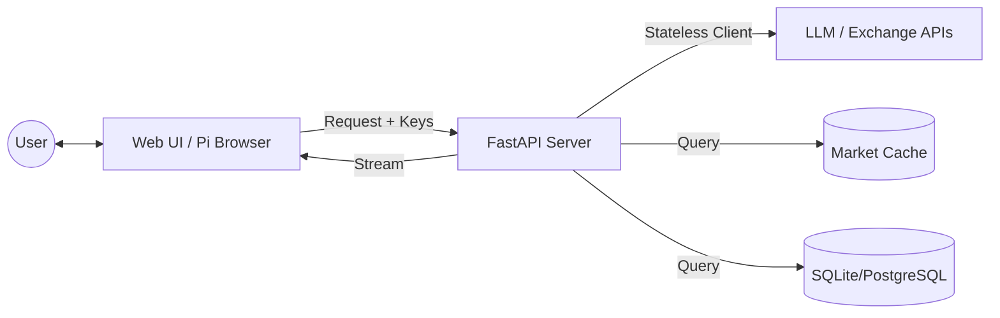

[ 🇹🇼 中文版 (Chinese Version) ](README_CN.md)

# Pi Crypto Insight: AI-Powered Crypto Analysis + Community Forum

An open-source project by independent developers, building AI-Agents that autonomously plan, use tools, and solve complex problems — from underlying data acquisition and robust backend infrastructure to high-level agent logic design.

We are looking for technical partners, business collaborations, and development sponsorship to pioneer the AI wave together.

---

## 🌟 What's New

### 🗣️ Community Forum (PTT-Style)
A cryptocurrency discussion forum integrated with Pi Network payments:
- **Board System** — Organized by topic (Crypto, US Stocks, TW Stocks)
- **Post Categories** — Analysis, Questions, Tutorials, News, Discussion, Insights
- **Tag System** — #BTC #ETH #SOL for content discovery
- **Voting** — Push (👍) and Boo (👎) mechanism
- **Pi Payments** — 1 Pi to post, tip authors directly

### 💎 Membership Tiers
| Feature | Guest | Free | PRO |
|---------|-------|------|-----|
| Read Posts | ✅ | ✅ | ✅ |
| Comment/Vote | ❌ | ✅ (20/day) | ✅ Unlimited |
| Create Posts | ❌ | 1 Pi/post | ✅ Free |
| Tip Authors | ❌ | ✅ | ✅ |
| Private Messages | ❌ | ❌ | ✅ |
| AI Long-term Memory | ❌ | ❌ | ✅ |

### 🔗 Pi Network Integration
- Native Pi SDK payment flow
- Post fee collection (1 Pi)
- P2P tipping (author receives directly)
- Transaction hash tracking

---

## 🛠 Our Team & Expertise

| Member | Technical Expertise | Core Area | Contact |
|--------|---------------------|-----------|---------|
| Yu-Hao Chen | LLM & AI-Agent Architect | LLM frameworks, AI-Agents workflow, Prompt Engineering | a29015822@gmail.com |
| Hung-Yu Lai | Intelligent Data Retrieval | Financial crawling, data cleaning, dynamic information flow | howard880729@gmail.com |
| Po-Chun Shih | Backend & Infra Engineer | High-concurrency backend, database optimization | williampcs0203@mail.com |
| Wang-Ting Sheng | Backend Engineer | Spring Boot & Django, Docker, Cloud Deployment | s04240046gothu@gmail.com |

---

## 🏗️ System Architecture

### Key Features

#### 1. Privacy-First Architecture (BYOK)
- **Bring Your Own Key (LLM)**: Users provide their own API keys (OpenAI, Gemini, OpenRouter). Keys stored in browser `localStorage`, never on server.
- **Secure OKX Integration**: Session-based API credentials, stateless connectors destroyed after each request.

#### 2. Multi-Tiered Analysis Agent System (LangGraph)
- **Analyst Team**: Technical, sentiment, fundamental, and news analysts working in parallel.
- **Committee Debate**: Bull vs Bear researchers debate market trends.
- **Risk Management**: Automated stop-loss, take-profit, and position sizing.

#### 3. Community Forum
- **Pi-Powered Posts**: Pay 1 Pi to publish (PRO members free)
- **Tipping System**: Direct P2P Pi transfers to authors
- **Reputation System**: Voting affects author credibility

#### 4. Market Intelligence
- **Intelligent Caching**: Market Pulse data cached, <100ms response for BTC, ETH, SOL
- **Live Tickers**: Real-time price updates via WebSocket
- **Multi-Exchange Core**: Unified data from OKX and Binance

### Architecture Diagram


---

## 🛠️ Technology Stack

- **Backend**: FastAPI, LangGraph, Pydantic, Pandas, Gunicorn
- **Frontend**: HTML5, Tailwind CSS, Vanilla JS, Lucide Icons
- **AI Models**: GPT-4o, Gemini 1.5 Pro, Claude 3.5 (via OpenRouter)
- **Visualization**: Lightweight Charts, Chart.js
- **Real-time**: WebSocket, Server-Sent Events (SSE)
- **Database**: SQLite (dev), PostgreSQL (production)
- **Payments**: Pi Network SDK

---

## ⚙️ Quick Start

### Development Mode

1. **Install Dependencies**:
   ```bash
   pip install -r requirements.txt
   ```

2. **Configure Environment**:
   Create a `.env` file (see `.env.example`). Note: LLM and OKX keys are provided via the Web UI.

3. **Run the Server**:
   ```bash
   python api_server.py
   ```

4. **Access the UI**:
   Open `http://localhost:8111`, go to **Settings**, and enter your API keys.

### Production Mode

For high-availability multi-worker deployment:

```bash
# Linux/macOS
chmod +x start_production.sh
./start_production.sh start

# Windows (Git Bash/WSL)
bash start_production.sh start
```

**Production Features:**
- ✅ Multi-worker processes (horizontal scaling)
- ✅ Automatic restart on failure
- ✅ Health check endpoints (`/health`, `/ready`)
- ✅ Structured logging

**See [Production Deployment Guide](docs/PRODUCTION_DEPLOYMENT.md) for details.**

---

## 🗺️ Roadmap

### Phase 1 (Current) ✅
- [x] Crypto discussion board
- [x] Post/Comment/Vote system
- [x] Tag system
- [x] Pi payment integration (post fee, tipping)
- [x] Membership tiers
- [x] Production deployment (Gunicorn)

### Phase 2 (Planned)
- [ ] US/TW Stock boards
- [ ] Friend system & private messaging
- [ ] Author reputation/accuracy tracking
- [ ] Embedded real-time price cards in posts

### Phase 3 (Future)
- [ ] **Paid Columns** — Creators monetize content via Pi subscriptions
- [ ] **Prediction Challenges** — Users predict prices, system tracks accuracy
- [ ] **NFT Achievement Badges** — Mint achievements as tradeable NFTs
- [ ] **Copy Trading Signals** — Verified traders share strategies
- [ ] **AI API Marketplace** — Purchase LLM credits with Pi

---

## 🤝 Collaboration & Sponsorship

We welcome developers worldwide to exchange ideas, commission projects, or support our R&D through cryptocurrency.

**This is an independent open-source project and is not affiliated with any institution.**

## 💎 Crypto Donation

- **BTC**: bc1qze054pw29crex29rzus80e6gjtzmcrvd60qfkc
- **ETH (ERC-20)**: 0x37332CEAe1eb3AcD3a76c2dA54B8D586448F1db9
- **USDT (ERC-20)**: 0x37332ceae1eb3acd3a76c2da54b8d586448f1db9

## 📩 Contact Us

Contact members via Email above or start a discussion on GitHub.

---

## 📄 License

This project is licensed under the [Apache License 2.0](LICENSE).

---

### ⚠️ Trademark Disclaimer

The **Pi Network** logo and name are trademarks of **Pi Network**. This project is an independent community contribution and is not affiliated with, endorsed by, or sponsored by the **Pi Core Team**.

---

*"Collaborating to build intelligence that acts, not just talks."*

**Last Updated**: 2026-01-24
