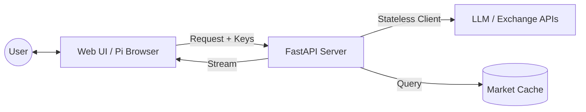

[ 🇹🇼 中文版 (Chinese Version) ](README_CN.md)

# Building the Future with AI-Agents, Intelligent Data, and Scalable Infrastructure

This is an open-source project maintained by independent developers, dedicated to evolving Large Language Models (LLMs) from simple chat interfaces into AI-Agents capable of autonomous planning, tool usage, and solving complex problems. From underlying data acquisition and robust backend infrastructure to high-level agent logic design, we are building a complete AI ecosystem loop.

We are looking for technical partners, business collaborations, and development sponsorship to pioneer the AI wave together.

## 🛠 Our Team & Expertise

We are a team of independent developers with complementary expertise, covering the three core areas of AI development:

| Member | Technical Expertise | Core Area | Contact |
|--------|---------------------|-----------|---------|
| Yu-Hao Chen | LLM & AI-Agent Architect | Specializes in LLM application frameworks, autonomous agent (AI-Agents) workflow design, and Prompt Engineering. | a29015822@gmail.com |
| Hung-Yu Lai | Intelligent Data Retrieval | Specializes in precision financial crawling, data cleaning, and dynamic information flow to provide high-quality knowledge bases for AI. | howard880729@gmail.com |
| Po-Chun Shih | Backend & Infra Engineer | Responsible for high-concurrency backend architecture, database maintenance, and optimization to support the large-scale computing needs of AI agents. | williampcs0203@mail.com |
| Wang-Ting Sheng | Backend Engineer | Spring Boot & Django API Development, Docker,Cloud DeploymentM, Databases | s04240046gothu@gmail.com |

## 🌟 Our Focus Directions

- **AI-Agent Ecosystem**: Developing autonomous agents with self-correction and tool-calling capabilities.
- **Intelligent Financial Data**: Combining LLMs with financial crawlers to achieve automated market analysis and information extraction.
- **High-Performance AI Backend**: Providing a stable and scalable runtime environment for complex AI logic.

## 🤝 Collaboration, Join Us, or Sponsor | Support Our Vision

We welcome developers from around the world to exchange ideas, commission corporate projects, or support our R&D work through cryptocurrency. Your sponsorship funds will be used directly to purchase LLM-related APIs, rent small servers, and other infrastructure, allowing us to explore more technical possibilities and continuously optimize the performance and functions of AI-Agents.

**This is an independent open-source project and is not affiliated with any institution.**

## 📩 Contact Us

Welcome to contact members via the above Emails or start a discussion on GitHub.

## 💎 Crypto Donation

- **BTC**: bc1qze054pw29crex29rzus80e6gjtzmcrvd60qfkc
- **ETH (ERC-20)**: 0x37332CEAe1eb3AcD3a76c2dA54B8D586448F1db9
- **USDT (ERC-20)**: 0x37332ceae1eb3acd3a76c2da54b8d586448f1db9

## 🏗️ System Architecture & Technical Details: Pi Crypto Insight

This is an advanced cryptocurrency trading system based on AI agents, featuring a modern **FastAPI** backend and a **Pi Network-inspired** mobile-first web interface.

### 🌟 Key Features

#### 1. Privacy-First Architecture (BYOK)
- **Bring Your Own Key (LLM)**: Users provide their own API keys (OpenAI, Gemini, OpenRouter). Keys are stored in the browser's `localStorage` and never saved on the server.
- **Secure OKX Integration**: Trading and asset management use a session-based approach. API credentials travel via secure headers and are used to create temporary, stateless connectors that are destroyed after each request.
- **Incognito-Ready**: No persistent server-side storage of user credentials ensures privacy even on shared devices.

#### 2. Modern Web Interface (Pi App Style)
- **Mobile-First Design**: Optimized for Pi Browser and mobile devices with a sleek, dark-mode aesthetic.
- **Real-time Streaming (SSE)**: AI responses are streamed character-by-character for a smooth, conversational experience.
- **Interactive Charts**: Integrated with Lightweight Charts and Chart.js for real-time market visualization.

#### 3. Multi-Tiered Analysis Agent System (LangGraph)
- **Analyst Team**: Technical, sentiment, fundamental, and news analysts working in parallel.
- **Committee Debate**: Multi-model consensus system where "Bull" and "Bear" researchers debate market trends.
- **Risk Management**: Automated evaluation of stop-loss, take-profit, and position sizing.

#### 4. Market Intelligence & Performance
- **Intelligent Caching**: Market Pulse data is cached and updated periodically. Users see near-instant reports (<100ms) for major assets like BTC, ETH, and SOL.
- **Live Tickers**: Real-time price updates via WebSocket.
- **Multi-Exchange Core**: Unified data fetching from OKX and Binance with automatic symbol normalization.

### 🏗️ System Architecture

#### High-Level Data Flow


#### Agent System Workflow (LangGraph)
1. **Data Prep**: Aggregates OHLCV, Indicators, and News.
2. **Analysis**: Parallel processing by specialized AI analysts.
3. **Debate**: Competitive reasoning between Bull/Bear models.
4. **Decision**: Synthesized trading advice with risk checks.
5. **Approval**: Final fund manager review.

### 🔧 Core File Descriptions

#### Backend & Core Logic
- `api_server.py` - FastAPI entry point and server configuration.
- `api/routers/` - Modular API endpoints (analysis, market, trading, system).
- `core/graph.py` - LangGraph workflow definition for deep analysis.
- `interfaces/chat_interface.py` - Orchestrator for handling chat logic and agent routing.
- `utils/user_client_factory.py` - Factory for creating stateless, user-specific LLM clients.
- `utils/okx_auth.py` - Authentication middleware for handling user-provided exchange credentials.

#### Data & Analysis
- `data/data_fetcher.py` - Standardized data acquisition from OKX/Binance.
- `data/indicator_calculator.py` - Technical indicator calculations (RSI, MACD, etc.).
- `analysis/market_pulse.py` - Core logic for background market monitoring and caching.
- `analysis/crypto_screener.py` - Market scanning and anomaly detection.

#### Frontend Assets
- `web/index.html` - The main SPA interface.
- `web/js/` - Modular frontend logic (chat, market, okxKeyManager, apiKeyManager).
- `web/styles.css` - Custom Pi-themed Tailwind configuration.

### 🛠️ Technology Components

- **Backend**: FastAPI, LangGraph, Pydantic, Pandas.
- **Frontend**: HTML5, Tailwind CSS, Vanilla JS, Lucide Icons.
- **AI Models**: GPT-4o, Gemini 1.5 Pro, Claude 3.5 (via OpenRouter).
- **Visualization**: Lightweight Charts, Chart.js.
- **Real-time**: WebSocket, Server-Sent Events (SSE).

### ⚙️ Quick Start

1. **Install Dependencies**:
   ```bash
   pip install -r requirements.txt
   ```

2. **Configure Environment**:
   Create a `.env` file (see `.env.example`). Note: LLM and OKX keys are now provided via the Web UI.

3. **Run the Server**:
   ```bash
   python api_server.py
   ```

4. **Access the UI**:
   Open `http://localhost:8111` in your browser, go to **Settings**, and enter your API keys to get started.

## 📄 License

This project is licensed under the [Apache License 2.0](LICENSE).

---

### ⚠️ Trademark Disclaimer

The **Pi Network** logo and name are trademarks of the **Pi Network**. This project is an independent community contribution and is not affiliated with, endorsed by, or sponsored by the **Pi Core Team**. 

The use of the Pi Network logo and related assets in the UI is for decorative and identification purposes within the Pi Browser ecosystem only. The developers of this project do not claim any ownership over Pi Network trademarks.

---

"Collaborating to build intelligence that acts, not just talks."

Let's define the next decade of AI together.
