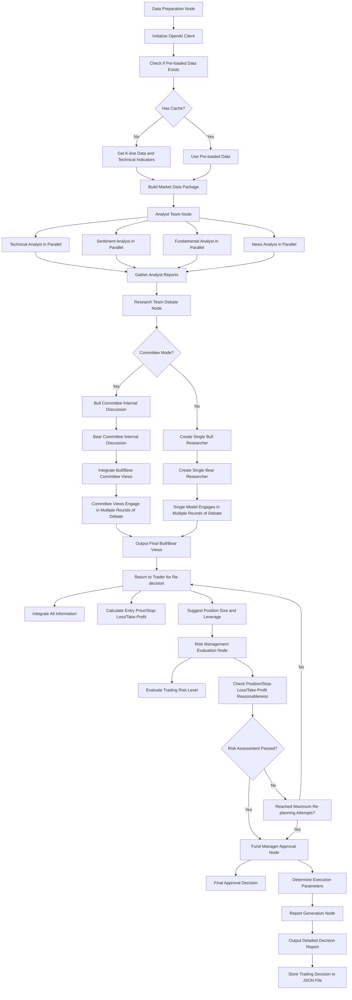

[ 🇹🇼 中文版 (Chinese Version) ](README_CN.md)

# Building the Future with AI-Agents, Intelligent Data, and Scalable Infrastructure

This is an open-source project maintained by independent developers, dedicated to evolving Large Language Models (LLMs) from simple chat interfaces into AI-Agents capable of autonomous planning, tool usage, and solving complex problems. From underlying data acquisition and robust backend infrastructure to high-level agent logic design, we are building a complete AI ecosystem loop.

We are looking for technical partners, business collaborations, and development sponsorship to pioneer the AI wave together.

## 🛠 Our Team & Expertise

We are a team of independent developers with complementary expertise, covering the three core areas of AI development:

| Member | Technical Expertise | Core Area | Contact |
|--------|---------------------|-----------|---------|
| Yu-Hao Chen | LLM & AI-Agent Architect | Specializes in LLM application frameworks, autonomous agent (AI-Agents) workflow design, and Prompt Engineering. | Email |
| Hung-Yu Lai | Intelligent Data Retrieval | Specializes in precision financial crawling, data cleaning, and dynamic information flow to provide high-quality knowledge bases for AI. | Email |
| Po-Chun Shih | Backend & Infra Engineer | Responsible for high-concurrency backend architecture, database maintenance, and optimization to support the large-scale computing needs of AI agents. | Email |

## 🌟 Our Focus Directions

- **AI-Agent Ecosystem**: Developing autonomous agents with self-correction and tool-calling capabilities.
- **Intelligent Financial Data**: Combining LLMs with financial crawlers to achieve automated market analysis and information extraction.
- **High-Performance AI Backend**: Providing a stable and scalable runtime environment for complex AI logic.

## 🤝 Collaboration, Join Us, or Sponsor | Support Our Vision

We welcome developers from around the world to exchange ideas, commission corporate projects, or support our R&D work through cryptocurrency. Your sponsorship funds will be used directly to purchase LLM-related APIs, rent small servers, and other infrastructure, allowing us to explore more technical possibilities and continuously optimize the performance and functions of AI-Agents.

**This is an independent open-source project and is not affiliated with any institution.**

## 📩 Contact Us

Welcome to contact members via the above Emails or start a discussion on GitHub.

## 💎 Crypto Donation

- **BTC**: bc1qze054pw29crex29rzus80e6gjtzmcrvd60qfkc
- **ETH (ERC-20)**: 0x37332CEAe1eb3AcD3a76c2dA54B8D586448F1db9
- **USDT (ERC-20)**: 0x37332ceae1eb3acd3a76c2da54b8d586448f1db9

## 🏗️ System Architecture & Technical Details

This is an advanced cryptocurrency trading system based on AI agents, using a multi-tiered analysis architecture that integrates technical analysis, sentiment analysis, fundamental analysis, and news analysis, and performs bull/bear debates and risk management through machine learning models.

### 🌟 Key Features

#### 1. Multi-Tiered Analysis Agent System
- **Analyst Team**: Technical analyst, sentiment analyst, fundamental analyst, news analyst
- **Research Team**: Bull researcher and bear researcher conducting debates
- **Trader**: Integrates information to make trading decisions
- **Risk Manager**: Evaluates risks and controls exposure
- **Fund Manager**: Final approval and execution

#### 2. Cross-Exchange Compatibility
- **Automatic Symbol Format Conversion**: System automatically adapts to different exchange symbol formats (Binance: "PIUSDT" ↔ OKX: "PI-USDT")
- **Multi-Exchange Support**: Seamless switching between exchanges like Binance, OKX
- **Backup Mechanism**: Automatically tries backup exchanges when primary exchange cannot find symbol
- **Unified Data Interface**: Standardizes data formats across different exchanges to ensure analysis consistency

#### 3. Intelligent Debate Mechanism
- Bulls and bears researchers engage in multiple rounds of debate
- Supports committee mode (multiple models form a committee)
- Automatically adjusts model confidence and arguments

#### 4. Dual Market Analysis
- **Spot Market**: Traditional buy/sell operations
- **Futures Market**: Supports leverage and bidirectional trading
- Independent analysis but cross-validation possible

#### 5. Fully Automated Risk Management
- Dynamic position adjustment
- Automatic stop-loss and take-profit calculation
- Leverage risk assessment
- Funding rate consideration

#### 6. Smart Caching and Data Optimization
- **LLM Cache Mechanism**: Uses `utils/llm_cache.py` to cache LLM request results, default 1-hour expiration time
- **Data Pre-loading Mechanism**: Avoids duplicate downloads and enables spot and futures analysis to share the same dataset
- **News Data Optimization**: Gets latest news on each execution to avoid outdated news data

### 🏗️ System Architecture

#### Agent System Workflow (LangGraph)


#### Agent Hierarchy Structure
1. **Tier 1: Analyst Team** (4 parallel agents)
   - Technical Analyst: Analyzes K-lines, indicators, trends
   - Sentiment Analyst: Evaluates market sentiment and participation
   - Fundamental Analyst: Evaluates long-term value and structure
   - News Analyst: Analyzes market news and event impact

2. **Tier 2: Research Team** (2 agents debating)
   - Bull Researcher: Supports bullish view
   - Bear Researcher: Supports bearish view
   - Supports multiple rounds of debate and committee mode

3. **Tier 3: Trader**
   - Integrates all information to make trading decisions
   - Calculates entry price, stop-loss price, take-profit price
   - Determines position size and leverage multiplier

4. **Tier 4: Risk Manager**
   - Evaluates trading risk level
   - Controls position and leverage
   - Decides whether to approve trading

5. **Tier 5: Fund Manager**
   - Final approval and execution
   - Determines final execution parameters

### 🔧 Core File Descriptions

#### Required Core Files
- `core/main.py` - System entry point
- `core/graph.py` - LangGraph workflow definition
- `core/agents.py` - All AI agent implementations
- `core/models.py` - Data model definitions (Pydantic)
- `core/config.py` - System configuration and AI model settings
- `data/data_fetcher.py` - Exchange data acquisition
- `data/data_processor.py` - Data processing and indicator calculations
- `data/indicator_calculator.py` - Technical indicator calculator
- `analysis/reporting.py` - Report generation
- `trading/okx_api_connector.py` - OKX exchange API connector

#### Tools/Utility Files
- `utils/llm_client.py` - LLM client management
- `utils/llm_cache.py` - LLM result caching mechanism
- `utils/retry_utils.py` - Retry mechanism utilities
- `utils/utils.py` - General utility functions
- `utils/settings.py` - System settings parameters

#### Analysis Module
- `analysis/crypto_screener.py` - Cryptocurrency screener
- `analysis/backend_analyzer.py` - Backend analysis engine (generates JSON-format trading decisions, supports GUI-free background running)
- `analysis/batch_analyzer.py` - Batch analyzer

#### Interface-Related Files
- `interfaces/chat_interface.py` - Chat interface
- `interfaces/run_chat.py` - Run chat interface
- `interfaces/batch_analyzer_app.py` - Batch analysis application interface

#### Trading-Related Files
- `trading/okx_api_connector.py` - OKX exchange API connector
- `trading/okx_auto_trader.py` - OKX auto trading executor

#### Test Files
- `tests/test_backend_analyzer.py` - Backend analyzer tests
- `tests/test_multi_source_news.py` - Multi-source news analysis tests
- `tests/test_pi_analysis.py` - PI Network analysis tests
- `tests/validate_backend_json.py` - Backend JSON output validation

#### Configuration and Documentation Files
- `requirements.txt` - Project dependency package list
- `NEWS_SOURCES_GUIDE.md` - News source setup guide

#### Backend Analysis Functionality
- `analysis/backend_analyzer.py` - Backend analysis core module
  - `BackendAnalyzer` class: Provides backend analysis functionality
  - `analyze_symbol()` method: Analyzes single cryptocurrency and returns JSON format decision
  - `analyze_multiple_symbols()` method: Batch analyzes multiple cryptocurrencies
  - `save_decision_to_json()` method: Saves decision result to JSON file
  - `run_backend_analysis()` function: Main function for executing backend analysis
  - `run_batch_backend_analysis()` function: Executes batch backend analysis

#### Data Processing Functionality
- `data/indicator_calculator.py` - Technical indicator calculation module
  - RSI, MACD, Bollinger Bands, moving averages and other indicators calculation
  - Outlier detection and data validation

#### Exchange Data Acquisition Functionality
- `data/data_fetcher.py` - Exchange data acquisition module
  - Supports multi-exchange data acquisition (Binance, OKX)
  - Automatic symbol availability checking
  - Spot and futures market data acquisition
  - OKX API error handling and retry mechanism
  - Different exchange K-line data format standardization

#### Interface Application Functionality
- `interfaces/batch_analyzer_app.py` - Batch analysis interface application
  - Supports simultaneous analysis of multiple coins
  - Provides graphical operation interface
  - Export analysis results functionality

#### Symbol Format Conversion Functionality
- `analysis/batch_analyzer.py` - Automatic symbol format conversion
  - Automatically converts Binance format symbols (e.g. "PIUSDT") to target exchange format (e.g. "PI-USDT" on OKX)
  - Supports bidirectional conversion between Binance ↔ OKX formats
  - Main conversion rule: Binance format without separator (BTCUSDT) converts to OKX format with separator (BTC-USDT)
  - Error handling: Automatically tries backup exchange when primary exchange cannot find symbol

#### Trading Execution Functionality
- `trading/okx_auto_trader.py` - Auto trading executor
  - Import JSON trading decisions
  - Execute actual buy/sell orders
  - Risk control and order management

#### Test Validation Functionality
- `tests/validate_backend_json.py` - JSON format validation tool
  - Validates backend analyzer output format
  - Checks decision data integrity
- `tests/test_backend_analyzer.py` - Backend analyzer function tests
- `tests/test_multi_source_news.py` - Multi-source news analysis accuracy tests
- `tests/test_pi_analysis.py` - PI Network related analysis tests

#### System Support Functions
- `utils/llm_cache.py` - LLM result caching mechanism
  - Reduces API request frequency
  - Speeds up repeated analysis
  - Cache result validation mechanism
  - Default cache duration: 1 hour (3600 seconds)
  - Cache directory: .llm_cache
- `interfaces/chat_interface.py` - Data pre-loading mechanism
  - Avoids duplicate downloads for spot and futures analysis
  - Unifies news data acquisition within single execution
  - Supports data sharing during parallel analysis

#### Output Files
- `trading_decisions_*.json` - Trading decision archives
  - Contains detailed decisions for spot and futures markets
  - Includes risk assessment and technical indicator information

### 🛠️ Technology Components

#### Dependencies
- `openai`: AI model integration
- `langgraph`: Agent state machine management
- `pandas`: Data processing
- `numpy`: Numerical computation
- `python-dotenv`: Environment variable management
- `requests`: API communication
- `cachetools`: Caching tools (for interface caching and LLM result caching)

#### Supported AI Model Platforms
- **OpenAI**: GPT-4o, GPT-4o mini, o4-mini
- **Google Gemini**: Gemini 2.5 Flash, Gemini 1.5 Pro
- **OpenRouter**: Multiple model providers
- **Local LLM**: Supports local models running via vLLM, Ollama, LM Studio, etc. (OpenAI-compatible interface)

#### Supported Exchanges
- **Binance**: Spot and futures markets
- **OKX**: Spot and perpetual futures markets
- **Automatic Symbol Format Conversion**: System automatically handles symbol format differences across exchanges (e.g. Binance format "PIUSDT" automatically converts to OKX format "PI-USDT")
- Expandable support for other exchanges

### ⚙️ Configuration Instructions

#### Environment Variables Configuration
Set the following variables in the `.env` file:

```env
# OpenAI API
OPENAI_API_KEY=your_openai_api_key

# Google Gemini API
GOOGLE_API_KEY=your_google_api_key

# OpenRouter API
OPENROUTER_API_KEY=your_openrouter_api_key

# OKX API (for actual trading)
OKX_API_KEY=your_okx_api_key
OKX_API_SECRET=your_okx_api_secret
OKX_PASSPHRASE=your_okx_passphrase
OKX_BASE_URL=https://www.okx.com

# News API (optional)
NEWSAPI_KEY=your_newsapi_key
```

#### System Configuration (`config.py`)

##### AI Model Configuration
```python
# Base models (used for analyst team)
FAST_THINKING_MODEL = "gpt-4o"  # Used for data collection and quick analysis
DEEP_THINKING_MODEL = "o4-mini"  # Used for deep reasoning and decision-making
```

##### Multi-Model Debate Configuration
- `ENABLE_MULTI_MODEL_DEBATE`: Enable multi-model debate or not
- `ENABLE_COMMITTEE_MODE`: Enable committee mode or not

##### Committee Mode Configuration
```python
# Bull Committee Models
BULL_COMMITTEE_MODELS = [
    {"provider": "openai", "model": "gpt-4o-mini"},
    {"provider": "google_gemini", "model": "gemini-2.5-flash"},
    {"provider": "local", "model": "llama-3-8b-instruct"},  # Local model example
]
```

##### Local Model Configuration
```python
# For connecting to vLLM, Ollama, etc.
LOCAL_LLM_CONFIG = {
    "base_url": "http://0.0.0.0:8080/v1",
    "api_key": "not-needed",
    "temperature": 0.1,
}
```

##### Trading Limit Configuration
```python
# Investment amount limits (USDT)
MINIMUM_INVESTMENT_USD = 20  # Minimum investment amount
MAXIMUM_INVESTMENT_USD = 50.0  # Maximum investment amount
EXCHANGE_MINIMUM_ORDER_USD = 1.0  # Exchange minimum order amount
```

### 📊 Trading Strategy

#### Analysis Dimensions
1. **Technical Analysis**
   - Support and resistance levels
   - Trend line analysis
   - Indicators like RSI, MACD, Bollinger Bands
   - Volume analysis

2. **Sentiment Analysis**
   - Market fear and greed index
   - Trading volume anomaly detection
   - Liquidity analysis

3. **Fundamental Analysis**
   - Project fundamentals
   - Development activity monitoring
   - Supply changes

4. **News Events**
   - Major news impact
   - Regulatory news
   - Technical updates

#### Risk Control
- **Position Management**: Dynamically adjust position size
- **Stop-Loss**: Multiple stop-loss strategies (ATR, percentage, technical levels)
- **Take-Profit**: Risk-reward ratio management (1:2, 1:3)
- **Leverage Control**: Dynamically adjust based on volatility

---

"Collaborating to build intelligence that acts, not just talks."

Let's define the next decade of AI together.
