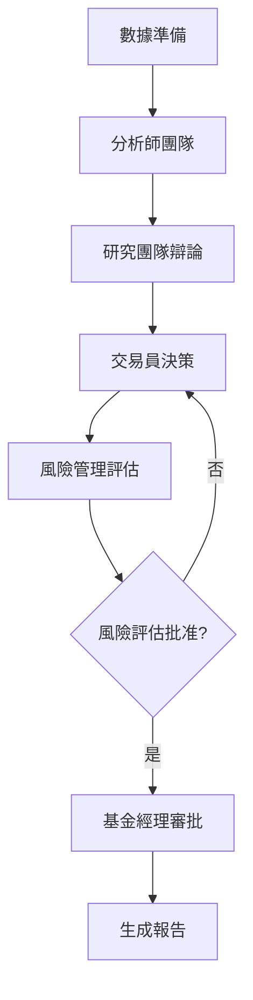

# AI 加密貨幣智能交易系統

## 概述

這是一個基於 AI 代理（Agent）的先進加密貨幣交易系統，採用多層級分析架構，整合了技術分析、情緒分析、基本面分析和新聞分析，並通過機器學習模型進行多空辯論與風險管理。

## 🌟 核心特性

### 1. 多層級分析代理系統
- **分析師團隊**：技術分析師、情緒分析師、基本面分析師、新聞分析師
- **研究團隊**：多頭研究員與空頭研究員進行辯論
- **交易員**：整合資訊做出交易決策
- **風險經理**：評估風險並控制敞口
- **基金經理**：最終審批與執行

### 2. 智能辯論機制
- 多頭與空頭研究員進行多輪辯論
- 支援委員會模式（多個模型組成委員會）
- 自動調整模型信心度與論點

### 3. 雙市場分析
- **現貨（Spot）市場**：傳統買賣操作
- **合約（Futures）市場**：支援槓桿與雙向交易
- 獨立分析但可交叉驗證

### 4. 全自動風險管理
- 動態倉位調控
- 止損止盈自動計算
- 槍槓桿風險評估
- 資金費率考量

## 🏗️ 系統架構

### 工作流程（LangGraph）


### 代理層級結構
1. **第一層：分析師團隊** (4 個代理並行)
   - 技術分析師：分析 K 線、指標、趨勢
   - 情緒分析師：評估市場情緒與參與度
   - 基本面分析師：評估長期價值與結構
   - 新聞分析師：分析市場新聞與事件影響

2. **第二層：研究團隊** (2 個代理辯論)
   - 多頭研究員：支持看漲觀點
   - 空頭研究員：支持看跌觀點
   - 支援多輪辯論與委員會模式

3. **第三層：交易員**
   - 綜合所有資訊做出交易決策
   - 計算進場價、止損價、止盈價
   - 決定倉位大小與槓桿倍數

4. **第四層：風險管理員**
   - 評估交易風險等級
   - 控制倉位與槓桿
   - 決定是否批准交易

5. **第五層：基金經理**
   - 最終審批與執行
   - 決定最終執行參數

## 🛠️ 技術組件

### 依賴套件
- `openai`: AI 模型接入
- `langgraph`: 代理狀態機管理
- `pandas`: 數據處理
- `numpy`: 數值運算
- `python-dotenv`: 環境變數管理
- `requests`: API 通信

### 支援的 AI 模型平台
- **OpenAI**: GPT-4o, GPT-4o mini, o4-mini
- **Google Gemini**: Gemini 2.5 Flash, Gemini 1.5 Pro
- **OpenRouter**: 多家模型提供商

### 支援的交易所
- **Binance**: 現貨與期貨市場
- **OKX**: 現貨與永續合約市場
- 可擴展支持其他交易所

## ⚙️ 配置說明

### 環境變數配置
在 `.env` 文件中設置以下變數：

```env
# OpenAI API
OPENAI_API_KEY=your_openai_api_key

# Google Gemini API
GOOGLE_API_KEY=your_google_api_key

# OpenRouter API
OPENROUTER_API_KEY=your_openrouter_api_key

# OKX API (用於實際交易)
OKX_API_KEY=your_okx_api_key
OKX_API_SECRET=your_okx_api_secret
OKX_PASSPHRASE=your_okx_passphrase
OKX_BASE_URL=https://www.okx.com

# 新聞 API (可選)
NEWSAPI_KEY=your_newsapi_key
```

### 系統配置（`config.py`）

#### AI 模型配置
```python
# 基礎模型（用於分析師團隊）
FAST_THINKING_MODEL = "gpt-4o"  # 用於數據收集和快速分析
DEEP_THINKING_MODEL = "o4-mini"  # 用於深度推理和決策
```

#### 多模型辯論配置
- `ENABLE_MULTI_MODEL_DEBATE`: 是否啟用多模型辯論
- `ENABLE_COMMITTEE_MODE`: 是否啟用委員會模式

#### 委員會模式配置
```python
# 多頭委員會模型
BULL_COMMITTEE_MODELS = [
    {"provider": "openai", "model": "gpt-4o-mini"},
    {"provider": "google_gemini", "model": "gemini-2.5-flash"},
    # 可添加更多模型
]

# 空頭委員會模型
BEAR_COMMITTEE_MODELS = [
    {"provider": "openai", "model": "gpt-4o-mini"},
    {"provider": "google_gemini", "model": "gemini-2.5-flash"},
    # 可添加更多模型
]
```

## 📊 交易策略

### 分析維度
1. **技術分析**
   - 支撐壓力位
   - 趨勢線分析
   - RSI、MACD、布林帶等指標
   - 成交量分析

2. **情緒分析**
   - 市場恐慌貪婪指數
   - 交易量異常檢測
   - 流動性分析

3. **基本面分析**
   - 項目基本面向
   - 開發活動監控
   - 供應量變化

4. **新聞事件**
   - 重大新聞影響
   - 監管消息
   - 技術更新

### 風險控制
- **倉位管理**: 動態調整倉位大小
- **止損機制**: 多種止損策略（ATR、百分比、技術位）
- **止盈機制**: 風險回報比管理（1:2, 1:3）
- **槓桿控制**: 根據波動率動態調整

## 🚀 使用方法

### 命令行執行
```bash
# 分析單一交易對（預設 BTCUSDT）
python main.py --symbol BTCUSDT --interval 1d --limit 100

# 指定交易所（binance 或 okx）
python main.py --symbol ETHUSDT --exchange okx --interval 4h

# 指定槓桿倍數（合約市場）
python main.py --symbol BTCUSDT --interval 1h --leverage 10

# 篩選前30名加密貨幣
python main.py --screen

# 自訂 K 線數量
python main.py --symbol SOLUSDT --interval 15m --limit 200
```

### 參數說明
- `--symbol`: 交易對符號（預設: BTCUSDT）
- `--exchange`: 交易所（binance/okx，預設: binance）
- `--interval`: K 線時間週期（1m, 5m, 15m, 1h, 4h, 1d 等）
- `--limit`: 獲取的 K 線數量（預設: 100）
- `--leverage`: 合約市場槓桿倍數（預設: 5x）
- `--screen`: 對前30名加密貨幣進行篩選分析

### 範例執行
```bash
# 分析 BTCUSDT 4小時線，使用 10 倍槓桿
python main.py --symbol BTCUSDT --interval 4h --leverage 10 --limit 150

# 分析 Ethereum 在 OKX 交易所的日線
python main.py --symbol ETHUSDT --exchange okx --interval 1d
```

## 📈 運行流程

1. **數據獲取**
   - 從交易所獲取歷史 K 線數據
   - 收集技術指標與市場資訊
   - 獲取最新新聞事件

2. **分析師團隊並行工作**
   - 4 個分析師同時工作，提升效率
   - 生成多維度分析報告

3. **研究團隊辯論**
   - 多頭與空頭研究員基於分析報告進行辯論
   - 支援多輪互動，逐輪強化論點

4. **交易決策**
   - 交易員整合所有資訊做出買賣決策
   - 計算具體進場價、止損、止盈

5. **風險評估**
   - 風險管理員評估交易風險
   - 控制倉位與槓桿倍數
   - 可能要求重新規劃

6. **最終審批**
   - 基金經理最終批准
   - 確定執行參數

7. **生成報告**
   - 輸出詳細的決策報告
   - 包含所有層級的分析結果

## 📊 報告內容

### 分析師報告
- 各維度分析摘要
- 看漲與看跌論點
- 分析師信心度

### 辯論結果
- 多頭研究員觀點
- 空頭研究員觀點
- 各方信心度

### 交易決策
- 交易動作（買入/賣出/做多/做空/觀望）
- 進場價格
- 止損價格
- 止盈價格
- 倉位大小
- 槓桿倍數（合約）

### 風險評估
- 風險等級
- 風險警告
- 建議調整

### 最終批准
- 是否批准交易
- 執行指示
- 最終決策理由

## 🔧 自訂與擴展

### 添加新指標
在 `indicator_calculator.py` 中添加新的技術指標計算函數。

### 更改 AI 模型
在 `config.py` 中調整不同層級的模型配置：
- `FAST_THINKING_MODEL`: 用於快速分析的模型
- `DEEP_THINKING_MODEL`: 用於深度推理的模型

### 新增交易所支持
在 `data_fetcher.py` 中添加新的交易所數據獲取器。

## 🚨 風險提示

⚠️ **重要提示**: 
- 本系統僅供教育和研究用途
- 加密貨幣交易具有高風險，可能造成重大損失
- 請根據自身風險承受能力進行投資
- 任何 AI 預測都不是保證，市場可能隨時反轉
- 請務必設置適當的風險管理措施

## 📞 支援與貢獻

如需技術支援或有興趣貢獻代碼，請提交 issue 或 pull request。

## 📄 許可證

本項目採用 MIT 許可證。