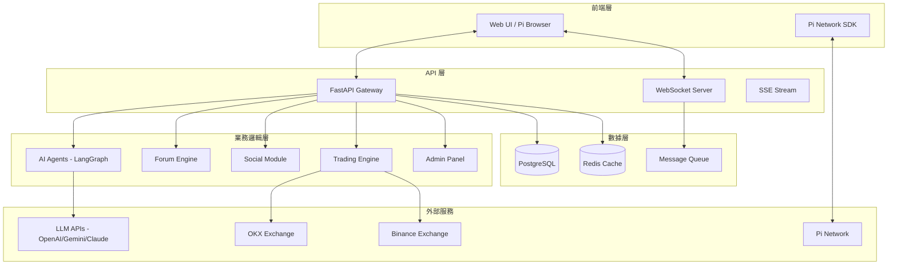

[ 🇺🇸 English Version ](README.md)

# Pi Crypto Insight
## AI 驅動的加密貨幣分析 × 社群生態系

> **結合 AI 智能分析與 Pi Network 支付的加密貨幣社群平台**

這是一個由獨立開發者維護的開源專案，致力於將大型語言模型 (LLM) 從簡單的對話框演進為能自主規劃、調用工具並解決複雜問題的 AI-Agents。從底層的數據採集、穩健的後端架構，到頂層的代理人邏輯設計，我們建構完整的 AI 生態閉環。

我們正在尋找技術夥伴、商務合作以及開發贊助，一同在 AI 浪潮中開疆闢土。

---

## 核心價值主張

### 為什麼選擇 Pi Crypto Insight？

| 優勢 | 說明 |
|------|------|
| 🧠 **AI 多代理分析** | 技術、情緒、基本面、新聞四維並行分析 |
| 💬 **PTT 風格社群** | 加密貨幣、美股、台股主題討論區 |
| 💰 **Pi 生態整合** | 發文、打賞、會員全鏈支付 |
| 🔐 **隱私優先設計** | 用戶數據自主，安全交易 |

### 獨特賣點

- **市場首個**整合 Pi Network 的 AI 分析平台
- **LangGraph 多代理辯論系統** — 多空對決機制
- **完整社群生態** — 討論 + 社交 + 交易
- **即時多交易所數據** — OKX + Binance 統一接口

---

## 市場機會

### 目標市場

| 區隔 | 機會 |
|------|------|
| **加密貨幣投資者** | 尋求 AI 輔助決策工具 |
| **Pi Network 用戶** | 4500萬+ 用戶，缺乏實用生態應用 |
| **華語金融社群** | PTT/Dcard 的進階版體驗 |

### 競爭優勢

| 維度 | Pi Crypto Insight | 傳統分析工具 | 一般論壇 |
|------|-------------------|--------------|----------|
| AI 分析深度 | 多代理辯論系統 | 單一模型 | 無 |
| 支付整合 | Pi Network 原生 | 傳統支付 | 廣告/訂閱 |
| 社群互動 | 發文+打賞+信譽 | 無 | 基礎功能 |
| 即時數據 | OKX + Binance | 單一交易所 | 無 |
| 隱私保護 | 用戶數據自主 | 中心化存儲 | 中心化 |

### 進入門檻

- ✅ Pi Network 官方 SDK 整合認證
- ✅ 多交易所 API 串接經驗
- ✅ LangGraph AI 代理技術積累

---

## 功能亮點

### 🧠 AI 智能分析系統

**多代理協作架構**

| 代理 | 職責 |
|------|------|
| **技術分析師** | K線型態、技術指標、支撐阻力 |
| **情緒分析師** | 社群情緒、恐懼貪婪指數 |
| **基本面分析師** | 鏈上數據、項目進展 |
| **新聞分析師** | 即時新聞、事件驅動分析 |

**決策機制**

```
用戶查詢 → [技術分析師] [情緒分析師] [基本面分析師] [新聞分析師]
                    ↓
            [多頭研究員] vs [空頭研究員]
                    ↓
                [仲裁代理]
                    ↓
            [風險管理員] → 最終建議
```

---

### 💬 社群討論區（類 PTT）

**看板分類**

| 看板 | 主題 |
|------|------|
| 💎 加密貨幣 | BTC、ETH、SOL、山寨幣 |
| 📈 美股 | 科技股、ETF、選擇權 |
| 🏦 台股 | 台積電、金融股、ETF |

**互動機制**

- **發文分類** — 分析 / 請益 / 教學 / 新聞 / 閒聊 / 心得
- **標籤系統** — #BTC #ETH #SOL 快速篩選
- **投票機制** — 推 (👍) / 噓 (👎) 影響作者信譽
- **Pi 打賞** — 直接 P2P 轉帳給作者

---

### 👥 社交功能

| 功能 | 說明 |
|------|------|
| **好友系統** | 加好友、封鎖用戶、查看狀態 |
| **私訊功能** | 即時聊天（PRO 會員） |
| **通知中心** | 好友請求、打賞、系統公告 |
| **監控清單** | 追蹤感興趣的幣種 |

---

### 🛡️ 管理與治理

- **管理後台** — 用戶管理、內容審核、數據統計
- **詐騙追蹤** — 社群檢舉可疑內容
- **治理投票** — 社群共同決策
- **審計日誌** — 完整操作記錄

---

### 📊 市場數據

| 功能 | 說明 |
|------|------|
| **即時行情** | WebSocket 即時報價 |
| **多交易所** | OKX + Binance 統一接口 |
| **專業圖表** | 金融級 K 線圖表 |
| **資金費率** | 合約市場數據 |

---

## 技術架構

### 系統架構圖



### 核心技術棧

| 層級 | 技術 | 用途 |
|------|------|------|
| **後端框架** | FastAPI | 高效能非同步 API |
| **AI 編排** | LangGraph | 多代理工作流程 |
| **LLM 整合** | LangChain + OpenRouter | 多模型支援 |
| **資料庫** | PostgreSQL | 結構化數據存儲 |
| **快取** | Redis | 市場數據快取 |
| **即時通訊** | WebSocket + SSE | 雙向即時推送 |
| **前端** | HTML5 + Tailwind CSS | 響應式介面 |
| **圖表** | Lightweight Charts | 金融級圖表 |
| **支付** | Pi Network SDK | 原生 Pi 支付 |

### 技術亮點

**1. LangGraph 多代理系統**
- 多視角並行分析
- 多空辯論機制
- 仲裁代理平衡結論
- 風險管理員計算倉位

**2. 即時數據架構**
- WebSocket 雙向通訊（私訊、通知）
- SSE 單向推送（市場行情）
- Redis 快取熱門數據（< 100ms 響應）

**3. 模組化設計**
- 每個功能獨立 API Router
- 可水平擴展的無狀態架構
- 支援多 Worker 部署

---

## 商業模式

### 會員制度

| 功能 | 免費會員 | PRO 會員 |
|------|:--------:|:--------:|
| 瀏覽文章 | ✅ | ✅ |
| 瀏覽 AI 分析 | ✅ | ✅ |
| 回覆/投票 | ✅ 每日 20 則 | ✅ 無限制 |
| 發表文章 | 💰 1 Pi/篇 | ✅ 免費 |
| 打賞作者 | ✅ | ✅ |
| 私訊功能 | ❌ | ✅ |
| AI 長期記憶 | ❌ | ✅ |
| 好友系統 | ✅ | ✅ |
| 通知中心 | ✅ | ✅ |

### 營收來源

```
┌─────────────────────────────────────────────┐
│                   營收模型                    │
├─────────────────────────────────────────────┤
│  💰 發文費用    免費會員發文 1 Pi/篇           │
│  💎 PRO 訂閱    月費/年費（Pi 支付）           │
│  🔥 未來擴展    付費專欄、AI API 市集          │
└─────────────────────────────────────────────┘
```

### Pi Network 整合優勢

| 面向 | 優勢 |
|------|------|
| **用戶基礎** | 4500萬+ Pi 用戶，現成市場 |
| **支付體驗** | 原生 SDK，一鍵支付 |
| **手續費** | 遠低於傳統支付方式 |
| **生態定位** | Pi Network 少數金融類應用 |

---

## 核心團隊

| 成員 | 專業領域 | 核心職責 |
|------|----------|----------|
| **陳鈺澔** Yu-Hao Chen | LLM & AI-Agent Architect | LLM 應用架構、AI 代理工作流設計、Prompt Engineering |
| **賴弘育** Hung-Yu Lai | Intelligent Data Retrieval | 金融數據爬蟲、數據清洗、即時資訊流設計 |
| **施柏均** Po-Chun Shih | Backend & Infra Engineer | 高併發後端架構、資料庫優化、系統穩定性 |
| **盛王庭** Wang-Ting Sheng | Backend Engineer | API 開發、Docker 容器化、雲端部署 |

### 團隊優勢

- **全端能力** — 從 AI 模型到後端架構完整覆蓋
- **金融背景** — 熟悉加密貨幣與傳統金融市場
- **敏捷開發** — 快速迭代，持續交付價值

---

## 合作與贊助

我們歡迎來自世界各地的開發者交流、企業專案委託，或是透過加密貨幣支持我們的研發工作。

**此為獨立開發之開源專案，與任何機構無關。**

### 💎 加密貨幣贊助

| 幣種 | 地址 |
|------|------|
| **BTC** | `bc1qze054pw29crex29rzus80e6gjtzmcrvd60qfkc` |
| **ETH (ERC-20)** | `0x37332CEAe1eb3AcD3a76c2dA54B8D586448F1db9` |
| **USDT (ERC-20)** | `0x37332ceae1eb3acd3a76c2da54b8d586448f1db9` |

### 📩 聯絡我們

歡迎透過 Email 聯繫團隊成員，或在 GitHub 上發起討論。

---

## 授權協議

本專案採用 [Apache License 2.0](LICENSE) 授權。

---

### ⚠️ 商標聲明

**Pi Network** 標誌和名稱是 **Pi Network** 的商標。本專案是獨立的社群貢獻，與 **Pi Core Team** 沒有任何關聯、背書或贊助關係。

---

*"協作打造能行動的智能，而非僅能對話。"*

**最後更新**：2025-02
