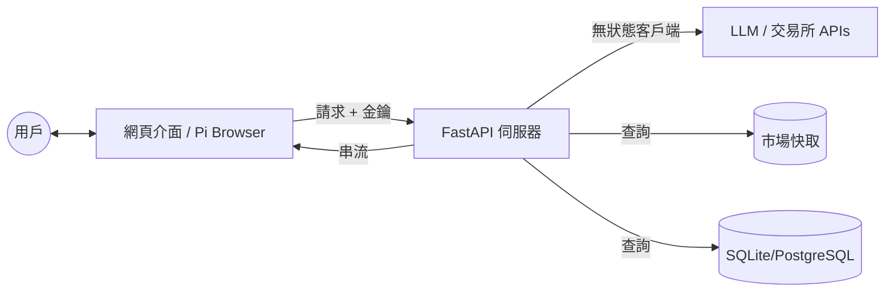

[ 🇺🇸 English Version ](README.md)

# Pi Crypto Insight：AI 驅動的加密貨幣分析 + 社群討論區

這是一個由獨立開發者維護的開源專案，致力於將大型語言模型 (LLM) 從簡單的對話框演進為能自主規劃、調用工具並解決複雜問題的 AI-Agents。從底層的數據採集、穩健的後端架構，到頂層的代理人邏輯設計，我們建構完整的 AI 生態閉環。

我們正在尋找技術夥伴、商務合作以及開發贊助，一同在 AI 浪潮中開疆闢土。

---

## 🌟 最新功能

### 🗣️ 社群討論區（類 PTT 形式）
結合 Pi Network 支付機制的加密貨幣討論區：
- **看板系統** — 依主題分類（加密貨幣、美股、台股）
- **文章分類** — 分析、請益、教學、新聞、閒聊、心得
- **標籤系統** — #BTC #ETH #SOL 快速找到相關內容
- **投票機制** — 推（👍）和噓（👎）互動
- **Pi 支付** — 發文 1 Pi，可直接打賞作者

### 💎 會員制度
| 功能 | 訪客 | 免費會員 | PRO 會員 |
|------|------|----------|----------|
| 瀏覽文章 | ✅ | ✅ | ✅ |
| 回覆/投票 | ❌ | ✅（每日 20 則）| ✅ 無限制 |
| 發表文章 | ❌ | 付費 1 Pi | ✅ 免費 |
| 打賞他人 | ❌ | ✅ | ✅ |
| 私訊功能 | ❌ | ❌ | ✅ |
| AI 長期記憶 | ❌ | ❌ | ✅ |

### 🔗 Pi Network 整合
- 原生 Pi SDK 支付流程
- 發文費用收取（1 Pi）
- P2P 打賞（作者直接收款）
- 交易哈希追蹤

---

## 🛠 核心技術與團隊成員

| 成員 | 技術專長 | 核心領域 | 聯絡方式 |
|------|----------|----------|----------|
| 陳鈺澔 (Yu-Hao Chen) | LLM & AI-Agent Architect | LLM 應用框架、AI-Agents 工作流、Prompt Engineering | a29015822@gmail.com |
| 賴弘育 (Hung-Yu Lai) | Intelligent Data Retrieval | 金融精準爬蟲、數據清洗、動態資訊流 | howard880729@gmail.com |
| 施柏均 (Po-Chun Shih) | Backend & Infra Engineer | 高併發後端架構、數據庫優化 | williampcs0203@mail.com |
| 盛王庭 (Wang-Ting Sheng) | Backend Engineer | Spring Boot & Django、Docker、雲端部署 | s04240046gothu@gmail.com |

---

## 🏗️ 系統架構

### 核心特性

#### 1. 隱私優先架構 (BYOK)
- **自帶金鑰 (LLM)**：用戶自行提供 API 金鑰（OpenAI、Gemini、OpenRouter），金鑰儲存於瀏覽器 `localStorage`，永不存於伺服器
- **安全的 OKX 整合**：基於會話的 API 憑證，每次請求後即銷毀

#### 2. 多層級分析代理系統 (LangGraph)
- **分析師團隊**：技術、情緒、基本面、新聞分析師並行工作
- **委員會辯論**：多頭 vs 空頭研究員辯論市場趨勢
- **風險管理**：自動評估止損、止盈和倉位大小

#### 3. 社群討論區
- **Pi 支付發文**：付 1 Pi 發文（PRO 會員免費）
- **打賞系統**：直接 P2P Pi 轉帳給作者
- **信譽系統**：投票影響作者信譽

#### 4. 市場情報
- **智能快取**：Market Pulse 數據快取，BTC、ETH、SOL 回應 <100ms
- **即時行情**：透過 WebSocket 即時更新價格
- **多交易所核心**：統一獲取 OKX 和 Binance 數據

### 架構圖


---

## 🛠️ 技術組件

- **後端**：FastAPI、LangGraph、Pydantic、Pandas、Gunicorn
- **前端**：HTML5、Tailwind CSS、Vanilla JS、Lucide Icons
- **AI 模型**：GPT-4o、Gemini 1.5 Pro、Claude 3.5（透過 OpenRouter）
- **視覺化**：Lightweight Charts、Chart.js
- **即時通訊**：WebSocket、Server-Sent Events (SSE)
- **資料庫**：SQLite（開發）、PostgreSQL（生產）
- **支付**：Pi Network SDK

---

## ⚙️ 快速開始

### 開發模式

1. **安裝依賴**：
   ```bash
   pip install -r requirements.txt
   ```

2. **配置環境**：
   創建 `.env` 文件（參見 `.env.example`）。注意：LLM 和 OKX 金鑰透過網頁介面提供。

3. **運行伺服器**：
   ```bash
   python api_server.py
   ```

4. **訪問介面**：
   在瀏覽器開啟 `http://localhost:8080`，前往 **Settings** 輸入 API 金鑰。

### 生產模式

多 Worker 高可用部署：

```bash
# Linux/macOS
chmod +x start_production.sh
./start_production.sh start

# Windows (Git Bash/WSL)
bash start_production.sh start
```

**生產環境特性：**
- ✅ 多 Worker 進程（水平擴展）
- ✅ 故障自動重啟
- ✅ 健康檢查端點（`/health`、`/ready`）
- ✅ 結構化日誌

**詳見 [生產環境部署指南](docs/PRODUCTION_DEPLOYMENT.md)**

---

## 🗺️ 發展路線圖

### Phase 1（目前）✅
- [x] 加密貨幣討論區
- [x] 發文/回覆/投票系統
- [x] 標籤系統
- [x] Pi 支付整合（發文付費、打賞）
- [x] 會員制度
- [x] 生產環境部署（Gunicorn）

### Phase 2（規劃中）
- [ ] 美股、台股看板
- [ ] 好友系統與私訊功能
- [ ] 作者信譽/準確率追蹤
- [ ] 文章內嵌即時行情卡片

### Phase 3（未來）
- [ ] **付費專欄** — 創作者透過 Pi 訂閱變現
- [ ] **預測挑戰賽** — 用戶預測價格，系統追蹤準確率
- [ ] **NFT 成就徽章** — 成就鑄造為可交易 NFT
- [ ] **跟單信號** — 驗證交易者分享策略
- [ ] **AI API 市集** — 用 Pi 購買 LLM 額度

---

## 🤝 合作與贊助

我們歡迎來自世界各地的開發者交流、企業專案委託，或是透過加密貨幣支持我們的研發工作。

**此為獨立開發之開源專案，與任何機構無關。**

## 💎 加密貨幣贊助

- **BTC**: bc1qze054pw29crex29rzus80e6gjtzmcrvd60qfkc
- **ETH (ERC-20)**: 0x37332CEAe1eb3AcD3a76c2dA54B8D586448F1db9
- **USDT (ERC-20)**: 0x37332ceae1eb3acd3a76c2da54b8d586448f1db9

## 📩 聯絡我們

歡迎透過上述 Email 聯繫成員，或在 GitHub 上發起討論。

---

## 📄 授權協議

本專案採用 [Apache License 2.0](LICENSE) 授權。

---

### ⚠️ 商標聲明

**Pi Network** 標誌和名稱是 **Pi Network** 的商標。本專案是獨立的社群貢獻，與 **Pi Core Team** 沒有任何關聯、背書或贊助關係。

---

*「協作打造能行動的智能，而非僅能對話。」*

**最後更新**：2026-01-24
