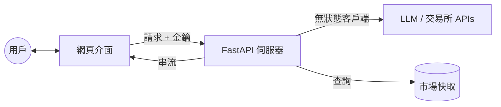

[ 🇺🇸 English Version ](README.md)

# 邁向自主智能：AI-Agent 自主代理系統

這是一個由獨立開發者維護的開源專案，致力於將大型語言模型 (LLM) 從簡單的對話框，演進為能自主規劃、調用工具並解決複雜問題的 AI-Agents。從底層的數據採集、穩健的後端架構，到頂層的代理人邏輯設計，我們建構完整的 AI 生態閉環。

我們正在尋找技術夥伴、商務合作以及開發贊助，一同在 AI 浪潮中開疆闢土。

## 🛠 核心技術與團隊成員

我們是由獨立開發者組成的團隊，成員專長互補，涵蓋 AI 開發的三大核心：

| 成員 | 技術專長 | 核心領域 | 聯絡方式 |
|------|----------|----------|----------|
| 陳鈺澔 (Yu-Hao Chen) | LLM & AI-Agent Architect | 專精於 LLM 應用框架、自主代理人 (AI-Agents) 工作流設計、Prompt Engineering。 | a29015822@gmail.com |
| 賴弘育 (Hung-Yu Lai) | Intelligent Data Retrieval | 專精於金融領域精準爬蟲、數據清洗與動態資訊流，為 AI 提供高品質知識庫。 | howard880729@gmail.com |
| 施柏均 (Po-Chun Shih) | Backend & Infra Engineer | 負責高併發後端架構、數據庫維運與優化，支撐 AI 代理人的大規模運算需求。 | williampcs0203@mail.com |

## 🌟 我們專注的方向

- **AI-Agent 生態系統**：開發具備自我修正與工具調用能力的自主代理。
- **智慧金融數據**：結合 LLM 與金融爬蟲，實現自動化的市場分析與資訊提取。
- **高性能 AI 後端**：為複雜的 AI 邏輯提供穩定、可擴展的運行環境。

## 🤝 合作、加入或贊助

我們歡迎來自世界各地的開發者交流、企業專案委託，或是透過加密貨幣支持我們的研發工作。您的贊助資金將直接用於購買 LLM 相關 API、租用小型伺服器等基礎建設，讓我們能夠嘗試更多種技術可能性，持續優化 AI-Agent 的性能與功能。

**此為獨立開發之開源專案，與任何機構無關。**

## 📩 聯絡我們

歡迎透過上述 Email 聯繫成員，或在 GitHub 上發起討論。

## 💎 加密貨幣贊助

- **BTC**: bc1qze054pw29crex29rzus80e6gjtzmcrvd60qfkc
- **ETH (ERC-20)**: 0x37332CEAe1eb3AcD3a76c2dA54B8D586448F1db9
- **USDT (ERC-20)**: 0x37332ceae1eb3acd3a76c2da54b8d586448f1db9

## 🏗️ 系統架構與技術細節：CryptoMind

這是一個基於 AI 代理的先進加密貨幣分析系統，採用現代化 **FastAPI** 後端與行動優先的網頁介面。

### 🌟 核心特性

#### 1. 隱私優先架構 (BYOK)
- **自帶金鑰 (LLM)**：用戶自行提供 API 金鑰（OpenAI、Gemini、OpenRouter）。金鑰儲存於瀏覽器的 `localStorage`，永不存儲於伺服器。
- **安全的 OKX 整合**：交易與資產管理採用基於會話的方式。API 憑證透過安全標頭傳輸，用於創建臨時、無狀態的連接器，每次請求後即銷毀。
- **無痕模式就緒**：無伺服器端用戶憑證持久化存儲，即使在共享設備上也能確保隱私。

#### 2. 現代化網頁介面
- **行動優先設計**：針對行動設備優化，採用時尚的深色模式美學。
- **即時串流 (SSE)**：AI 回應逐字串流，提供流暢的對話體驗。
- **互動式圖表**：整合 Lightweight Charts 和 Chart.js，實現即時市場視覺化。

#### 3. 多層級分析代理系統 (LangGraph)
- **分析師團隊**：技術、情緒、基本面和新聞分析師並行工作。
- **委員會辯論**：多模型共識系統，「多頭」和「空頭」研究員就市場趨勢進行辯論。
- **風險管理**：自動評估止損、止盈和倉位大小。

#### 4. 市場情報與效能
- **智能快取**：Market Pulse 數據定期快取更新。用戶可在 <100ms 內獲取 BTC、ETH、SOL 等主要資產的報告。
- **即時行情**：透過 WebSocket 即時更新價格。
- **多交易所核心**：統一從 OKX 和 Binance 獲取數據，自動符號標準化。

### 🏗️ 系統架構

#### 高層級數據流


#### 代理系統工作流程 (LangGraph)
1. **數據準備**：彙總 OHLCV、指標和新聞。
2. **分析**：專業 AI 分析師並行處理。
3. **辯論**：多頭/空頭模型競爭性推理。
4. **決策**：綜合交易建議與風險檢查。
5. **審批**：基金經理最終審核。

### 🔧 核心文件說明

#### 後端與核心邏輯
- `api_server.py` - FastAPI 入口點和伺服器配置。
- `api/routers/` - 模組化 API 端點（分析、市場、交易、系統）。
- `core/graph.py` - 深度分析的 LangGraph 工作流定義。
- `interfaces/chat_interface.py` - 處理聊天邏輯和代理路由的協調器。
- `utils/user_client_factory.py` - 創建無狀態、用戶特定 LLM 客戶端的工廠。
- `utils/okx_auth.py` - 處理用戶提供的交易所憑證的認證中介軟體。

#### 數據與分析
- `data/data_fetcher.py` - 從 OKX/Binance 標準化數據獲取。
- `data/indicator_calculator.py` - 技術指標計算（RSI、MACD 等）。
- `analysis/market_pulse.py` - 背景市場監控和快取的核心邏輯。
- `analysis/crypto_screener.py` - 市場掃描和異常檢測。

#### 前端資源
- `web/index.html` - 主要單頁應用介面。
- `web/js/` - 模組化前端邏輯（chat、market、okxKeyManager、apiKeyManager）。
- `web/styles.css` - 自訂主題 Tailwind 配置。

### 🛠️ 技術組件

- **後端**：FastAPI、LangGraph、Pydantic、Pandas。
- **前端**：HTML5、Tailwind CSS、Vanilla JS、Lucide Icons。
- **AI 模型**：GPT-4o、Gemini 1.5 Pro、Claude 3.5（透過 OpenRouter）。
- **視覺化**：Lightweight Charts、Chart.js。
- **即時通訊**：WebSocket、Server-Sent Events (SSE)。

### ⚙️ 快速開始

1. **安裝依賴**：
   ```bash
   pip install -r requirements.txt
   ```

2. **配置環境**：
   創建 `.env` 文件（參見 `.env.example`）。注意：LLM 和 OKX 金鑰現在透過網頁介面提供。

3. **運行伺服器**：
   ```bash
   python api_server.py
   ```

4. **訪問介面**：
   在瀏覽器中開啟 `http://localhost:8111`，前往 **Settings**，輸入您的 API 金鑰即可開始使用。

## 📄 授權協議

本專案採用 [Apache License 2.0](LICENSE) 授權。

---

### ⚠️ 商標聲明

**Pi Network** 標誌和名稱是 **Pi Network** 的商標。本專案是獨立的社群貢獻，與 **Pi Core Team** 沒有任何關聯、背書或贊助關係。

介面中使用 Pi Network 標誌和相關資源僅用於 Pi Browser 生態系統內的裝飾和識別目的。本專案開發者不主張對 Pi Network 商標的任何所有權。

---

「協作打造能行動的智能，而非僅能對話。」

讓我們一起定義 AI 的下一個十年。
