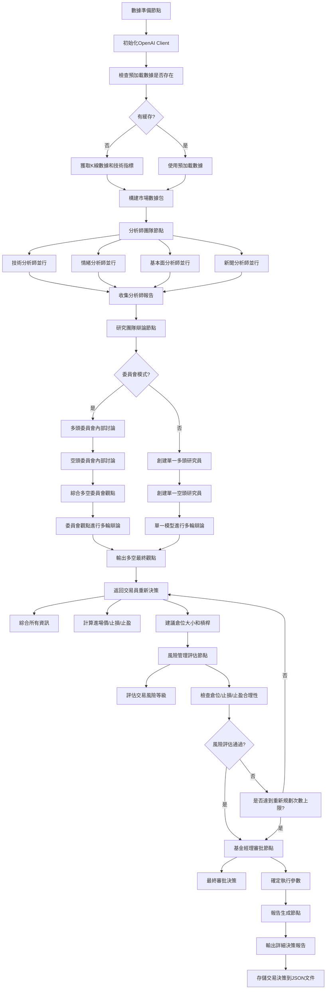

[ 🇺🇸 English Version ](README.md)

# 邁向自主智能：AI-Agent 自主代理系統

## Building the Future with AI-Agents, Intelligent Data, and Scalable Infrastructure

這是一個由獨立開發者維護的開源專案，致力於將 大型語言模型 (LLM) 從簡單的對話框，演進為能自主規劃、調用工具並解決複雜問題的 AI-Agents。從底層的數據採集、穩健的後端架構，到頂層的代理人邏輯設計，我們建構完整的 AI 生態閉環。

我們正在尋找技術夥伴、商務合作以及開發贊助，一同在 AI 浪潮中開疆闢土。

## 🛠 核心技術與團隊成員 | Our Team & Expertise

我們是由獨立開發者組成的團隊，成員專長互補，涵蓋 AI 開發的三大核心：

| 成員 | 技術專長 | 核心領域 | 聯絡方式 |
|------|----------|----------|----------|
| 陳鈺澔 (Yu-Hao Chen) | LLM & AI-Agent Architect | 專精於 LLM 應用框架、自主代理人 (AI-Agents) 工作流設計、Prompt Engineering。 | Email |
| 賴弘育 (Hung-Yu Lai) | Intelligent Data Retrieval | 專精於金融領域精準爬蟲、數據清洗與動態資訊流，為 AI 提供高品質知識庫。 | Email |
| 施柏均 (Po-Chun Shih) | Backend & Infra Engineer | 負責高併發後端架構、數據庫維運與優化，支撐 AI 代理人的大規模運算需求。 | Email |

## 🌟 我們專注的方向

- **AI-Agent 生態系統**： 開發具備自我修正與工具調用能力的自主代理。
- **智慧金融數據**： 結合 LLM 與金融爬蟲，實現自動化的市場分析與資訊提取。
- **高性能 AI 後端**： 為複雜的 AI 邏輯提供穩定、可擴展的運行環境。

## 🤝 合作、加入或贊助 | Support Our Vision

我們歡迎來自世界各地的開發者交流、企業專案委託，或是透過加密貨幣支持我們的研發工作。您的贊助資金將直接用於購買 LLM 相關 API、租用小型伺服器等基礎建設，讓我們能夠嘗試更多種技術可能性，持續優化 AI-Agent 的性能與功能。

**此為獨立開發之開源專案，與任何機構無關。**

## 📩 聯絡我們

歡迎透過上述 Email 聯繫成員，或在 GitHub 上發起討論。

## 💎 加密貨幣贊助 (Crypto Donation)

- **BTC**: bc1qze054pw29crex29rzus80e6gjtzmcrvd60qfkc
- **ETH (ERC-20)**: 0x37332CEAe1eb3AcD3a76c2dA54B8D586448F1db9
- **USDT (ERC-20)**: 0x37332ceae1eb3acd3a76c2da54b8d586448f1db9

## 🏗️ 系統架構與技術細節

這是一個基於 AI 代理（Agent）的先進加密貨幣交易系統，採用多層級分析架構，整合了技術分析、情緒分析、基本面分析和新聞分析，並通過機器學習模型進行多空辯論與風險管理。

### 🌟 核心特性

#### 1. 多層級分析代理系統
- **分析師團隊**：技術分析師、情緒分析師、基本面分析師、新聞分析師
- **研究團隊**：多頭研究員與空頭研究員進行辯論
- **交易員**：整合資訊做出交易決策
- **風險經理**：評估風險並控制敞口
- **基金經理**：最終審批與執行

#### 2. 跨交易所兼容性
- **自動符號格式轉換**：系統自動適配不同交易所的符號格式（Binance: "PIUSDT" ↔ OKX: "PI-USDT"）
- **多交易所支持**：無縫切換 Binance、OKX 等交易平台
- **備援機制**：當主要交易所無法找到符號時，自動嘗試備用交易所
- **統一數據接口**：標準化不同交易所的數據格式，確保分析一致性

#### 3. 智能辯論機制
- 多頭與空頭研究員進行多輪辯論
- 支援委員會模式（多個模型組成委員會）
- 自動調整模型信心度與論點

#### 4. 雙市場分析
- **現貨（Spot）市場**：傳統買賣操作
- **合約（Futures）市場**：支援槓桿與雙向交易
- 獨立分析但可交叉驗證

#### 5. 全自動風險管理
- 動態倉位調控
- 止損止盈自動計算
- 槓桿風險評估
- 資金費率考量

#### 6. 智能快取與數據優化
- **LLM 快取機制**：使用 `utils/llm_cache.py` 緩存 LLM 請求結果，默認 1 小時過期時間
- **數據預加載機制**：避免重複下載，實現現貨與期貨分析共享同一份數據
- **新聞數據優化**：每次執行時獲取最新新聞，避免新聞數據過時

### 🏗️ 系統架構

#### 代理系統工作流程（LangGraph）


#### 代理層級結構
1. **第一層：分析師團隊** (4 個代理並行)
   - 技術分析師：分析 K 線、指標、趨勢
   - 情緒分析師：評估市場情緒與參與度
   - 基本面分析師：評估長期價值與結構
   - 新聞分析師：分析市場新聞與事件影響

2. **第二層：研究團隊** (2 個代理辯論)
   - 多頭研究員：支持看漲觀點
   - 空頭研究員：支持看跌觀點
   - 支援多輪辯論與委員會模式

3. **第三層：交易員**
   - 綜合所有資訊做出交易決策
   - 計算進場價、止損價、止盈價
   - 決定倉位大小與槓桿倍數

4. **第四層：風險管理員**
   - 評估交易風險等級
   - 控制倉位與槓桿
   - 決定是否批准交易

5. **第五層：基金經理**
   - 最終審批與執行
   - 決定最終執行參數

### 🔧 核心文件說明

#### 必需的核心文件
- `core/main.py` - 系統入口點
- `core/graph.py` - LangGraph 工作流程定義
- `core/agents.py` - 所有 AI 代理實現
- `core/models.py` - 數據模型定義 (Pydantic)
- `core/config.py` - 系統配置和 AI 模型設置
- `data/data_fetcher.py` - 交易所數據獲取
- `data/data_processor.py` - 數據處理和指標計算
- `data/indicator_calculator.py` - 技術指標計算器
- `analysis/reporting.py` - 報告生成
- `trading/okx_api_connector.py` - OKX 交易所 API 連接器

#### 工具/輔助文件
- `utils/llm_client.py` - LLM 客戶端管理
- `utils/llm_cache.py` - LLM 結果緩存機制
- `utils/retry_utils.py` - 重試機制工具
- `utils/utils.py` - 通用工具函數
- `utils/settings.py` - 系統設置參數

#### 分析功能模組
- `analysis/crypto_screener.py` - 加密貨幣篩選器
- `analysis/backend_analyzer.py` - 後台分析引擎（產生JSON格式的交易決策，支援無GUI後台運行）
- `analysis/batch_analyzer.py` - 批量分析器

#### 介面相關文件
- `interfaces/chat_interface.py` - 聊天介面
- `interfaces/run_chat.py` - 運行聊天界面
- `interfaces/batch_analyzer_app.py` - 批量分析應用界面

#### 交易相關文件
- `trading/okx_api_connector.py` - OKX 交易所 API 連接器
- `trading/okx_auto_trader.py` - OKX 自動交易執行器

#### 測試檔案
- `tests/test_backend_analyzer.py` - 後台分析器測試
- `tests/test_multi_source_news.py` - 多來源新聞分析測試
- `tests/test_pi_analysis.py` - PI Network 分析測試
- `tests/validate_backend_json.py` - 後台 JSON 輸出驗證

#### 配置與說明文件
- `requirements.txt` - 專案依賴套件清單
- `NEWS_SOURCES_GUIDE.md` - 新聞來源設定指南

#### 後台分析功能
- `analysis/backend_analyzer.py` - 後台分析核心模組
  - `BackendAnalyzer` 類別：提供後台分析功能
  - `analyze_symbol()` 方法：分析單一加密貨幣並返回JSON格式決策
  - `analyze_multiple_symbols()` 方法：批量分析多個加密貨幣
  - `save_decision_to_json()` 方法：將決策結果保存為JSON文件
  - `run_backend_analysis()` 函數：執行後台分析的主要函數
  - `run_batch_backend_analysis()` 函數：執行批量後台分析

#### 資料處理功能
- `data/indicator_calculator.py` - 技術指標計算模組
  - RSI、MACD、布林帶、移動平均線等指標計算
  - 異常值檢測和數據驗證

#### 交易所數據獲取功能
- `data/data_fetcher.py` - 交易所數據獲取模組
  - 支援多交易所數據獲取（Binance、OKX）
  - 自動符號可用性檢查
  - 現貨與合約市場數據獲取
  - OKX API 錯誤處理與重試機制
  - 不同交易所 K 線數據格式標準化

#### 介面應用功能
- `interfaces/batch_analyzer_app.py` - 批量分析介面應用
  - 支援多幣種同時分析
  - 提供圖形化操作介面
  - 匯出分析結果功能

#### 符號格式轉換功能
- `analysis/batch_analyzer.py` - 符號格式自動轉換
  - 自動將 Binance 格式符號（如 "PIUSDT"）轉換為目標交易所格式（如 OKX 的 "PI-USDT"）
  - 支援 Binance ↔ OKX 格式之間的雙向轉換
  - 主要轉換規則：Binance 格式無分隔符（BTCUSDT）轉換為 OKX 格式含分隔符（BTC-USDT）
  - 錯誤處理：當主要交易所找不到符號時，自動嘗試備用交易所

#### 交易執行功能
- `trading/okx_auto_trader.py` - 自動交易執行器
  - 匯入 JSON 交易決策
  - 執行實際買賣訂單
  - 風險控制和訂單管理

#### 測試驗證功能
- `tests/validate_backend_json.py` - JSON 格式驗證工具
  - 驗證後台分析器輸出格式
  - 檢查決策數據完整性
- `tests/test_backend_analyzer.py` - 後台分析器功能測試
- `tests/test_multi_source_news.py` - 多來源新聞分析準確性測試
- `tests/test_pi_analysis.py` - PI Network 相關分析測試

#### 系統支援功能
- `utils/llm_cache.py` - LLM 結果快取機制
  - 減少 API 請求次數
  - 加快重複分析速度
  - 快取結果驗證機制
  - 預設快取期限：1 小時 (3600秒)
  - 快取目錄：.llm_cache
- `interfaces/chat_interface.py` - 數據預加載機制
  - 避免現貨與期貨分析重複下載數據
  - 新聞數據在單次執行中統一獲取一次
  - 支援並行分析時的數據共享

#### 產出檔案
- `trading_decisions_*.json` - 交易決策存檔
  - 包含現貨和合約市場的詳細決策
  - 包含風險評估和技術指標資訊

### 🛠️ 技術組件

#### 依賴套件
- `openai`: AI 模型接入
- `langgraph`: 代理狀態機管理
- `pandas`: 數據處理
- `numpy`: 數值運算
- `python-dotenv`: 環境變數管理
- `requests`: API 通信
- `cachetools`: 快取工具（用於接口快取和 LLM 結果快取）

#### 支援的 AI 模型平台
- **OpenAI**: GPT-4o, GPT-4o mini, o4-mini
- **Google Gemini**: Gemini 2.5 Flash, Gemini 1.5 Pro
- **OpenRouter**: 多家模型提供商
- **Local LLM**: 支援透過 vLLM, Ollama, LM Studio 等運行的本地模型（OpenAI 兼容接口）

#### 支援的交易所
- **Binance**: 現貨與期貨市場
- **OKX**: 現貨與永續合約市場
- **符號格式自動轉換**: 系統自動處理不同交易所的符號格式差異（例如 Binance 格式 "PIUSDT" 自動轉換為 OKX 格式 "PI-USDT"）
- 可擴展支持其他交易所

### ⚙️ 配置說明

#### 環境變數配置
在 `.env` 文件中設置以下變數：

```env
# OpenAI API
OPENAI_API_KEY=your_openai_api_key

# Google Gemini API
GOOGLE_API_KEY=your_google_api_key

# OpenRouter API
OPENROUTER_API_KEY=your_openrouter_api_key

# OKX API (用於實際交易)
OKX_API_KEY=your_okx_api_key
OKX_API_SECRET=your_okx_api_secret
OKX_PASSPHRASE=your_okx_passphrase
OKX_BASE_URL=https://www.okx.com

# 新聞 API (可選)
NEWSAPI_KEY=your_newsapi_key
```

#### 系統配置（`config.py`）

##### AI 模型配置
```python
# 基礎模型（用於分析師團隊）
FAST_THINKING_MODEL = "gpt-4o"  # 用於數據收集和快速分析
DEEP_THINKING_MODEL = "o4-mini"  # 用於深度推理和決策
```

##### 多模型辯論配置
- `ENABLE_MULTI_MODEL_DEBATE`: 是否啟用多模型辯論
- `ENABLE_COMMITTEE_MODE`: 是否啟用委員會模式

##### 委員會模式配置
```python
# 多頭委員會模型
BULL_COMMITTEE_MODELS = [
    {"provider": "openai", "model": "gpt-4o-mini"},
    {"provider": "google_gemini", "model": "gemini-2.5-flash"},
    {"provider": "local", "model": "llama-3-8b-instruct"},  # 本地模型範例
]
```

##### 本地模型配置
```python
# 用於連接 vLLM, Ollama 等
LOCAL_LLM_CONFIG = {
    "base_url": "http://0.0.0.0:8080/v1",
    "api_key": "not-needed",
    "temperature": 0.1,
}
```

##### 交易限制配置
```python
# 投資金額限制 (USDT)
MINIMUM_INVESTMENT_USD = 20  # 最低投資金額
MAXIMUM_INVESTMENT_USD = 50.0  # 最高投資金額
EXCHANGE_MINIMUM_ORDER_USD = 1.0  # 交易所最低下單金額
```

### 📊 交易策略

#### 分析維度
1. **技術分析**
   - 支撐壓力位
   - 趨勢線分析
   - RSI、MACD、布林帶等指標
   - 成交量分析

2. **情緒分析**
   - 市場恐慌貪婪指數
   - 交易量異常檢測
   - 流動性分析

3. **基本面分析**
   - 項目基本面向
   - 開發活動監控
   - 供應量變化

4. **新聞事件**
   - 重大新聞影響
   - 監管消息
   - 技術更新

#### 風險控制
- **倉位管理**: 動態調整倉位大小
- **止損機制**: 多種止損策略（ATR、百分比、技術位）
- **止盈機制**: 風險回報比管理（1:2, 1:3）
- **槓桿控制**: 根據波動率動態調整
