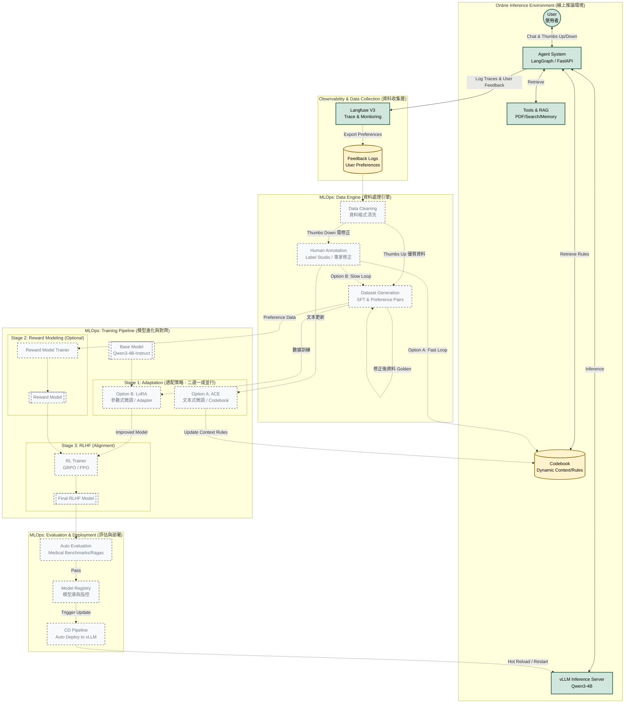

# MLOps & RLHF 系統架構流程圖

此文件描述了結合 **MLOps** 與 **RLHF/PPO** 的 Agent 系統閉環架構。

## 1. 系統架構全景圖 (Architecture Overview)

*   **藍色實線框 (Existing)**：目前已經實作完成的部分（Agent 運作、RAG 檢索、Langfuse 監控）。
*   **灰色虛線框 (Future/Planning)**：未來規劃的 MLOps、訓練與部署自動化流程。

---

## 2. 詳細發展規劃 (Detailed Development Roadmap)

以下詳細說明系統各階段的實作目標與技術細節。

### Phase 1: Data Engine (資料引擎建置)
**目標**：建立自動化的資料清洗與標註流程，將使用者的「點讚/倒贊」互動轉化為高品質的訓練數據。

1.  **資料導出 (ETL)**
    *   透過 Langfuse API 定期撈取 User Trace 與 Scores (Feedback)。
    *   **簡單分流**：
        *   **Positive (Thumbs Up)**：視為高品質對話，直接保留。
        *   **Negative (Thumbs Down)**：標記為待修正資料，進入人工標註流程。
2.  **資料清洗 (Data Cleaning)**
    *   **格式標準化**：將多輪對話轉換為標準的 `ShareGPT` 或 `Alpaca` 格式，移除系統無效標記，以利後續使用。
    *   *(註：本系統不處理敏感個資，故無需進行去識別化程序)*
3.  **人工標註 (Human Annotation)**
    *   引入 Label Studio 或自建簡易介面。
    *   **修正負評 (Fix Negatives)**：針對 User 標記為「倒贊」的回答，由專家撰寫正確的回答 (Golden Response)，使該筆資料轉為可用於 SFT 的訓練樣本。

### Phase 2: Domain Adaptation Strategy (策略選擇)
**目標**：提供不同的技術路徑以適應領域知識。開發團隊可依據運算資源與迭代速度需求，**選擇**以下其中一種策略（或混合使用）。

#### **Option A: Agentic Context Engineering (ACE) - The "Fast Loop"**
*   **適用場景**：需要極速修正錯誤、運算資源有限、或不想頻繁訓練模型時。
*   **核心機制**：**Codebook (動態規則庫)**。
*   **運作方式**：
    1.  當 Annotator 修正錯誤後，將修正邏輯提煉為「規則」存入 Codebook（例如：「回答糖尿病時需引用 2024 新制」）。
    2.  Agent 推論時檢索 Codebook，將規則動態注入 Prompt。
*   **優點**：**無需訓練 (Training-free)**，修正立竿見影。

#### **Option B: Traditional SFT / LoRA - The "Slow Loop"**
*   **適用場景**：Codebook 變得過於龐大影響效能、需要模型內化複雜邏輯、或追求極致的 Token 效率時。
*   **核心機制**：**LoRA (Low-Rank Adaptation)** 參數微調。
*   **運作方式**：
    1.  累積一定量的 Dataset（含 Golden Response）。
    2.  使用 Unsloth/Axolotl 進行週期性的權重更新。
*   **優點**：釋放 Context Window，模型反應更直覺穩定。

> **建議**：初期可先採用 **Option A (Fast Loop)** 快速迭代，待系統成熟或規則庫過大後，再引入 **Option B** 進行權重內化。

### Phase 3: Reward Modeling & RLHF (人類回饋強化學習)
**目標**：使模型不僅「答對」，還能符合人類偏好（如：語氣專業、不廢話、安全邊界），並利用使用者即時回饋進行優化。

1.  **資料來源與評斷點 (Feedback Loop)**
    *   **點讚/倒贊 (Thumbs Up/Down)**：使用者在前端介面直接對 Agent 的回答進行評分。這是系統最核心的人類反饋訊號。
    *   **偏好對資料**：將同一問題的「好回答」（獲讚）與「壞回答」（獲倒贊或被修正）配對，形成 Preference Dataset。
2.  **Reward Model (RM) 訓練**
    *   資料格式：`(Prompt, Winner_Response, Loser_Response)`。
    *   來源：從使用者互動紀錄中撈取獲讚與獲負評的對話。
    *   輸出：訓練一個 Scalar Reward Model，能對任意回答給出「符合人類偏好」的分數。
3.  **RLHF 策略更新 (GRPO / PPO)**
    *   **GRPO (Group Relative Policy Optimization)**：較現代的 RL 方法（如 DeepSeek-R1 使用），透過群體相對評分來優化策略，可減少對 Critic Model 的依賴，適合處理有明確評分規則或群體偏好的場景。
    *   **PPO (Proximal Policy Optimization)**：傳統 RLHF 流程，使用 TRL 框架結合 Reward Model 進行迭代更新。
    *   **流程**：Agent 生成多組回答 -> 根據 RM 分數或使用者偏好進行群體比較 (GRPO) -> 更新模型權重以最大化獲得「點讚」的機率。

### Phase 4: Auto-Eval & Deployment (自動評估與部署)
**目標**：確保新模型版本優於舊版，並能無縫更新至生產環境。

1.  **自動化評估 (Auto-Eval)**
    *   **RAGAS**：評估 RAG 系統的 Retrieval 準確度與 Generation 真實性。
    *   **Medical Benchmarks**：針對特定醫療指引建立 Golden Test Set，測試回答準確率。
    *   **Regression Test**：確保不會因為微調而遺忘通用對話能力。
2.  **Model Registry**
    *   使用 MLflow 或 Hugging Face Hub 管理模型版本 (v1.0, v1.1 ...)。
    *   記錄每個版本的 Training Loss, Eval Score 與 Dataset Hash。
3.  **CD Pipeline**
    *   當 Eval 通過後，觸發 CD 流程。
    *   自動將新模型權重 (LoRA Adapters 或 Merged Model) 推送至 vLLM Server。
    *   執行 vLLM 的 Rolling Update 或 Hot Swap，確保服務不中斷。