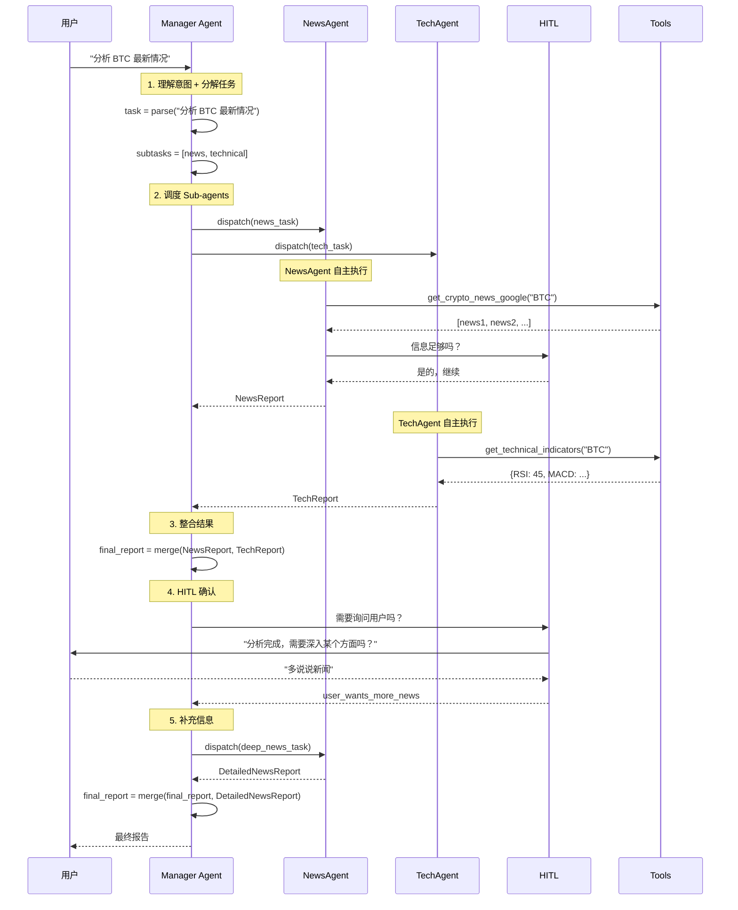

# Agent V3 架构设计文档

## 1. 问题分析

### 1.1 当前 V2 的问题

```python
# chat_v2.py - 当前的「伪 Agent」实现
def process_query(self, query: str) -> str:
    intent = self.classify_intent(query)  # if-else 分类

    if intent == "greeting":
        return self.handle_general_chat(query)
    elif intent == "news_query":
        return self.handle_news_query(query)
    elif intent == "crypto_analysis":
        return self.analyze(query)
    # ... 更多 if-else
```

**问题：**
1. **硬编码意图分类** - 每增加一个功能都要改 if-else
2. **没有真正的 Agent 协作** - agents 只是被动调用
3. **缺乏上下文传递** - sub-agents 之间没有信息共享
4. **HITL 不智能** - 固定时机询问，不是 LLM 决定

### 1.2 V1 的优点

V1 使用 LangChain ReAct Agent：
```python
# core/smart_agents.py - V1 的实现
class SmartTechnicalAnalyst:
    def __init__(self, client):
        self.tools = [technical_analysis_tool]
        self.agent = create_react_agent(self.client, self.tools, self.prompt)
        self.agent_executor = AgentExecutor(agent=self.agent, tools=self.tools)

    def analyze(self, market_data: Dict) -> AnalystReport:
        result = self.agent_executor.invoke({"input": query})
        return parsed_result
```

**优点：**
- LLM 自主决定是否调用工具
- 有 fallback 机制
- 真正的 ReAct 循环（Reasoning + Acting）

### 1.3 目标架构

结合 V1 的优点 + 多 Agent 协作 + 智能化 HITL

---

## 2. 架构设计

### 2.1 整体架构图

```
┌─────────────────────────────────────────────────────────────────────────┐
│                              用户层                                      │
│                                                                         │
│                           👤 User Input                                 │
│                               │                                         │
│                               ▼                                         │
└─────────────────────────────────────────────────────────────────────────┘
                                │
                                ▼
┌─────────────────────────────────────────────────────────────────────────┐
│                          Manager Agent                                   │
│  ┌─────────────────────────────────────────────────────────────────┐   │
│  │  职责：                                                          │   │
│  │  1. 理解用户意图                                                 │   │
│  │  2. 分解任务（Task Decomposition）                               │   │
│  │  3. 决定调度哪些 Sub-agents                                      │   │
│  │  4. 收集各 agent 结果                                            │   │
│  │  5. 整合最终报告                                                 │   │
│  │  6. 判断是否需要 HITL                                           │   │
│  └─────────────────────────────────────────────────────────────────┘   │
│                                                                         │
│  ┌─────────────┐  ┌─────────────┐  ┌─────────────┐                    │
│  │ Task Planner│  │  Scheduler  │  │  Reporter   │                    │
│  │  任务规划器  │  │   调度器    │  │  报告生成器  │                    │
│  └─────────────┘  └─────────────┘  └─────────────┘                    │
└─────────────────────────────────────────────────────────────────────────┘
                                │
                    ┌───────────┼───────────┐
                    │           │           │
                    ▼           ▼           ▼
┌─────────────────────────────────────────────────────────────────────────┐
│                          Sub-Agents 层                                   │
│                                                                         │
│  ┌─────────────┐ ┌─────────────┐ ┌─────────────┐ ┌─────────────┐       │
│  │  NewsAgent  │ │  TechAgent  │ │SentimentAgent│ │  ChatAgent  │       │
│  │             │ │             │ │              │ │             │       │
│  │ 工具:       │ │ 工具:       │ │ 工具:        │ │ 工具:       │       │
│  │ - RSS Tool  │ │ - TA Tool   │ │ - News Sent. │ │ - LLM Tool  │       │
│  │ - Web Crawl │ │ - API Tool  │ │ - Social API │ │             │       │
│  └─────────────┘ └─────────────┘ └─────────────┘ └─────────────┘       │
│                                                                         │
│  每个 Sub-agent:                                                        │
│  - 自主决定是否参与任务（should_participate）                            │
│  - 调用工具获取信息                                                     │
│  - 可以请求更多信息（通过 HITL）                                        │
│  - 返回结构化结果                                                       │
└─────────────────────────────────────────────────────────────────────────┘
                                │
                                ▼
┌─────────────────────────────────────────────────────────────────────────┐
│                            Tools 层                                      │
│                                                                         │
│  ┌──────────────────────────────────────────────────────────────────┐  │
│  │                      ToolRegistry                                 │  │
│  │                                                                   │  │
│  │  注册的工具：                                                     │  │
│  │  ┌──────────┐ ┌──────────┐ ┌──────────┐ ┌──────────┐           │  │
│  │  │RSS Tool  │ │ TA Tool  │ │ LLM Tool │ │ API Tool │           │  │
│  │  │Google RSS│ │ Indicators│ │ GPT-4o   │ │ Binance  │           │  │
│  │  └──────────┘ └──────────┘ └──────────┘ └──────────┘           │  │
│  └──────────────────────────────────────────────────────────────────┘  │
└─────────────────────────────────────────────────────────────────────────┘
                                │
                                ▼
┌─────────────────────────────────────────────────────────────────────────┐
│                    Human-in-the-Loop (HITL)                              │
│                                                                         │
│  ┌──────────────────────────────────────────────────────────────────┐  │
│  │  触发条件（由 LLM 决定）：                                        │  │
│  │                                                                   │  │
│  │  1. 信息不足时 → 询问用户补充                                     │  │
│  │     例：「你提到分析某个币，具体是哪个？」                        │  │
│  │                                                                   │  │
│  │  2. 结果不确定时 → 询问用户偏好                                   │  │
│  │     例：「找到多个结果，你想看哪个？」                            │  │
│  │                                                                   │  │
│  │  3. 重要决策前 → 请求用户确认                                     │  │
│  │     例：「分析完成，需要我深入某个方面吗？」                      │  │
│  │                                                                   │  │
│  │  4. 任务完成后 → 询问满意度                                       │  │
│  │     例：「这个回答对你有帮助吗？」                                │  │
│  └──────────────────────────────────────────────────────────────────┘  │
│                                                                         │
│  ┌─────────────┐  ┌─────────────┐  ┌─────────────┐                    │
│  │AskUserTool  │  │ConfirmTool  │  │FeedbackTool │                    │
│  │ 询问用户    │  │  确认决策   │  │  收集反馈   │                    │
│  └─────────────┘  └─────────────┘  └─────────────┘                    │
└─────────────────────────────────────────────────────────────────────────┘
                                │
                                ▼
┌─────────────────────────────────────────────────────────────────────────┐
│                          Memory & Context                                │
│                                                                         │
│  ┌─────────────────┐  ┌─────────────────┐  ┌─────────────────┐        │
│  │ConversationMem  │  │  AnalysisHist   │  │  UserPreference │        │
│  │   对话记忆      │  │   分析历史      │  │   用户偏好      │        │
│  └─────────────────┘  └─────────────────┘  └─────────────────┘        │
└─────────────────────────────────────────────────────────────────────────┘
```

### 2.2 数据流图



---

## 3. 组件详细设计

### 3.1 Manager Agent

```python
# core/agents_v3/manager.py

class ManagerAgent:
    """
    管理者 Agent - 负责任务分解、调度和整合
    """

    system_prompt = """你是一个加密货币分析系统的 Manager。
你的职责是：
1. 理解用户的查询意图
2. 分解任务，决定需要调用哪些专业 agent
3. 整合各 agent 的结果
4. 判断是否需要向用户询问更多信息

可用的 Sub-agents：
- NewsAgent: 新闻搜集和分析
- TechAgent: 技术指标分析
- SentimentAgent: 市场情绪分析
- ChatAgent: 一般对话和问答

你拥有的工具：
- dispatch_agent: 调度某个 agent 执行任务
- ask_user: 向用户询问问题
- merge_results: 整合多个 agent 的结果
"""

    def __init__(self, llm_client, agents: Dict[str, SubAgent], hitl_manager):
        self.llm = llm_client
        self.agents = agents
        self.hitl = hitl_manager
        self.memory = ConversationMemory()

    def process(self, query: str, session_id: str) -> str:
        """
        处理用户查询的主要入口

        使用 ReAct 模式：
        1. Thought: 分析任务
        2. Action: 调度 agents
        3. Observation: 收集结果
        4. 重复直到完成
        """
        context = self._build_context(session_id)

        # ReAct 循环
        while True:
            # LLM 决定下一步
            action = self._think(query, context)

            if action.type == "dispatch":
                # 调度 sub-agent
                result = self._dispatch(action.agent, action.task)
                context.add_observation(result)

            elif action.type == "ask_user":
                # HITL: 询问用户
                user_response = self.hitl.ask(action.question)
                context.add_user_input(user_response)

            elif action.type == "finish":
                # 完成，返回结果
                return self._generate_final_report(context)

    def _think(self, query: str, context: Context) -> Action:
        """LLM 思考下一步行动"""
        prompt = f"""
        用户查询: {query}

        当前上下文:
        {context.to_string()}

        请思考下一步应该做什么：
        - 如果需要更多信息，返回 ask_user action
        - 如果需要某个 agent 分析，返回 dispatch action
        - 如果已经有足够信息，返回 finish action
        """
        response = self.llm.invoke(prompt)
        return self._parse_action(response)

    def _dispatch(self, agent_name: str, task: str) -> AgentResult:
        """调度 sub-agent"""
        agent = self.agents.get(agent_name)
        if agent and agent.should_participate(task):
            return agent.execute(task)
        return AgentResult(success=False, message="Agent 无法处理此任务")
```

### 3.2 Sub-Agent 基类

```python
# core/agents_v3/base.py

class SubAgent(ABC):
    """
    Sub-Agent 基类

    所有专业 agent 继承此类，实现：
    - should_participate: 判断是否应该参与当前任务
    - execute: 执行任务
    - get_tools: 返回可用的工具
    """

    def __init__(self, llm_client, tool_registry: ToolRegistry, hitl: HITLManager):
        self.llm = llm_client
        self.tools = tool_registry.get_tools(self.expertise)
        self.hitl = hitl

    @property
    @abstractmethod
    def expertise(self) -> str:
        """专业领域"""
        pass

    @property
    @abstractmethod
    def description(self) -> str:
        """Agent 描述（供 Manager 参考）"""
        pass

    @abstractmethod
    def should_participate(self, task: Task) -> tuple[bool, str]:
        """
        判断是否应该参与此任务

        Returns:
            (should_join: bool, reason: str)
        """
        pass

    @abstractmethod
    def execute(self, task: Task) -> AgentResult:
        """
        执行任务

        使用 ReAct 模式：
        1. 思考需要什么信息
        2. 调用工具获取
        3. 如果信息不足，请求 HITL
        4. 返回结果
        """
        pass

    def ask_user(self, question: str) -> str:
        """通过 HITL 询问用户"""
        return self.hitl.ask(question)

    def use_tool(self, tool_name: str, **kwargs) -> Any:
        """调用工具"""
        tool = self.tools.get(tool_name)
        if tool:
            return tool.execute(**kwargs)
        raise ValueError(f"Tool {tool_name} not found")
```

### 3.3 NewsAgent 示例

```python
# core/agents_v3/news_agent.py

class NewsAgent(SubAgent):
    """
    新闻搜集 Agent

    职责：搜集、过滤、总结加密货币相关新闻
    """

    expertise = "news"
    description = "搜集和分析加密货币新闻，支持 Google RSS、CryptoPanic 等多来源"

    system_prompt = """你是一个专业的加密货币新闻分析师。
你的职责是：
1. 使用可用工具搜集新闻
2. 过滤和筛选相关新闻
3. 总结新闻要点
4. 分析新闻对市场的影响

如果新闻来源不足或信息不够，可以请求用户补充。"""

    def should_participate(self, task: Task) -> tuple[bool, str]:
        """判断是否参与"""
        prompt = f"""
        任务: {task.query}
        类型: {task.type}

        这个任务是否需要新闻搜集和分析？
        只回答 YES 或 NO，然后简短说明理由。
        """
        response = self.llm.invoke(prompt)
        return ("YES" in response.upper(), response)

    def execute(self, task: Task) -> AgentResult:
        """执行新闻搜集"""
        symbols = task.symbols or self._extract_symbols(task.query)

        if not symbols:
            # HITL: 询问用户
            response = self.ask_user("你想了解哪个加密货币的新闻？")
            symbols = self._extract_symbols(response)

        # ReAct 循环
        observations = []

        # Thought 1: 搜集新闻
        for symbol in symbols:
            news = self.use_tool("google_news", symbol=symbol, limit=5)
            observations.append(f"{symbol} 新闻: {len(news)} 条")

        # Thought 2: 如果新闻太少，尝试其他来源
        if len(observations) < 3:
            more_news = self.use_tool("cryptopanic", symbols=symbols)
            observations.append(f"CryptoPanic 补充: {len(more_news)} 条")

        # Thought 3: 总结
        summary = self._summarize(observations)

        return AgentResult(
            success=True,
            data={"news": observations, "summary": summary},
            message=f"已搜集 {len(observations)} 条相关新闻"
        )
```

### 3.4 HITL Manager (增强版)

```python
# core/agents_v3/hitl.py

class EnhancedHITLManager:
    """
    增强版 Human-in-the-Loop Manager

    与原版不同：
    1. 由 LLM 决定是否需要询问用户
    2. 支持多种询问类型
    3. 记录用户反馈用于学习
    """

    def __init__(self, llm_client):
        self.llm = llm_client
        self.pending_questions = []
        self.feedback_history = []

    def should_ask_user(self, context: dict, current_state: str) -> tuple[bool, str, str]:
        """
        LLM 判断是否需要询问用户

        Returns:
            (should_ask: bool, question: str, ask_type: str)
        """
        prompt = f"""
        当前状态: {current_state}
        已收集信息: {context.get('observations', [])}
        用户原始查询: {context.get('query')}

        请判断：
        1. 是否需要向用户询问更多信息？
        2. 如果需要，问什么问题？
        3. 问题类型是什么？(info_needed / preference / confirmation / satisfaction)

        返回 JSON 格式:
        {{
            "should_ask": true/false,
            "question": "问题内容",
            "type": "问题类型",
            "reason": "为什么需要询问"
        }}
        """
        response = self.llm.invoke(prompt)
        result = parse_json(response)

        return (
            result.get("should_ask", False),
            result.get("question", ""),
            result.get("type", "info_needed")
        )

    def ask(self, question: str, ask_type: str = "info_needed") -> str:
        """
        向用户提问并等待响应

        在 CLI 环境中直接打印并等待输入
        在 API 环境中返回 pending 状态
        """
        print(f"\n🤔 {question}")
        response = input("你的回答: ").strip()

        # 记录交互
        self.feedback_history.append({
            "question": question,
            "type": ask_type,
            "response": response,
            "timestamp": datetime.now()
        })

        return response
```

### 3.5 Tool Registry (增强版)

```python
# core/agents_v3/tool_registry.py

class ToolRegistry:
    """
    工具注册表

    管理所有可用工具，支持：
    - 按领域获取工具
    - 动态注册新工具
    - 工具使用记录
    """

    def __init__(self):
        self._tools: Dict[str, List[Tool]] = {
            "news": [],
            "technical": [],
            "sentiment": [],
            "general": [],
        }
        self._usage_log = []

    def register(self, tool: Tool, domains: List[str]):
        """注册工具到指定领域"""
        for domain in domains:
            if domain not in self._tools:
                self._tools[domain] = []
            self._tools[domain].append(tool)

    def get_tools(self, domain: str) -> Dict[str, Tool]:
        """获取指定领域的所有工具"""
        tools = {}
        # 包含通用工具
        for tool in self._tools.get("general", []):
            tools[tool.name] = tool
        # 包含领域工具
        for tool in self._tools.get(domain, []):
            tools[tool.name] = tool
        return tools

    def execute(self, tool_name: str, **kwargs) -> Any:
        """执行工具"""
        for domain_tools in self._tools.values():
            for tool in domain_tools:
                if tool.name == tool_name:
                    result = tool.execute(**kwargs)
                    self._log_usage(tool_name, kwargs, result)
                    return result
        raise ValueError(f"Tool {tool_name} not found")


# 预注册的工具
DEFAULT_TOOLS = [
    # News tools
    Tool(name="google_news", func=get_crypto_news_google,
         description="从 Google News RSS 获取新闻", domains=["news"]),
    Tool(name="cryptopanic", func=get_crypto_news_cryptopanic,
         description="从 CryptoPanic 获取新闻", domains=["news"]),

    # Technical tools
    Tool(name="technical_analysis", func=get_technical_indicators,
         description="获取技术指标", domains=["technical"]),
    Tool(name="price_data", func=get_price_data,
         description="获取价格数据", domains=["technical"]),

    # General tools
    Tool(name="ask_user", func=None,  # 特殊工具，由 HITL 处理
         description="向用户提问", domains=["general"]),
    Tool(name="web_search", func=web_search,
         description="网络搜索", domains=["general"]),
]
```

---

## 4. 与 V1/V2 对比

| 特性 | V1 | V2 (当前) | V3 (目标) |
|------|----|-----------|-----------|
| 意图识别 | LLM + 规则回退 | if-else | Manager Agent (LLM) |
| Agent 协作 | 单 Agent | 伪协作 | 真正多 Agent |
| 工具调用 | ReAct | 直接调用 | ReAct + ToolRegistry |
| HITL | 无 | 固定时机 | LLM 智能决定 |
| 上下文传递 | 简单 | 有但未用 | 完整传递 |
| 扩展性 | 需改代码 | 需改 if-else | 注册新 agent/tool |

---

## 5. 实现计划

### Phase 1: 基础架构 (2-3 天)
- [ ] 创建 `core/agents_v3/` 目录结构
- [ ] 实现 `SubAgent` 基类
- [ ] 实现 `ManagerAgent` 核心逻辑
- [ ] 增强 `ToolRegistry`

### Phase 2: 迁移 Agents (2-3 天)
- [ ] 实现 `NewsAgent` (参考 V1 SmartTechnicalAnalyst)
- [ ] 实现 `TechAgent`
- [ ] 实现 `ChatAgent`
- [ ] 实现 `SentimentAgent` (可选)

### Phase 3: HITL 增强 (1-2 天)
- [ ] 实现 `EnhancedHITLManager`
- [ ] 实现 `AskUserTool`
- [ ] 集成到 Manager 和 Sub-agents

### Phase 4: 接口层 (1 天)
- [ ] 创建 `chat_v3.py` 入口
- [ ] 兼容现有 API
- [ ] 添加调试日志

### Phase 5: 测试与文档 (1-2 天)
- [ ] 单元测试
- [ ] 集成测试
- [ ] 用户文档

---

## 6. 文件结构

```
core/agents_v3/
├── __init__.py
├── base.py              # SubAgent 基类
├── manager.py           # ManagerAgent
├── tools.py             # Tool 基类和工具定义
├── tool_registry.py     # 工具注册表
├── hitl.py              # 增强 HITL
├── memory.py            # 对话记忆 (复用 v2)
├── models.py            # 数据模型
│
├── agents/
│   ├── __init__.py
│   ├── news_agent.py    # 新闻搜集 Agent
│   ├── tech_agent.py    # 技术分析 Agent
│   ├── chat_agent.py    # 一般对话 Agent
│   └── sentiment_agent.py  # 情绪分析 Agent (可选)
│
└── prompts/
    ├── manager_prompt.py
    ├── news_agent_prompt.py
    └── ...

chat_v3.py               # 新的入口文件
```

---

## 7. 使用示例

```python
# chat_v3.py

from core.agents_v3 import ManagerAgent, ToolRegistry, EnhancedHITLManager
from core.agents_v3.agents import NewsAgent, TechAgent, ChatAgent

def main():
    # 1. 初始化工具注册表
    registry = ToolRegistry()
    for tool in DEFAULT_TOOLS:
        registry.register(tool, tool.domains)

    # 2. 初始化 HITL
    hitl = EnhancedHITLManager(llm_client)

    # 3. 初始化 Sub-agents
    agents = {
        "news": NewsAgent(llm_client, registry, hitl),
        "tech": TechAgent(llm_client, registry, hitl),
        "chat": ChatAgent(llm_client, registry, hitl),
    }

    # 4. 初始化 Manager
    manager = ManagerAgent(llm_client, agents, hitl)

    # 5. 运行
    while True:
        query = input("💬 > ")
        result = manager.process(query, session_id="default")
        print(result)
```

---

## 8. 风险与缓解

| 风险 | 缓解措施 |
|------|---------|
| LLM 调用次数增加导致成本上升 | 使用 gpt-4o-mini + 缓存 |
| ReAct 循环可能死循环 | 设置最大迭代次数 (5-10) |
| Agent 之间信息不一致 | Manager 统一整合 + 上下文传递 |
| HITL 过于频繁影响体验 | 设置询问阈值 + 用户可配置 |

---

## 9. 待确认问题

1. **LLM 选择**: 是否继续使用 GPT-4o-mini，还是考虑其他模型？
2. **并发执行**: Sub-agents 是否需要并发执行以提高效率？
3. **状态持久化**: 对话历史是否需要持久化到数据库？
4. **回退机制**: 如果 Manager 无法理解任务，如何回退？

---

**文档版本**: v1.0
**创建日期**: 2026-02-16
**作者**: Claude Agent V3 Design Team
