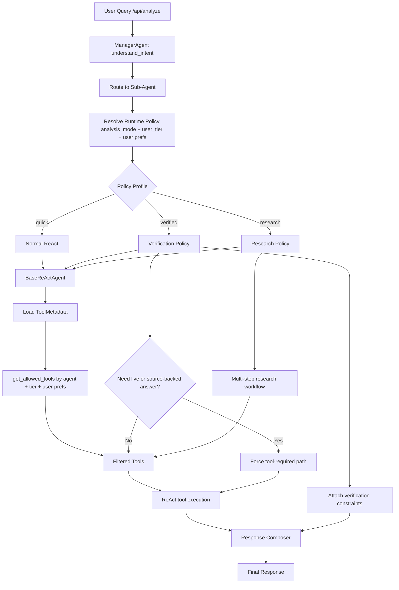

# Agent Skill Integration Plan

## Goal

Integrate "skill-like" rules into the current platform without turning skills into runtime tools.

The correct layering is:

- Skill/Policy layer: rules and workflows
- Agent runtime layer: routing, enforcement, response constraints
- Tool/Data layer: actual market/news/fundamental lookups

## Current Architecture Mapping

- Entry API: [api/routers/analysis.py](/Users/a1031737/agent_stock/stock_agent/api/routers/analysis.py)
- Manager orchestration: [core/agents/manager.py](/Users/a1031737/agent_stock/stock_agent/core/agents/manager.py)
- ReAct execution: [core/agents/base_react_agent.py](/Users/a1031737/agent_stock/stock_agent/core/agents/base_react_agent.py)
- Tool registry: [core/agents/tool_registry.py](/Users/a1031737/agent_stock/stock_agent/core/agents/tool_registry.py)
- Tool permission filtering: [core/database/tools.py](/Users/a1031737/agent_stock/stock_agent/core/database/tools.py)

## Integration Principle

Do not create a fake "skill tool".

Instead:

- `signal-verification` becomes `analysis_mode=verified`
- `stock-research` becomes a structured multi-step workflow
- `agent-eval-finance` becomes test/eval coverage
- `cost-aware-market-analysis` becomes routing/escalation policy

## Recommended Runtime Model

- `quick`
  - Default mode
  - Normal ReAct behavior
  - Tool usage is allowed but not strongly enforced

- `verified`
  - For finance questions that require freshness or source grounding
  - Prefer or require lookup tools for price/news/filings/live data questions
  - Final answer must include date, source/tool mention, and inference boundary

- `research`
  - Optional later phase
  - Multi-step workflow across price, news, fundamentals, filings
  - Only used when the user explicitly requests deep analysis

## Flow Diagram

## Skill-to-Platform Mapping

### 1. signal-verification

Purpose:

- Define which questions must use tools
- Define which answers must include date/source
- Define which statements must be labeled as inference

Platform placement:

- `analysis_mode=verified`
- Policy hooks inside `ManagerAgent` and `BaseReActAgent`

### 2. stock-research

Purpose:

- Define a structured research workflow
- Coordinate multiple data sources

Platform placement:

- Future `analysis_mode=research`
- Manager-level planning plus agent/tool orchestration

### 3. agent-eval-finance

Purpose:

- Validate tool use
- Validate freshness behavior
- Validate free vs premium differences
- Validate verified response constraints

Platform placement:

- `tests/` and eval harness only
- Not a user-facing runtime feature

### 4. cost-aware-market-analysis

Purpose:

- Route cheap/simple requests to quick mode
- Escalate high-risk requests to verified mode
- Limit model and tool cost

Platform placement:

- `ManagerAgent` routing policy
- Possible future prompt/routing heuristics

## MVP Implementation Plan

### Phase 1

Add `analysis_mode=verified` only.

Changes:

- Extend request model in [api/routers/analysis.py](/Users/a1031737/agent_stock/stock_agent/api/routers/analysis.py)
- Pass `analysis_mode` into graph state/context
- Add verified policy checks in [core/agents/base_react_agent.py](/Users/a1031737/agent_stock/stock_agent/core/agents/base_react_agent.py)
- Add response constraints for verified mode:
  - mention data date
  - mention tool/source used
  - distinguish data vs inference

### Phase 2

Add routing policy:

- `free` defaults to `quick`
- `premium` can select `verified`

### Phase 3

Add eval coverage:

- verified mode uses tool for live-market questions
- verified mode includes source/date in final answer
- free/premium mode behavior is different where expected

## Non-Goals

- Do not expose "skill" as a frontend tool
- Do not reintroduce old bull/bear debate structure as default output
- Do not create a single monolithic "research tool" before policy is stable

## Recommended Next Step

Implement the MVP:

1. request field: `analysis_mode`
2. runtime propagation into manager/agent context
3. verified policy in `BaseReActAgent`
4. minimal frontend selector for premium users
