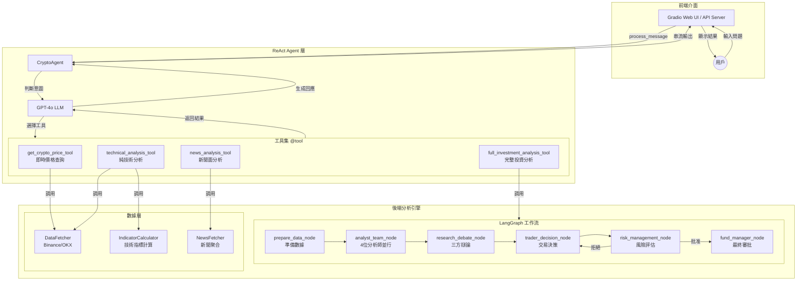
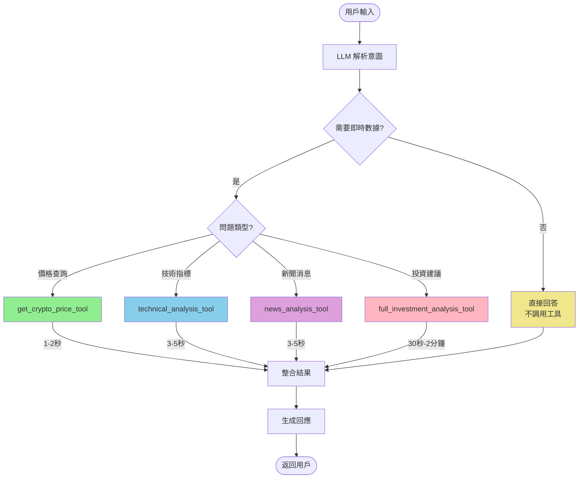
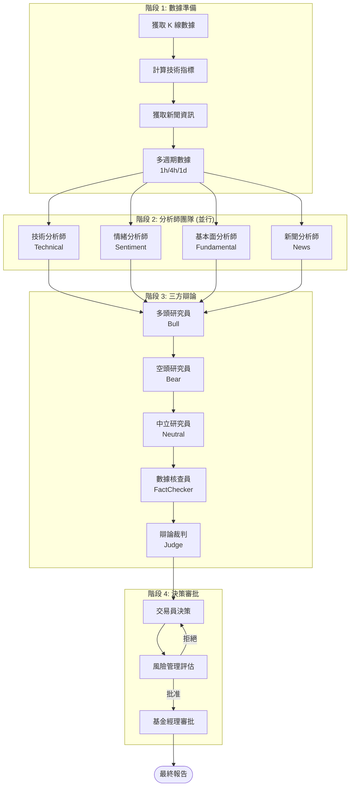
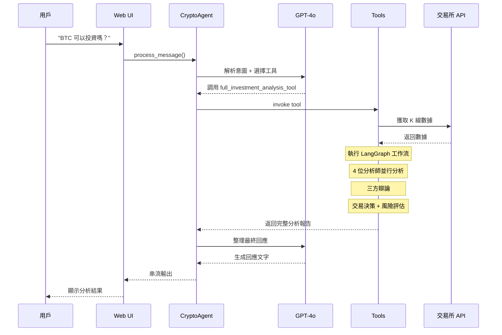

# Pi Crypto Insight - 系統架構圖

## 1. 整體架構流程



## 2. Agent 工具調用決策流程



## 3. 完整投資分析流程 (full_investment_analysis_tool)



## 4. 檔案結構與依賴關係

```mermaid
flowchart LR
    subgraph Interfaces["interfaces/"]
        CI[chat_interface.py]
        AS[api_server.py]
    end

    subgraph Core["core/"]
        AG[agent.py<br/>CryptoAgent]
        TL[tools.py<br/>@tool 定義]
        GR[graph.py<br/>LangGraph 流程]
        AGS[agents.py<br/>分析師類別]
        MD[models.py<br/>數據模型]
        CF[config.py<br/>配置]
    end

    subgraph Data["data/"]
        DF[data_fetcher.py]
        DP[data_processor.py]
        IC[indicator_calculator.py]
    end

    subgraph Utils["utils/"]
        UT[utils.py<br/>新聞聚合]
        LC[llm_client.py]
    end

    AS --> CI
    CI --> AG
    AG --> TL
    TL --> GR
    TL --> DF
    TL --> DP
    GR --> AGS
    GR --> DP
    AGS --> MD
    DP --> IC
    DP --> UT
    AGS --> LC

    style AG fill:#FFD700
    style TL fill:#98FB98
    style GR fill:#87CEFA
```

## 5. 數據流向



## 6. 工具選擇策略

```mermaid
flowchart TD
    Input[用戶輸入] --> Analyze{分析問題類型}

    Analyze -->|"現在多少錢?"<br/>"價格是多少?"| P[get_crypto_price_tool]
    Analyze -->|"RSI 是多少?"<br/>"MACD 如何?"<br/>"趨勢?"| T[technical_analysis_tool]
    Analyze -->|"最新新聞?"<br/>"有什麼消息?"| N[news_analysis_tool]
    Analyze -->|"可以投資嗎?"<br/>"應該買嗎?"<br/>"完整分析"| F[full_investment_analysis_tool]
    Analyze -->|"什麼是 RSI?"<br/>"你好"<br/>一般問題| D[直接回答]

    P -->|最快| R1[1-2 秒]
    T -->|快| R2[3-5 秒]
    N -->|快| R3[3-5 秒]
    F -->|慢| R4[30秒-2分鐘]
    D -->|即時| R5[即時]

    R1 & R2 & R3 & R4 & R5 --> Output[返回結果]

    style P fill:#90EE90
    style T fill:#87CEEB
    style N fill:#DDA0DD
    style F fill:#FFB6C1
    style D fill:#F0E68C
```

---

## 快速參考

| 工具名稱 | 功能 | 速度 | 調用場景 |
|---------|------|------|---------|
| `get_crypto_price_tool` | 即時價格 | 1-2秒 | 價格查詢 |
| `technical_analysis_tool` | 技術指標 | 3-5秒 | RSI/MACD/趨勢 |
| `news_analysis_tool` | 新聞分析 | 3-5秒 | 新聞/情緒 |
| `full_investment_analysis_tool` | 完整分析 | 30秒-2分 | 投資建議 |
| (無工具) | 直接回答 | 即時 | 知識問答/聊天 |
