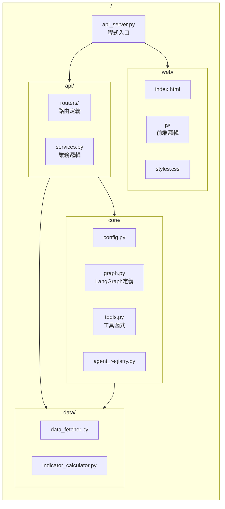

# Pi Crypto Insight - 系統架構圖

## 1. 整體架構流程

本系統採用現代化的前後端分離架構，前端為 Mobile-First 的響應式 Web App (Pi Browser 相容)，後端為基於 FastAPI 的高效能非同步伺服器。

```mermaid
flowchart TB
    subgraph Frontend["前端 (Web/Mobile)"]
        UI[HTML5 + TailwindCSS + JS]
        SSE[Server-Sent Events (串流接收)]
        Chart[Lightweight Charts (K線圖)]
        User((用戶))
    end

    subgraph Backend["API Server (FastAPI)"]
        API[api_server.py]
        Router[API Routers]
        WS[WebSocket Manager]
    end

    subgraph AgentLayer["智慧代理層 (ReAct + LangGraph)"]
        Bot[CryptoAnalysisBot]
        LLM[LLM Client (GPT-4o/Gemini/Claude)]
        
        subgraph Tools["工具集 (@tool)"]
            T1[get_crypto_price_tool<br/>即時價格]
            T2[technical_analysis_tool<br/>技術指標]
            T3[news_analysis_tool<br/>新聞情緒]
            T4[full_investment_analysis_tool<br/>深度分析流程]
        end

        subgraph Workflow["LangGraph 深度分析引擎"]
            N1[準備數據] --> N2[分析師團隊]
            N2 --> N3[三方辯論]
            N3 --> N4[交易決策]
            N4 --> N5[風險控管]
        end
    end

    subgraph DataServices["數據服務層"]
        Screener[Crypto Screener<br/>背景篩選]
        Pulse[Market Pulse<br/>市場脈動]
        Data[Data Fetcher<br/>(OKX/Binance)]
    end

    User -->|HTTP/REST| UI
    UI -->|POST /api/analyze| API
    UI -->|GET /api/market/ticker| WS
    
    API --> Router
    Router -->|分析請求| Bot
    
    Bot -->|Prompt| LLM
    LLM -->|Tool Call| Tools
    
    T1 & T2 --> Data
    T3 --> Data
    T4 -->|Invoke| Workflow
    
    Workflow -->|Result| Bot
    Bot -->|Streaming Response| SSE
    SSE -->|Update UI| UI
```

## 2. 核心組件說明

### 前端 (Frontend)
- **技術棧**: 原生 HTML5, Tailwind CSS, Vanilla JavaScript (無大型框架依賴，輕量化)。
- **特色**: 
  - **Mobile-First**: 專為 Pi Browser 及行動裝置優化。
  - **Pi Design**: 深色模式 (Dark Mode)，符合 Pi Network 設計語言。
  - **即時性**: 使用 `EventSource` 接收 AI 打字機效果回應，WebSocket 接收即時行情。

### 後端 (Backend API)
- **核心**: Python FastAPI，提供 REST API 與 WebSocket 服務。
- **模組化路由 (`api/routers/`)**:
  - `analysis.py`: 處理 AI 對話與深度分析請求 (Streaming)。
  - `market.py`: 提供市場數據、K線數據、篩選器結果。
  - `agents.py`: Agent 的 CRUD 管理與配置。
  - `system.py`: 系統健康狀態與配置。

### 智慧代理層 (Agent Layer)
- **Orchestrator**: `CryptoAnalysisBot` (位於 `interfaces/chat_interface.py`) 負責接收用戶訊息，維護對話歷史，並調用 LLM。
- **ReAct 模式**: LLM 根據用戶問題動態選擇工具 (價格查詢、技術分析、新聞、或深度報告)。
- **Deep Dive**: 當用戶要求「完整分析」時，觸發 `full_investment_analysis_tool`，進入 LangGraph 定義的複雜工作流。

## 3. 完整投資分析流程 (LangGraph)

當調用 `full_investment_analysis_tool` 時，系統執行以下並行與序列任務：

```mermaid
flowchart TB
    subgraph Phase1["階段 1: 數據聚合"]
        D1[OHLCV K線數據]
        D2[技術指標計算 (RSI, MACD, BB)]
        D3[新聞與社群情緒]
    end

    subgraph Phase2["階段 2: 平行分析 (Committee)"]
        A1[技術分析師]
        A2[基本面分析師]
        A3[情緒分析師]
        A4[新聞分析師]
    end

    subgraph Phase3["階段 3: 辯論與決策"]
        Bull[多頭代表]
        Bear[空頭代表]
        Judge[裁判官]
        Decision[最終投資建議]
    end

    D1 & D2 & D3 --> A1 & A2 & A3 & A4
    A1 & A2 & A3 & A4 --> Bull & Bear
    Bull <--> Bear
    Bull & Bear --> Judge
    Judge --> Decision
```

## 4. 檔案結構映射



## 5. 數據流與回應機制

1.  **用戶輸入**: "分析 BTC 趨勢"
2.  **API 接收**: `/api/analyze` 接收請求 (包含用戶 API Key 配置)。
3.  **Bot 處理**: 
    - LLM 判斷意圖 -> 調用 `technical_analysis_tool`。
    - 工具執行 -> 調用 `data_fetcher` 獲取 OKX 數據 -> `indicator_calculator` 計算。
    - LLM 接收工具結果 -> 生成自然語言回應。
4.  **串流輸出**: 通過 Server-Sent Events (SSE) 逐字回傳給前端。
5.  **前端渲染**: JavaScript 解析 SSE 數據，實時更新對話框，並可選地渲染圖表 (Chart.js/Lightweight Charts)。

## 6. 擴展性設計

- **自定義 Agent**: 透過 `/api/agents` 端點，支援動態註冊新的 Agent 行為與專屬工具。
- **BYOK (Bring Your Own Key)**: 支援用戶在前端配置自己的 OpenAI/Gemini/Anthropic API Key，後端動態建立 LLM Client，確保隱私與靈活性。
- **Worker 模式**: 支援將耗時的市場掃描 (`market_scanner`) 拆分為獨立 Worker Process 運行。