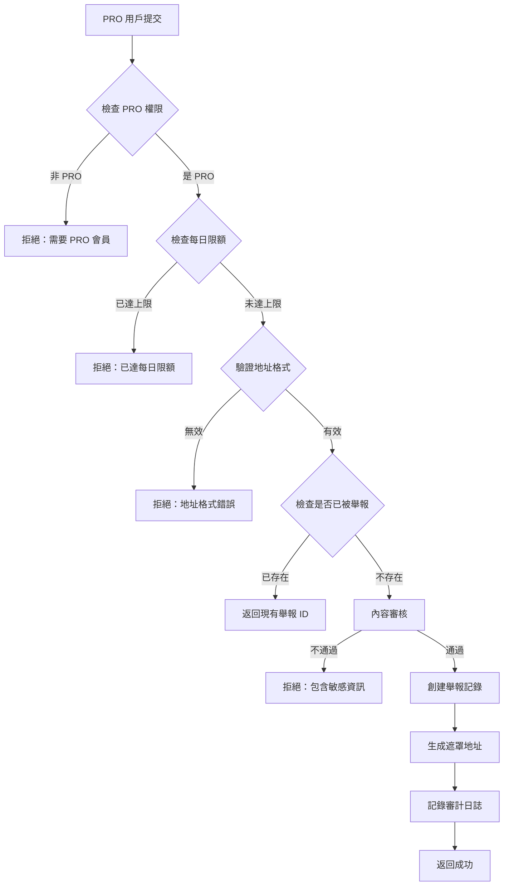

# 可疑錢包追蹤系統 - 設計文檔

**創建日期**: 2026-02-07
**狀態**: 設計完成，待實施
**優先級**: 高 - Phase 2 核心功能

---

## 一、功能概述

### 目標
為 Pi Network DApp 用戶提供**商業級反詐騙社群功能**，讓 PRO 用戶可以舉報可疑錢包地址，所有用戶可查看、投票和評論，形成社群防護網。

### 核心特性
- 🛡️ **PRO 用戶舉報** - 僅 PRO 會員可提交可疑錢包
- 👥 **社群驗證** - 動態門檻（淨贊同率 > 70% 且總投票數 ≥ 10）
- 🔍 **去重機制** - 每個錢包只能被舉報一次
- 💬 **證詞分享** - PRO 用戶可評論補充受騙經歷
- 🔐 **隱私保護** - 舉報者錢包地址部分遮罩
- ⚙️ **配置驅動** - 所有參數可在 CONFIG 即時調整

### 設計原則
✅ **安全** - 地址驗證、防刷票、內容審核
✅ **便利** - 直觀 UI、快速搜尋、一鍵投票
✅ **迅速** - 索引優化、多層快取、即時更新

---

## 二、數據庫架構

### 2.1 主表：scam_reports（詐騙舉報表）

```sql
CREATE TABLE scam_reports (
    id SERIAL PRIMARY KEY,

    -- 錢包資訊
    scam_wallet_address TEXT NOT NULL UNIQUE,
    blockchain_type TEXT DEFAULT 'pi_network',

    -- 舉報者資訊
    reporter_user_id TEXT NOT NULL,
    reporter_wallet_address TEXT NOT NULL,
    reporter_wallet_masked TEXT NOT NULL,

    -- 詐騙資訊
    scam_type TEXT NOT NULL,
    description TEXT NOT NULL,
    transaction_hash TEXT,

    -- 驗證狀態
    verification_status TEXT DEFAULT 'pending',

    -- 社群投票統計
    approve_count INTEGER DEFAULT 0,
    reject_count INTEGER DEFAULT 0,

    -- 元數據
    comment_count INTEGER DEFAULT 0,
    view_count INTEGER DEFAULT 0,

    -- 時間戳
    created_at TIMESTAMP DEFAULT CURRENT_TIMESTAMP,
    updated_at TIMESTAMP DEFAULT CURRENT_TIMESTAMP,

    -- 外鍵
    FOREIGN KEY (reporter_user_id) REFERENCES users(user_id)
);

-- 索引優化
CREATE INDEX idx_scam_wallet ON scam_reports(scam_wallet_address);
CREATE INDEX idx_scam_type ON scam_reports(scam_type);
CREATE INDEX idx_verification_status ON scam_reports(verification_status);
CREATE INDEX idx_created_at ON scam_reports(created_at DESC);
```

### 2.2 投票表：scam_report_votes

```sql
CREATE TABLE scam_report_votes (
    id SERIAL PRIMARY KEY,
    report_id INTEGER NOT NULL,
    user_id TEXT NOT NULL,
    vote_type TEXT NOT NULL,
    created_at TIMESTAMP DEFAULT CURRENT_TIMESTAMP,

    UNIQUE(report_id, user_id),
    FOREIGN KEY (report_id) REFERENCES scam_reports(id) ON DELETE CASCADE,
    FOREIGN KEY (user_id) REFERENCES users(user_id)
);

CREATE INDEX idx_vote_report ON scam_report_votes(report_id);
CREATE INDEX idx_vote_user ON scam_report_votes(user_id);
```

### 2.3 評論表：scam_report_comments

```sql
CREATE TABLE scam_report_comments (
    id SERIAL PRIMARY KEY,
    report_id INTEGER NOT NULL,
    user_id TEXT NOT NULL,
    content TEXT NOT NULL,
    transaction_hash TEXT,
    attachment_url TEXT,
    is_hidden INTEGER DEFAULT 0,
    created_at TIMESTAMP DEFAULT CURRENT_TIMESTAMP,

    FOREIGN KEY (report_id) REFERENCES scam_reports(id) ON DELETE CASCADE,
    FOREIGN KEY (user_id) REFERENCES users(user_id)
);

CREATE INDEX idx_comment_report ON scam_report_comments(report_id);
CREATE INDEX idx_comment_created ON scam_report_comments(created_at DESC);
```

---

## 三、配置系統設計

所有關鍵參數存儲在 `system_config` 表，支持即時調整。

### 3.1 配置項列表

| 配置鍵 | 類型 | 預設值 | 說明 |
|--------|------|--------|------|
| `scam_report_daily_limit_pro` | int | 5 | PRO 用戶每日舉報限額 |
| `scam_comment_require_pro` | bool | true | 評論是否僅限 PRO |
| `scam_verification_vote_threshold` | int | 10 | 驗證所需最低投票數 |
| `scam_verification_approve_rate` | float | 0.7 | 驗證所需贊同率 |
| `scam_types` | json | [...] | 詐騙類型列表（可動態新增） |
| `scam_wallet_mask_length` | int | 4 | 錢包地址遮罩長度 |
| `scam_list_page_size` | int | 20 | 列表分頁大小 |

### 3.2 詐騙類型配置（JSON）

```json
[
  {"id": "fake_official", "name": "假冒官方", "icon": "🎭"},
  {"id": "investment_scam", "name": "投資詐騙", "icon": "💰"},
  {"id": "fake_airdrop", "name": "空投詐騙", "icon": "🎁"},
  {"id": "trading_fraud", "name": "交易詐騙", "icon": "🔄"},
  {"id": "gambling", "name": "賭博騙局", "icon": "🎰"},
  {"id": "phishing", "name": "釣魚網站", "icon": "🎣"},
  {"id": "other", "name": "其他詐騙", "icon": "⚠️"}
]
```

---

## 四、API 路由設計

### 4.1 舉報管理 API

**端點前綴**: `/api/scam-tracker/reports`

| 方法 | 路徑 | 權限 | 功能 |
|------|------|------|------|
| POST | `/` | PRO | 提交新舉報 |
| GET | `/` | 公開 | 獲取舉報列表 |
| GET | `/{report_id}` | 公開 | 獲取舉報詳情 |
| GET | `/search?wallet_address=...` | 公開 | 搜尋錢包 |

### 4.2 投票 API

**端點前綴**: `/api/scam-tracker/votes`

| 方法 | 路徑 | 權限 | 功能 |
|------|------|------|------|
| POST | `/{report_id}?vote_type=approve\|reject` | 登入用戶 | 投票（支持 Toggle） |

### 4.3 評論 API

**端點前綴**: `/api/scam-tracker/comments`

| 方法 | 路徑 | 權限 | 功能 |
|------|------|------|------|
| POST | `/{report_id}` | PRO | 添加評論 |
| GET | `/{report_id}` | 公開 | 獲取評論列表 |

---

## 五、業務邏輯設計

### 5.1 舉報提交流程



### 5.2 驗證狀態自動更新

```python
# 每次投票後自動計算
total_votes = approve_count + reject_count
approve_rate = approve_count / total_votes

if total_votes >= threshold (預設 10):
    if approve_rate >= 0.7:
        status = 'verified'
    elif approve_rate < 0.3:
        status = 'disputed'
    else:
        status = 'pending'
else:
    status = 'pending'
```

### 5.3 關鍵函數簽名

```python
# core/database/scam_tracker.py

def create_scam_report(...) -> Dict[str, Any]
def get_scam_reports(...) -> List[Dict]
def get_scam_report_by_id(...) -> Optional[Dict]
def search_wallet(wallet_address: str) -> Optional[Dict]
def vote_scam_report(...) -> Dict[str, Any]
def add_scam_comment(...) -> Dict[str, Any]
def get_scam_comments(...) -> List[Dict]
```

---

## 六、前端 UI 設計

### 6.1 頁面結構

```
web/scam-tracker/
├── index.html          # 舉報列表頁
├── detail.html         # 舉報詳情頁
├── submit.html         # 提交舉報頁（PRO 限定）
└── js/
    └── scam-tracker.js # 核心邏輯
```

### 6.2 核心 UI 元素

**列表頁功能：**
- 📊 詐騙類型篩選器
- 🏷️ 驗證狀態篩選器
- 🔄 排序選項（最新/最多認同/最多查看）
- 🔍 錢包地址搜尋
- 📱 響應式卡片佈局

**詳情頁功能：**
- 🎯 完整錢包地址（可複製）
- 🔗 區塊鏈瀏覽器鏈接
- 👍/👎 投票按鈕（支持 Toggle）
- 📊 驗證進度條
- 💬 評論區（PRO 用戶專屬）
- 📎 交易哈希證據展示

**提交頁功能：**
- ✅ 實時表單驗證
- 📝 字數統計（20-2000 字）
- 🔒 隱私提示（地址遮罩說明）
- 📊 剩餘舉報次數顯示
- ⚠️ 惡意誣陷警告

### 6.3 狀態徽章設計

```html
<!-- 驗證狀態 -->
<span class="badge verified">✅ 已驗證</span>
<span class="badge pending">⏳ 待驗證</span>
<span class="badge disputed">⚠️ 有爭議</span>

<!-- 詐騙類型 -->
<span class="badge type">🎭 假冒官方</span>
```

---

## 七、安全機制

### 7.1 地址驗證

**Pi Network 地址規則：**
- 以 'G' 開頭
- 長度 56 字符
- Base32 字符集（A-Z, 2-7）

```python
def validate_pi_address(address: str) -> bool:
    pattern = r'^G[A-Z2-7]{55}$'
    return bool(re.match(pattern, address))
```

### 7.2 防刷票機制

1. **舉報者不能投自己的票**
2. **同一用戶 1 分鐘內最多 5 票**
3. **每人每個舉報只能投一票**
4. **支持切換投票（approve ↔ reject）**

### 7.3 內容審核

- 檢測電子郵件地址
- 檢測電話號碼
- 敏感詞過濾（可配置）
- 長度限制（20-2000 字）

### 7.4 Rate Limiting

```python
@limiter.limit("10/minute")  # 提交舉報
@limiter.limit("30/minute")  # 投票
```

---

## 八、性能優化

### 8.1 數據庫索引

- ✅ `scam_wallet_address` - 快速去重和搜尋
- ✅ `scam_type` - 分類篩選
- ✅ `verification_status` - 狀態篩選
- ✅ `created_at DESC` - 時間排序
- ✅ 投票表複合索引

### 8.2 快取策略

- 配置數據：複用現有 `ConfigCacheManager`（10秒內存 + 5分鐘 Redis）
- 熱門舉報：可選增加 Redis 快取（未來擴展）

### 8.3 分頁查詢

```python
# 預設每頁 20 條，最多 100 條
limit = min(request_limit, 100)
```

---

## 九、部署注意事項

### 9.1 環境變數

```bash
ENVIRONMENT=production
DATABASE_URL=postgresql://...
REDIS_URL=redis://...  # 用於配置快取
JWT_SECRET_KEY=<強隨機密鑰>
TEST_MODE=false
```

### 9.2 數據庫初始化

系統啟動時自動執行 `init_db()`，創建所有必要的表和索引。

### 9.3 監控指標

```sql
-- 每日舉報數趨勢
SELECT DATE(created_at), COUNT(*) FROM scam_reports
GROUP BY DATE(created_at) ORDER BY DATE(created_at) DESC;

-- 驗證狀態分佈
SELECT verification_status, COUNT(*) FROM scam_reports
GROUP BY verification_status;

-- 異常投票行為
SELECT user_id, COUNT(*) FROM scam_report_votes
WHERE created_at > NOW() - INTERVAL '1 hour'
GROUP BY user_id HAVING COUNT(*) > 20;
```

---

## 十、擴展計劃（未來）

### Phase 2.1 - 基礎功能（當前設計）
- ✅ 舉報、投票、評論
- ✅ 社群驗證機制
- ✅ 防刷票和內容審核

### Phase 2.2 - 增強功能
- 🔜 區塊鏈交易驗證（整合 Pi Explorer API）
- 🔜 舉報者信譽系統
- 🔜 導出黑名單 CSV
- 🔜 舉報統計儀表板

### Phase 2.3 - 高級功能
- 🔜 AI 詐騙模式識別
- 🔜 跨平台地址關聯分析
- 🔜 自動預警通知
- 🔜 API 開放給第三方查詢

---

## 十一、成功標準

### 功能完整性
- ✅ PRO 用戶可提交舉報
- ✅ 所有用戶可查看、搜尋、投票
- ✅ PRO 用戶可評論
- ✅ 自動驗證狀態更新
- ✅ 所有參數可在 CONFIG 調整

### 性能指標
- ⚡ 列表頁加載 < 500ms
- ⚡ 詳情頁加載 < 300ms
- ⚡ 投票響應 < 200ms
- ⚡ 搜尋響應 < 100ms

### 安全標準
- 🔐 所有輸入已驗證
- 🔐 防刷票機制生效
- 🔐 內容審核運作
- 🔐 審計日誌完整

---

## 十二、參考資料

- 現有論壇系統：`api/routers/forum/posts.py`
- 配置管理：`core/database/system_config.py`
- 安全工具：`web/js/security-utils.js`
- 認證系統：`api/deps.py`

---

**設計完成日期**: 2026-02-07
**預計開發時間**: 3-5 個工作日
**下一步**: 創建詳細實施計劃
