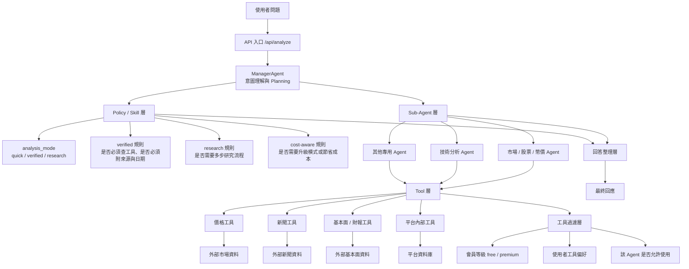
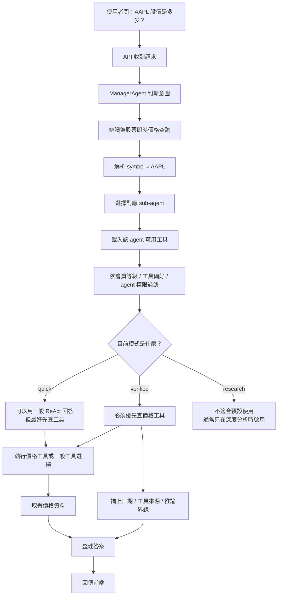
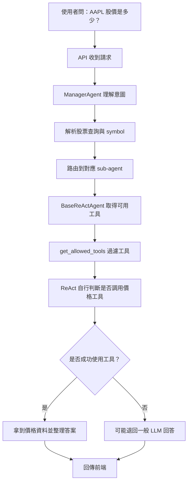
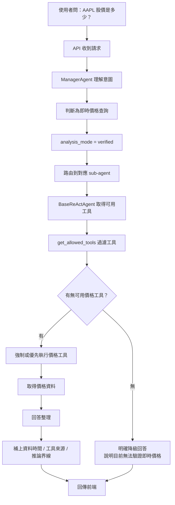

# 整體平台架構圖

## 目的

這份文件用中文整理目前平台中：

- 使用者請求
- Planning
- Policy / Skill
- Sub-Agent
- Tool
- 會員權限與工具過濾
- 回應生成

之間的實際關係。

重點是釐清：

- `planning` 沒有消失
- `skill` 不直接取代 `tool`
- `tool` 是能力
- `skill/policy` 是規則
- `agent` 是執行者

---

## 一、整體分層圖

---

## 二、每一層的角色

### 1. API 入口層

負責：

- 接收使用者問題
- 驗證登入身份
- 建立對應的 LLM client
- 建立 ManagerAgent
- 傳入使用者資訊、會員資訊、session 資訊

這一層不負責回答內容，只負責把請求送進系統。

---

### 2. Planning 層

負責：

- 判斷使用者問題是什麼類型
- 是否需要拆任務
- 是否需要解析股票代碼或幣種代碼
- 應該交給哪個 sub-agent
- 應該用 `quick`、`verified` 還是 `research`

這就是原本的 planning。

它沒有消失，只是現在變成平台內部決策引擎，而不是使用者直接看到的東西。

---

### 3. Policy / Skill 層

負責：

- 定義規則
- 約束 agent 怎麼使用 tool
- 規定回答要符合什麼品質標準

例如：

- `verified` 模式下，價格問題不能只靠模型猜
- `verified` 模式下，回答要附資料時間與來源
- `research` 模式下，要跑多步資料查詢流程
- `free` 使用者與 `premium` 使用者可用能力不同

這一層的本質是：

**告訴系統應該怎麼做，而不是親自查資料。**

---

### 4. Sub-Agent 層

負責：

- 接收 planning 後的任務
- 根據 policy/skill 決定執行方式
- 選擇與組合可用工具
- 取得工具結果後整理成自然語言

Sub-agent 是實際執行單位。

它既不是純規則，也不是資料工具，而是中間執行者。

---

### 5. Tool 層

負責：

- 查價格
- 查新聞
- 查財報或基本面
- 查平台內部資料
- 寫入或讀取平台設定

Tool 的本質是：

**原子能力。**

也就是一個可被重複調用、輸入輸出清楚的能力單元。

---

### 6. 工具過濾層

負責：

- 根據會員等級判斷工具是否可用
- 根據使用者工具偏好判斷工具是否啟用
- 根據 agent allowlist 判斷該 agent 能不能使用這個工具

這一層是商業規則核心。

它的作用是：

**不是每個 agent 在每個情況下都能用所有工具。**

---

### 7. 回答整理層

負責：

- 把工具結果整理成人類可讀的回答
- 在 `verified` 模式下補上：
  - 資料時間
  - 工具或來源
  - 推論與事實的界線

這一層不應該亂猜資料，而應該主要做表達與整合。

---

## 三、Skill 與 Tool 的關係

### 正確關係

- `tool` 提供能力
- `skill/policy` 決定能力怎麼被使用
- `planning` 決定何時該使用哪種規則
- `sub-agent` 實際執行

### 錯誤關係

- 不應該把 skill 直接假裝成一個 frontend tool
- 不應該讓 tool 自己決定整體商業規則
- 不應該只相信 sub-agent 自己會遵守規則

---

## 四、用「AAPL 股價是多少？」看實際流程

### 4.1 目前現況流程

這是目前系統比較接近的實際狀態：

目前現況的特點：

- 已經有 `ManagerAgent`
- 已經有 `BaseReActAgent`
- 已經有工具過濾
- 已經有價格型工具註冊基礎
- 但還沒有完整明確的 `verified` 強制規則

也就是說：

**現在系統可以查工具，但還沒有做到「這種問題一定要查工具，否則不能假裝已驗證」的完整約束。**

### 4.2 未來 verified 流程

這是建議導入 `analysis_mode=verified` 後的流程：

未來 verified 流程的核心差異是：

- 問題先被標記為「需要驗證」
- 系統不再完全放任 ReAct 自由決定
- 若沒有完成工具查詢，就不能假裝已驗證
- 回答會帶驗證資訊

### 4.3 目前與未來的差異表

| 項目 | 目前現況 | 未來 verified 流程 |
|---|---|---|
| 是否可解析 AAPL | 有 | 有 |
| 是否能路由到 sub-agent | 有 | 有 |
| 是否有工具過濾 | 有 | 有 |
| 是否一定要求價格問題先查工具 | 尚未完整保證 | 需要保證 |
| 工具不可用時是否明確降級 | 不一定 | 必須 |
| 回答是否固定附資料時間 | 不一定 | 必須 |
| 回答是否固定附工具/來源 | 不一定 | 必須 |
| 是否能驗證 policy 是否達成 | 觀察性不足 | 需要 log + test 支撐 |

---

## 五、什麼是 verified 模式

`verified` 不是「系統聲稱自己絕對正確」。

`verified` 的真正意思是：

**對時間敏感或需要依據的問題，系統必須先查資料，再回答。**

### verified 模式至少要做到

1. 對價格、新聞、財報等問題優先或強制查工具
2. 回答中交代資料時間
3. 回答中交代使用的工具或來源
4. 如果無法查證，就不能假裝自己已查到

### 5.1 verified 與 quick 的差異

#### quick

- 目標是快速回覆
- 可用工具時最好查
- 但不一定對每個價格問題都強制執行工具
- 輸出格式較自由

#### verified

- 目標是提高可信度
- 對時間敏感問題優先或強制查工具
- 回答必須交代資料時間與依據
- 查不到時必須降級，而不是硬答

### 5.2 verified 模式下誰負責驗證

這件事不能只交給 sub-agent 自己自律。

應該分成三層責任：

#### 1. Runtime enforcement

由 `BaseReActAgent` 或對應 policy hook 負責：

- 判斷這題是否屬於必須驗證的類型
- 判斷是否真的執行了必要工具
- 沒做到時就降級或拒絕假裝已驗證

#### 2. Observability

由 log / metadata 負責：

- 記錄 analysis_mode
- 記錄可用工具
- 記錄實際使用了哪些工具
- 記錄是否符合 verified policy

#### 3. Test / Eval

由測試負責：

- 驗證 `verified + 價格問題` 真的會用工具
- 驗證工具被關掉時會降級
- 驗證回答含日期與來源資訊
- 驗證 free / premium 行為差異

---

## 六、建議的產品對外形式

對使用者不要直接暴露 `skill` 這個詞。

比較好的產品形式是：

- `quick`
- `verified`
- `research`

這樣：

- 使用者看到的是模式
- 平台內部運作的是 planning + policy + tool orchestration

---

## 七、結論

整體系統應該這樣理解：

- `planning`：判斷要怎麼做
- `skill/policy`：規定做到什麼標準
- `sub-agent`：負責執行
- `tool`：負責拿資料與做操作
- `tool gating`：決定哪些能力能被使用
- `response layer`：把結果整理成使用者可讀內容

一句話總結：

**skill 駕馭 tool，planning 協調 skill，sub-agent 執行 tool，最後再由回答層輸出。**
